# Практическая работа №1 - Основы командной строки Linux

## 1. Создание виртуальной машины

1. Параметры виртуальной машины в процессе создания
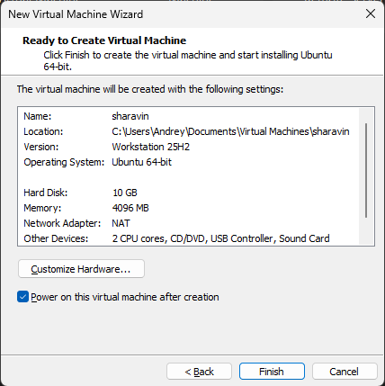
2. Командная строка Ubuntu после установки с приглашением

## 2. Информация о системе

1. Вывод информации о системе
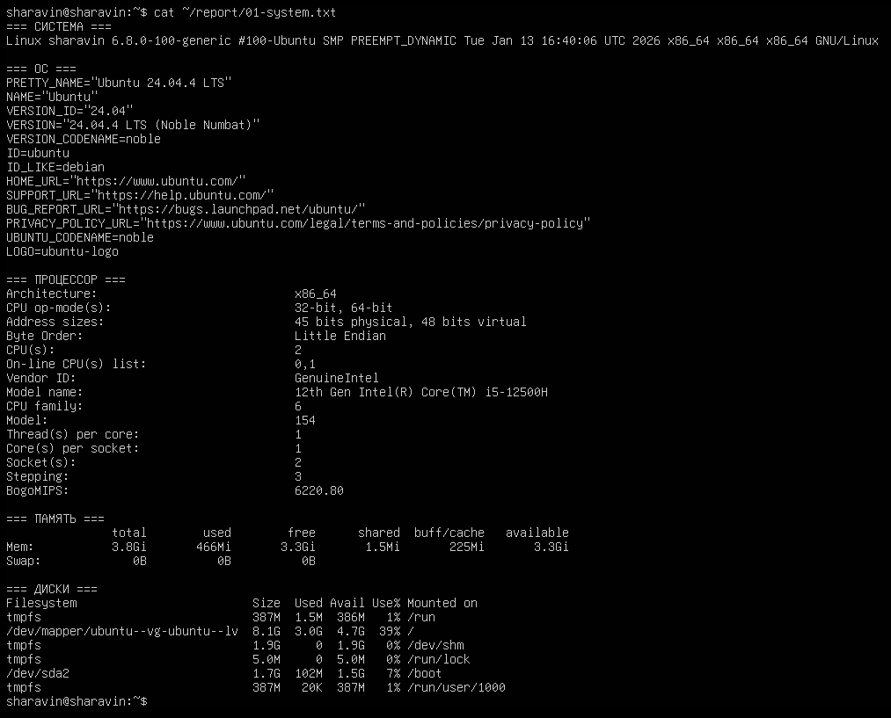

## 3. Сеть: IP-адрес и открытые порты

1. Вывод `ip addr show`
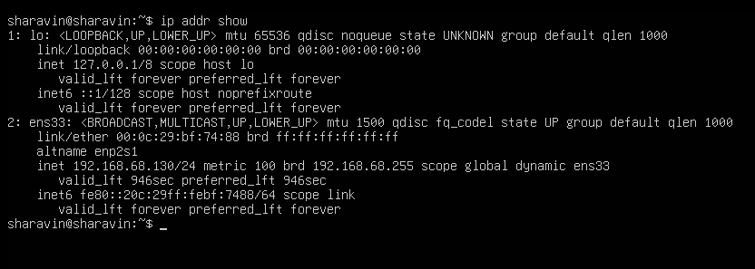
2. Вывод `sudo ss -tlnp`
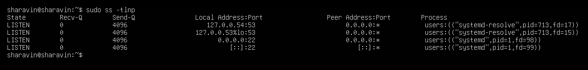

## 4. Сервис SSH

1. Вывод `sudo systemctl status ssh`
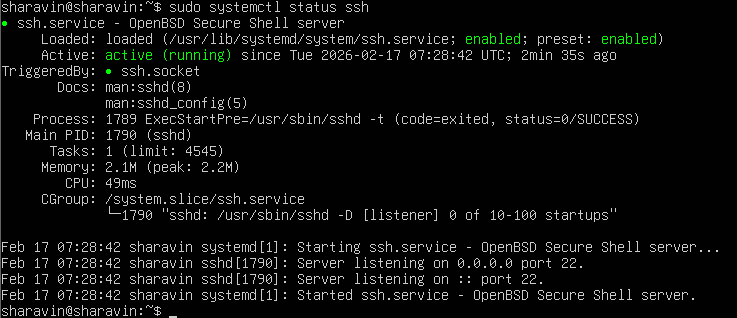
2. Вывод `sudo ss -tlnp | grep ssh`
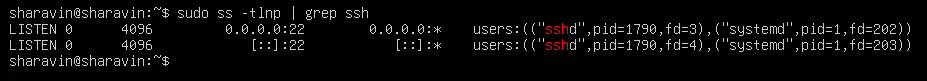

## 5. Пользователи и группы

1. Вывод `grep '/bin/bash' /etc/passwd'`
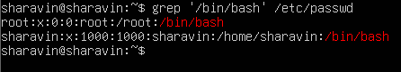
2. Процесс создания пользователя `boardy`
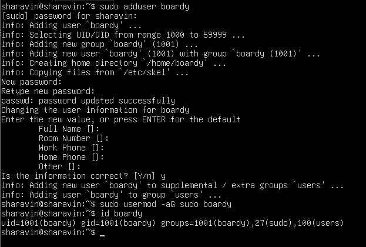
3. Вывод `id boardy`
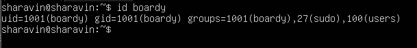

## 6. Дерево каталогов

1. Вывод `ls -la /`
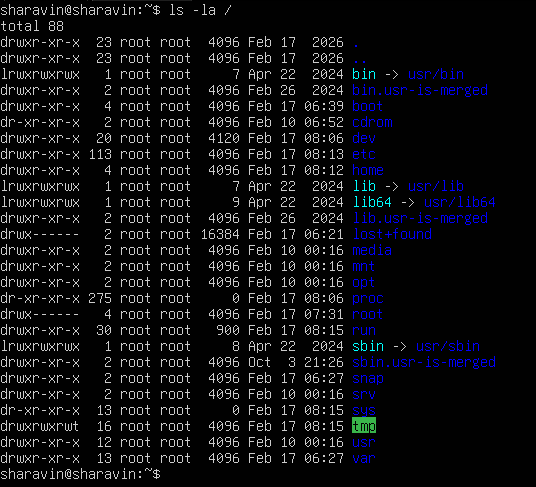
2. Вывод `ls -la ~`
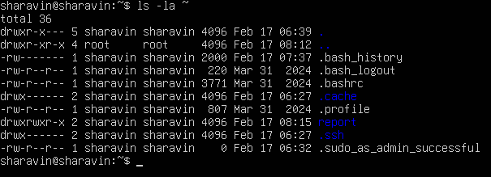

## 7. Права доступа

1. Вывод `ls -ld / /etc /var/ tmp /home`
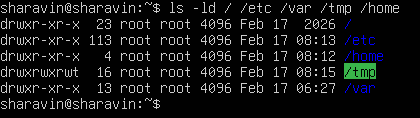
2. Три состояния testfile.txt
[chmod](screenshots/14-chmod.png)

## 8. Установленные пакеты и сервисы

1. Вывод `dpkg -l | grep -E 'openssh|python|git|curl|vim|nano`
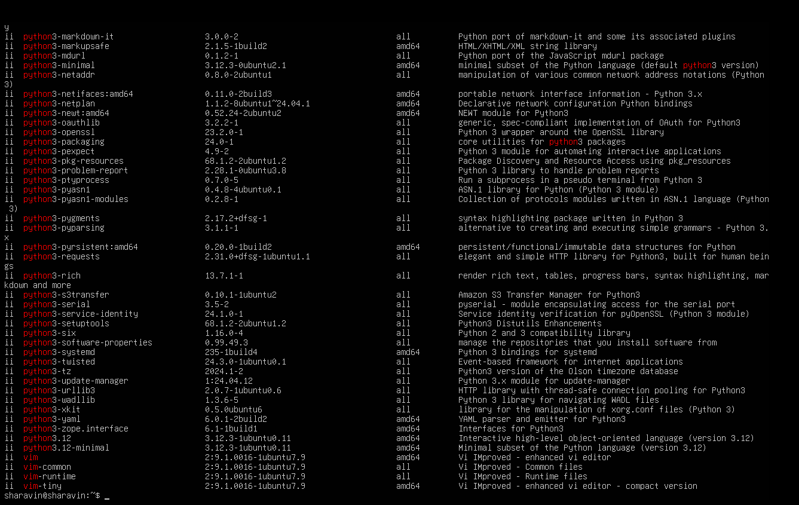
2. Вывод `systemctl list-units --type=service --state=running`
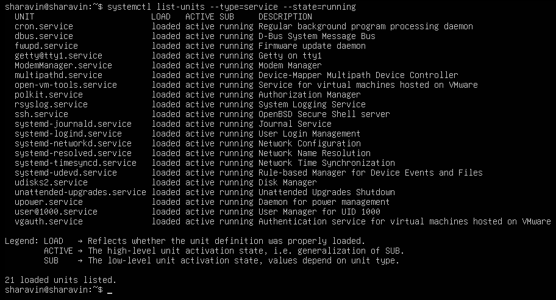

## 9. Конвейер и перенаправление

1. Вывод топ-10 процессов по памяти
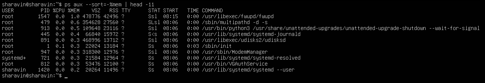
2. Вывод процессов по пользователям
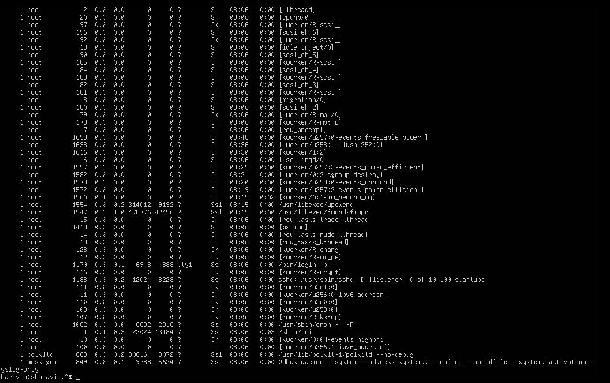
3. Вывод топ-10 больших файлов в /var
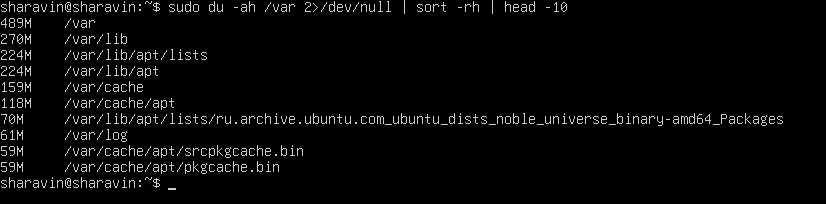

## 10. Итоговый файл

1. Вывод всех файлов с отчётами
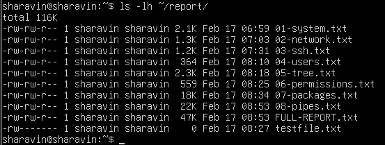