# Практика 10: Авторизация, куки, сессии

## Часть A. Подготовка и вёрстка
1. Столбец `password_hash`

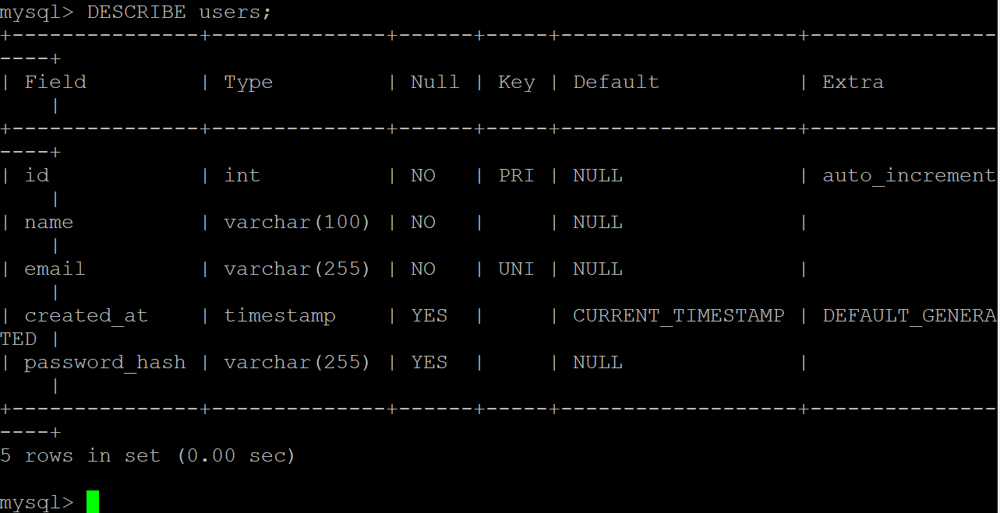

- Использование `VARCHAR(255)` является стандартом для обеспечения совместимости с будущими алгоритмами хеширования, которые могут генерировать более длинные строки
- Если установить длину `VARCHAR(50)`, хеш от функции `password_hash()` будет обрезан при сохранении в базу данных. В результате проверка пароля через `password_verify()` всегда будет возвращать ошибку, так как данные в базе станут невалидными

2. Partials

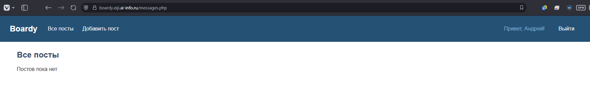

- Меню вынесено в отдельный файл для соблюдения принципа DRY (Don't Repeat Yourself), что позволяет подключать его на всех страницах сайта одной строкой и централизованно управлять навигацией
- Если добавить новую ссылку в этот файл, она мгновенно появится на всех страницах проекта, где подключен данный partial

3. Вёрстка форм по макетам

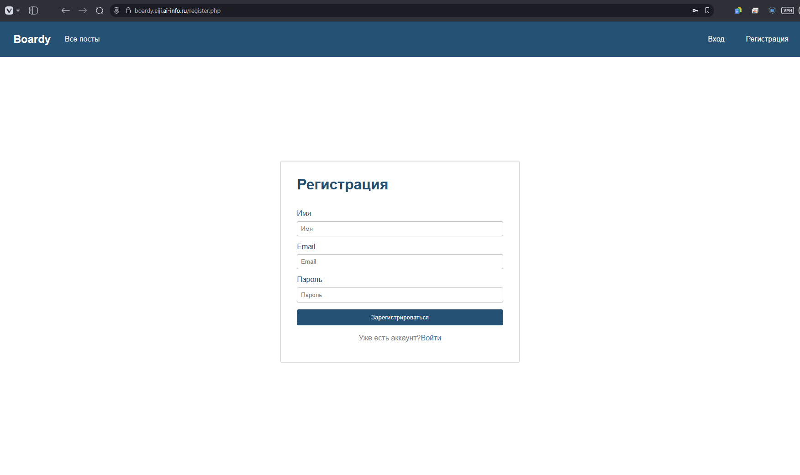

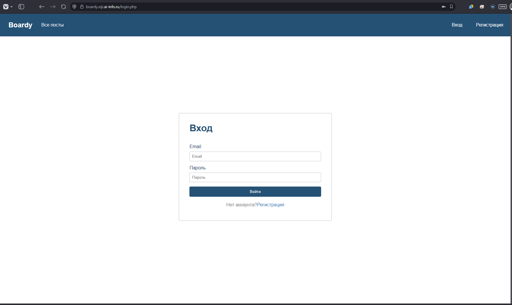

## Часть B. Регистрация и логин
4. Регистрация

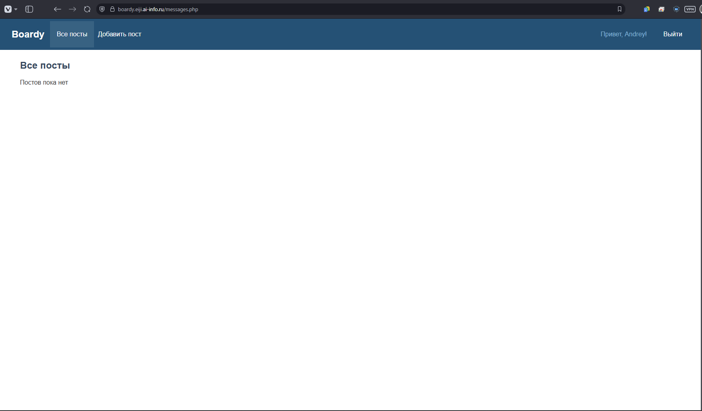

5. Хеш в базе

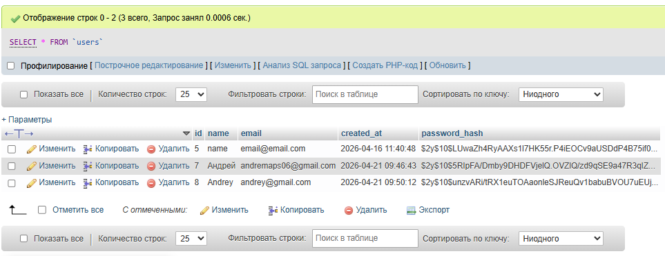

- В структуре `$2y$10$Kx8QnZq...`
  - Часть `$2y$` обозначает используемый алгоритм (bcrypt)
  - `$10$` - это cost factor, определяющий количество итераций хеширования ($2^{10}$)
  - Остальная часть строки содержит соль (salt) и непосредственно результат вычисления хеша
- Увеличение cost factor до 15 заставит сервер выполнять в 32 раза больше итераций, что экспоненциально повысит устойчивость к перебору паролей, однако это также значительно увеличит время обработки каждого запроса на вход, что может создать высокую нагрузку на процессор и замедлить работу сайта для пользователей

6. Защита от повторной регистрации

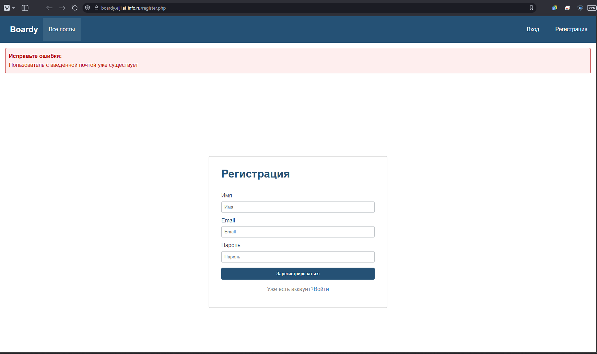

- Проверка email перед выполнением `INSERT` позволяет вывести пользователю понятное сообщение об ошибке прямо в интерфейсе, не прерывая выполнение скрипта
- Без этой проверки база данных выдаст критическую ошибку, если на поле email установлен индекс `UNIQUE`, либо в системе появятся дубликаты аккаунтов

7. Логин

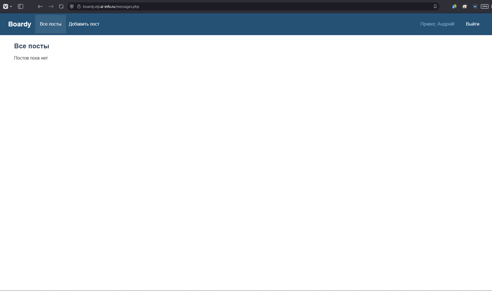

8. Неверный пароль

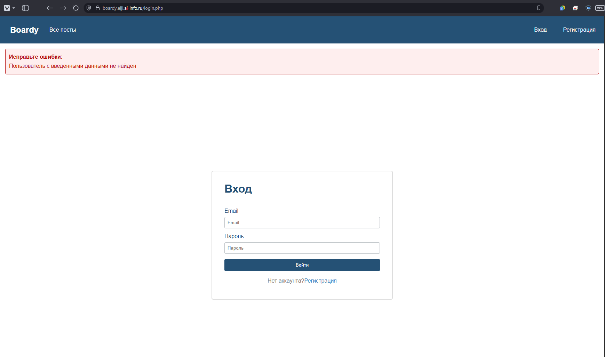

- Использование одинакового сообщения "Пользователь не найден или пароль неверный" - это важная мера безопасности, которая предотвращает перебор имен пользователей

## Часть C. Куки и сессии
9. Кука PHPSESSID

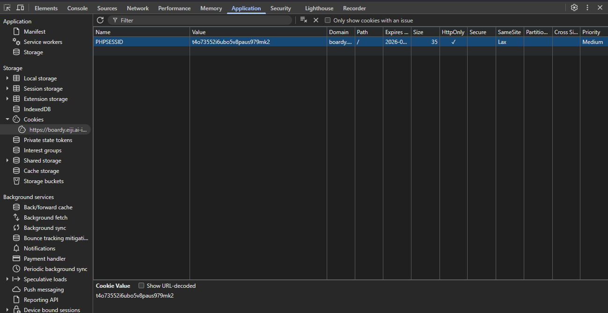

- В значении куки хранится только уникальный идентификатор сессии, который служит ключом для поиска данных на стороне сервера
- Это значение генерируется PHP автоматически при вызове `session_start()`. Каждый раз, когда браузер отправляет этот идентификатор обратно, сервер понимает, какой именно набор данных (`$_SESSION`) нужно подгрузить для конкретного пользователя

10. Параметры куки

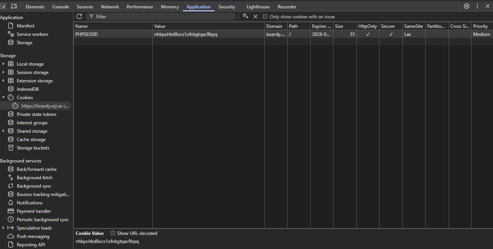

- Если убрать флаг `HttpOnly`, JavaScript на стороне клиента получит полный доступ к чтению идентификатора сессии
- В случае XSS-атаки злоумышленник сможет внедрить скрипт, который украдет значение куки и отправит его на свой сервер
  - Далее он сможет подменить себя как пользователя, не зная логина и пароля

11. HttpOnly на практике

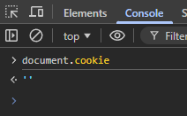

- Флаг HttpOnly явно запрещает доступ к куке через любые клиентские скрипты. Браузер строго соблюдает это правило и передаёт такую куку только в HTTP-заголовках при запросах к серверу

12. Файл сессии на сервере

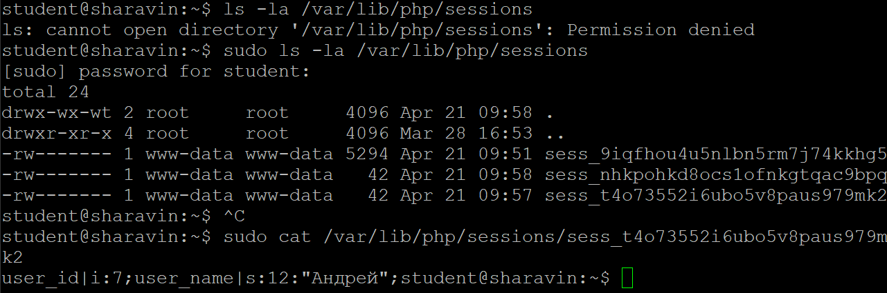

- В файле на сервере хранится содержимое массива `$_SESSION`, включая фактические данные пользователя (`ID`, `name`). В куке на клиенте находится только случайный идентификатор сессии
- Такое разделение необходимо для безопасности, чтобы конфиденциальная информация оставалась под контролем сервера и была защищена от подмены пользователем

## Часть D. Защита и доработка
13. Защита страниц

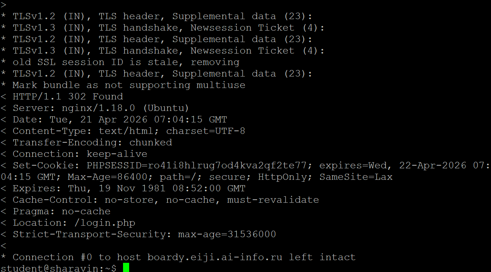

14. Посты с автором

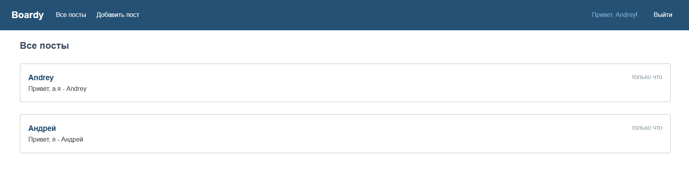

- Использование `JOIN` позволяет базе данных эффективно сопоставить записи за один проход, что значительно быстрее и экономнее по ресурсам, чем выполнение сотен отдельных запросов в цикле

15. Добавление поста

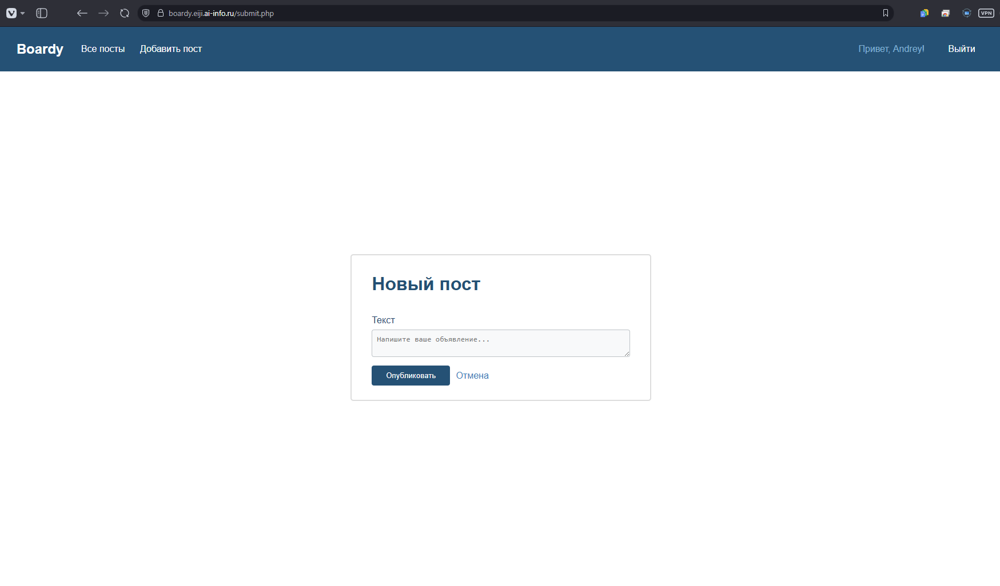

16. Logout

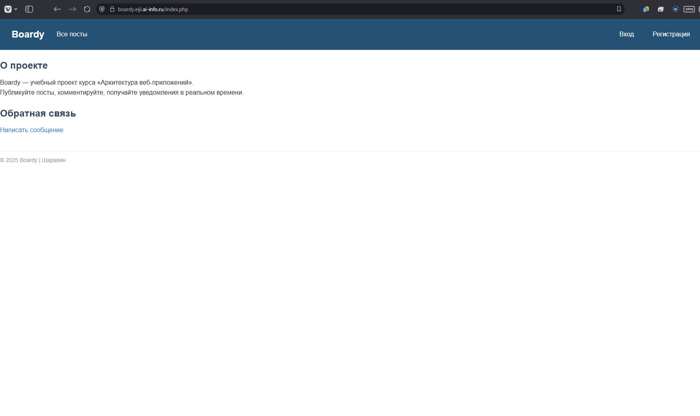

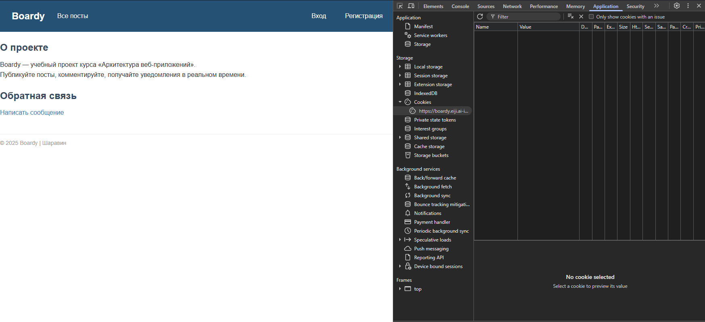

- `session_destroy()` уничтожает все данные, связанные с текущей сессией на стороне сервера (удаляет файл сессии).
- Функция `setcookie()` с прошедшей датой необходима, чтобы заставить браузер физически удалить куку `PHPSESSID`
- Если выполнить только `session_destroy()`, файл на сервере исчезнет, но кука в браузере останется и при следующем визите сервер создаст новую пустую сессию с тем же ID
- Если же только просрочить куку в браузере, данные на сервере останутся висеть в папке временных файлов

17. Истёкшая сессия

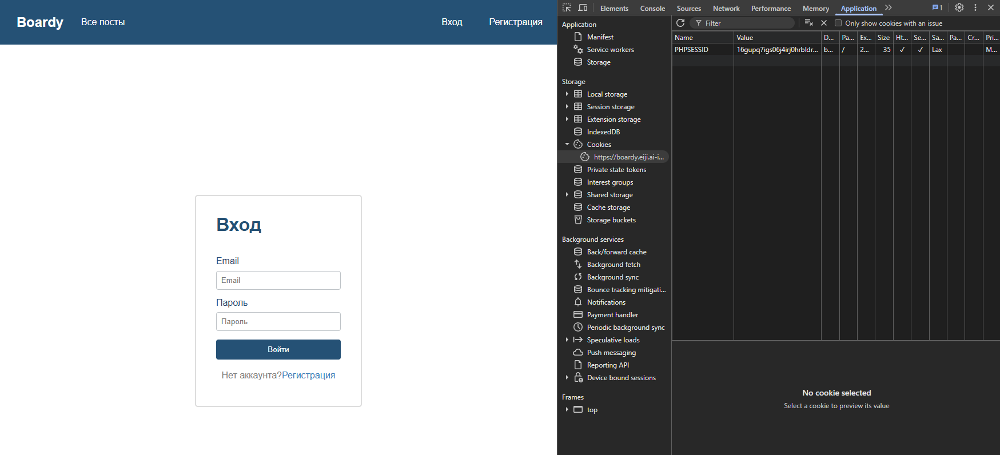

- Браузер считает себя залогиненным, потому что в его памяти всё ещё хранится кука с идентификатором сессии, которую он исправно отправляет серверу при каждом запросе
- Однако сервер, получив этот ID, не может найти соответствующий ему файл, так как он был удален вручную
- В результате PHP не может восстановить данные из `$_SESSION`, считает сессию недействительной и обрабатывает запрос как от гостя