# Практика 11: JWT для API и OAuth через GitHub

## Часть A. JWT для API

1. auth.py

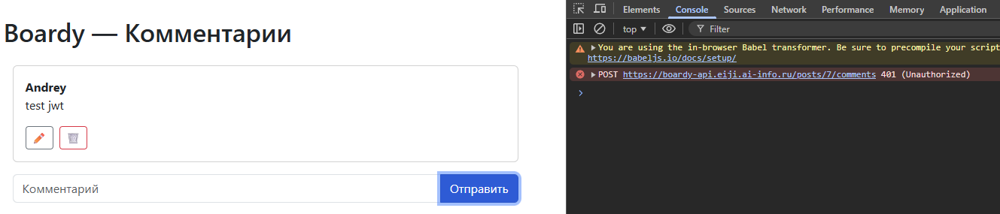
- Слово "Bearer" (предъявитель) указывает серверу на конкретный тип схемы аутентификации. Для доступа к ресурсу достаточно просто "предъявить" данный токен
  - Схем аутентификации существует несколько. "Bearer" - одна из них
- Без указания схемы серверу пришлось бы угадывать формат токена, что привело бы к конфликтам и ошибкам при поддержке нескольких способов входа

2. /api/me.php

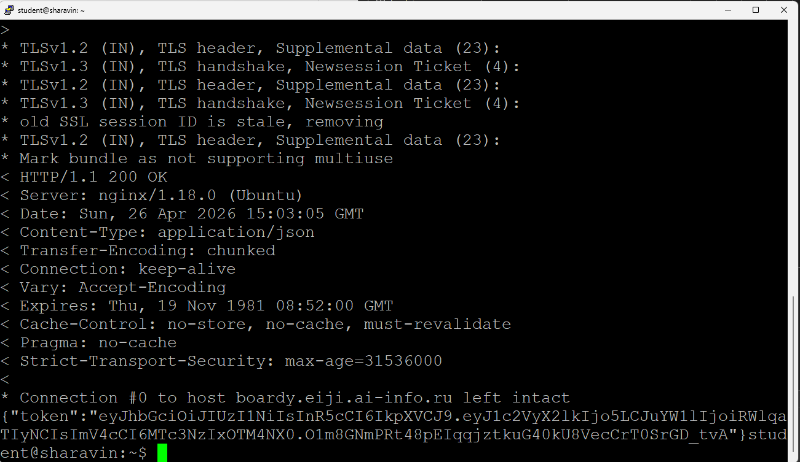

- Файл `me.php` использует `session_start()`, потому что он проверяет уже существующее состояние авторизации, а не выполняет новый вход
- Кука `PHPSESSID` в этом запросе играет роль пропуска
  - браузер автоматически передает её серверу, чтобы тот мог найти соответствующий файл сессии
  - Если `ID` в куке совпадает с файлом на сервере, где записан `user_id`, скрипт подтверждает личность пользователя и выдает ему JWT-токен

3. React получает JWT

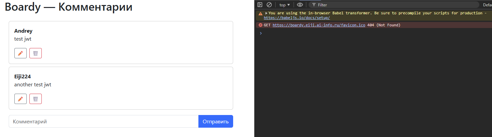

4. Bearer в запросах

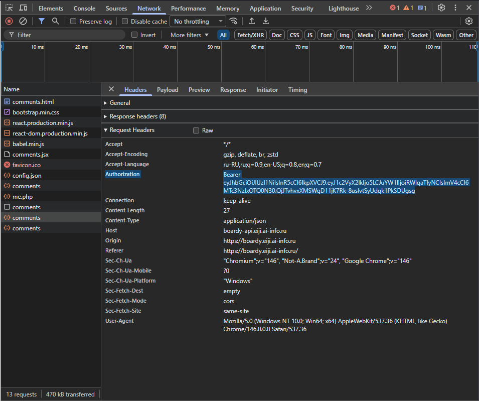

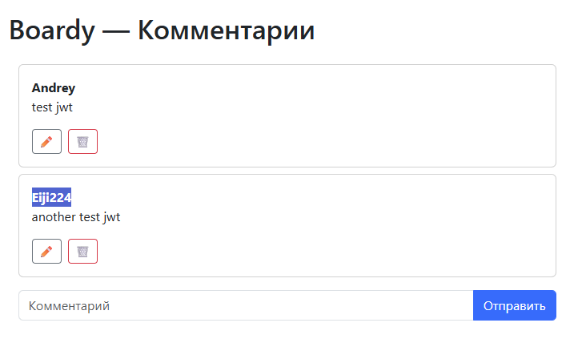

5. jwt.io

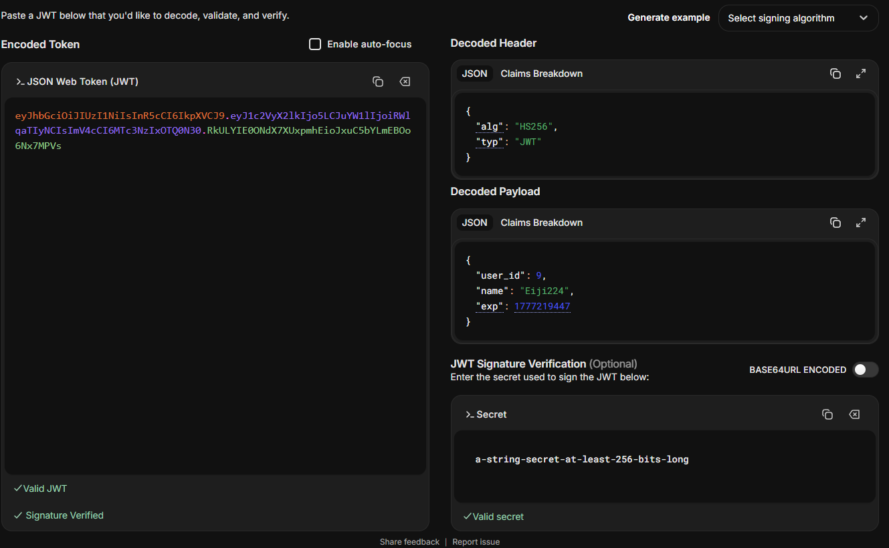

- Данные в payload закодированы в формате Base64URL, поэтому их может прочитать любой желающий
- Злоумышленник, перехвативший токен, увидит всё содержимое: ID пользователя, его имя и другие открытые поля
- Это не является проблемой, так как целостность токена защищена криптографической подписью. Любая попытка злоумышленника изменить данные в payload сделает подпись невалидной, и сервер просто отклонит такой токен

6. Истёкший токен

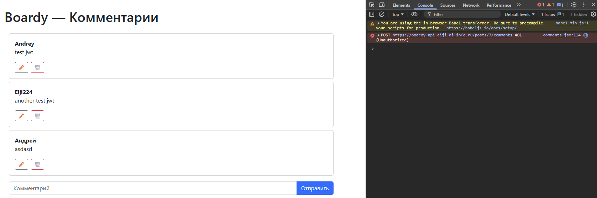

7. Невалидный токен

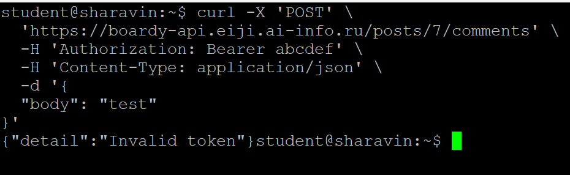

## Часть B. OAuth через GitHub

8. OAuth App на GitHub

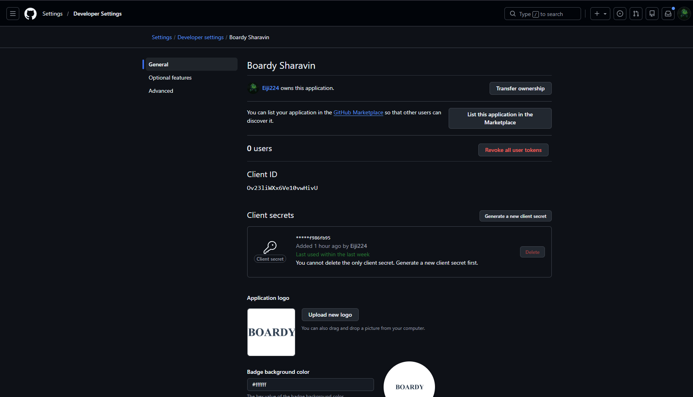

9. Столбец github_id

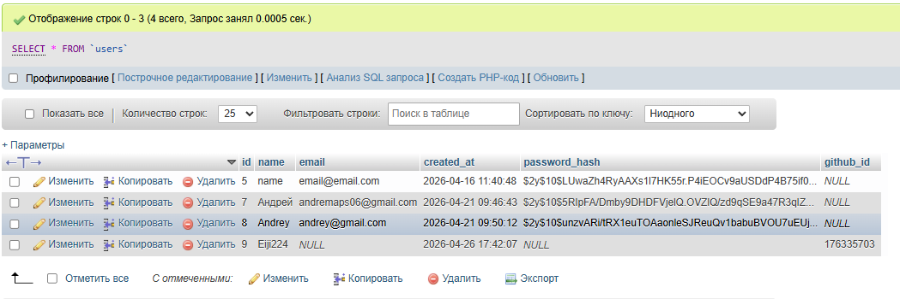

10. Кнопка "Войти через GitHub"

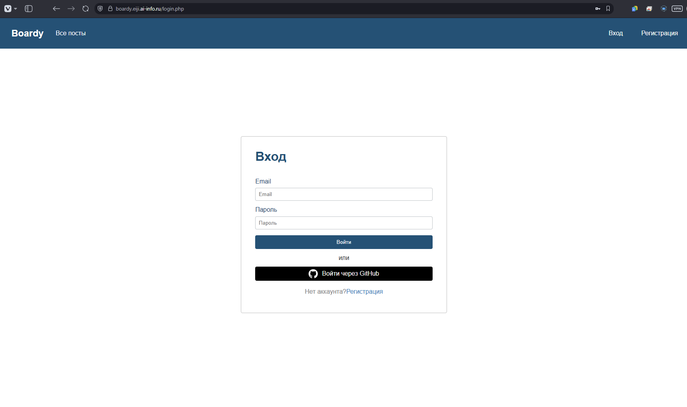

11. OAuth flow

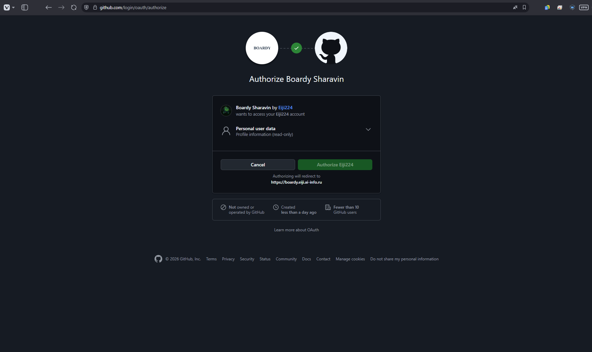

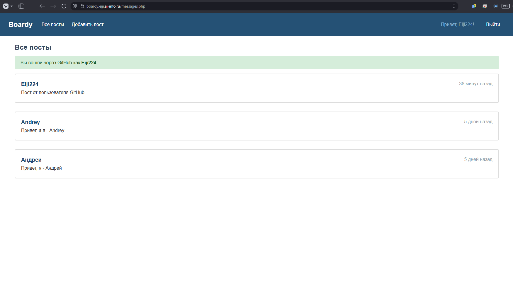

- Поиск по `github_id` необходим, так как это уникальный и неизменяемый идентификатор пользователя внутри системы GitHub, гарантирующий точность сопоставления аккаунтов

12. github_id в базе

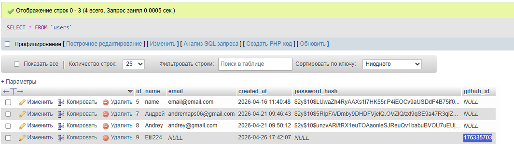

13. OAuth -> JWT -> API

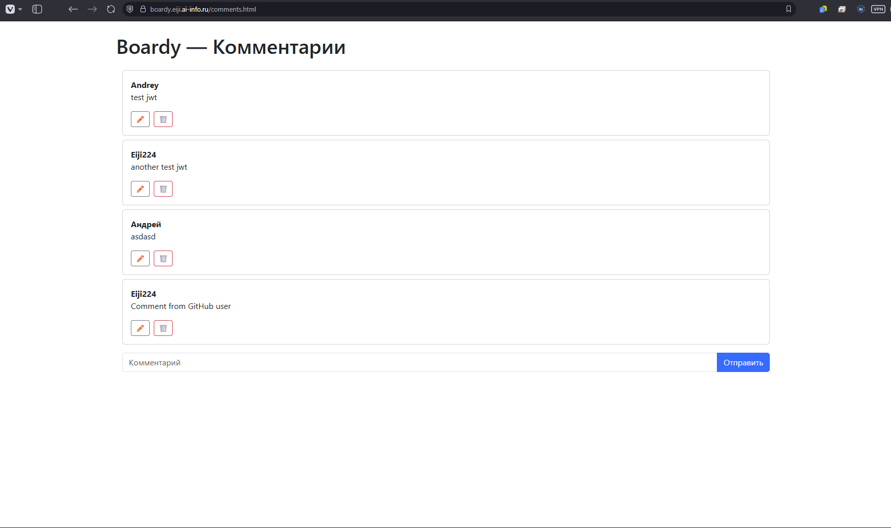

- Кнопка -> GitHub -> Callback: Пользователь нажимает "Войти", перенаправляется на GitHub для подтверждения, и после апрува возвращается на `oauth-callback.php` с временным кодом
- Сессия -> me.php -> JWT: Сервер обменивает код на данные профиля, сохраняет их в `$_SESSION`. На фронтенде React вызывает me.php, который проверяет сессию и выдает подписанный JWT
- React -> FastAPI -> Комментарий: React сохраняет JWT в памяти и прикрепляет его к заголовку `Authorization`; FastAPI проверяет подпись токена, достает `user_id` и сохраняет комментарий в базу данных

14. Параметр state

- `State` - это уникальный случайный токен, который служит защитным механизмом для проверки, что запрос на авторизацию был инициирован именно пользователем, а не злоумышленником
  - Он связывает запрос к GitHub с ответом, который возвращается на сервер, предотвращая подмену сессий

- Сценарий CSRF-атаки без `state`:
  1. Злоумышленник инициирует вход через GitHub на целевом сайте, но останавливается на этапе получения `code`, не завершая процесс
  2. Он копирует ссылку с этим `code` и заманивает жертву, у которой уже есть активная сессия на сайте, перейти по ней
  3. Жертва переходит по ссылке с кодом злоумышленника на `oauth-callback.php`
  4. Сайт, не имея проверки `state`, принимает этот код как валидный и связывает аккаунт GitHub злоумышленника с локальным профилем жертвы
  5. В результате злоумышленник может войти в личный кабинет жертвы, просто авторизовавшись через свой GitHub

## Часть C. Анализ

15. Три способа входа

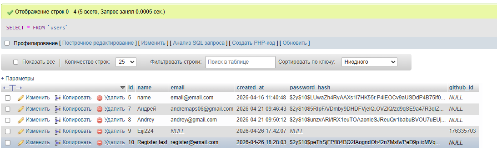

16. Сравнение механизмов

| Вопрос | Куки + сессии | JWT | OAuth |
| :--- | :--- | :--- | :--- |
| **Где хранятся данные?** | На сервере (файлы или БД) | В самом токене у клиента | У провайдера (GitHub/Google) и в access-токене |
| **Кто прикрепляет к запросу?** | Браузер автоматически при каждом запросе к домену | Программист вручную через заголовок `Authorization` | Программист вручную (через заголовок или параметры) |
| **Для какого типа клиентов?** | Классические сайты (SSR) | SPA (React/Vue), мобильные приложения, микросервисы | Сторонние сервисы, которым нужен доступ к вашим данным |
| **Можно ли отозвать?** | Да, мгновенно удалив файл сессии на сервере | Нет (до истечения срока) | Да, отозвав разрешение в настройках аккаунта провайдера |
| **Кросс-доменно работает?** | Ограниченно (мешают политики безопасности и SameSite) | Отлично, так как это просто строка в HTTP-заголовке | Отлично, это стандарт для взаимодействия разных систем |

17. Баги и пакеты

| Баг | Чем опасен                     | Как закрывает пакет |
| :--- |:-------------------------------| :--- |
| **Секрет в коде** | Утечёт через git               | `passport:keys` генерирует RSA, хранит в файлах, `.gitignore` |
| **Нет refresh** | Истёк JWT -> логиниться заново | Passport: `refresh_token` из коробки |
| **CSRF вручную (state)** | Забыл проверить -> дыра        | Socialite: проверяет автоматически |