# Практика 13. WebSocket: реалтайм-лента

## Часть A. FastAPI^ WebSocket

1. ConnectionManager

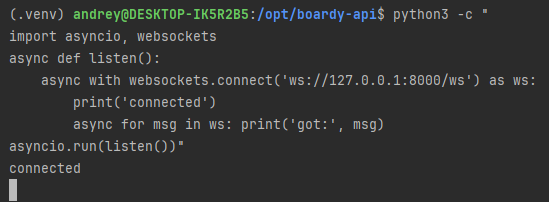

- Почему список подключений хранится в памяти, а не в БД?
  - WebSocket привязан к конкретному процессу в ОС и его невозможно "положить" в базу данных
- Что произойдет при перезапуске Uvicorn?
  - Память процесса очистится и список подключений станет пустым. Браузеры клиентов зафиксируют обрыв соединения.
- Как это решается в реальных проектах?
  - Используется брокер Redis
  - Он работает в оперативной памяти и с его помощью сообщения пересылаются между сервисами

2. /internal/broadcast

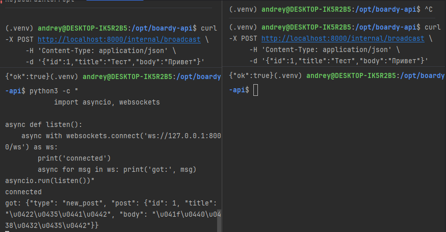

- Почему не требуется JWT-авторизация?
  - JWT-токены используются для аутентификации внешних пользователей. Запросы на /internal/broadcast отправляет не человек из браузера, а сам фронтенд
- Какой риск остается без авторизации?
  - Если эндпоинт оставить полностью открытым, любой внешний злоумышленник сможет отправить прямой HTTP-запрос и заспамить или подменить JSON-данные в веб-сокетах всех подключенных пользователей
- Как этот риск закрывает Nginx?
  - Защита реализуется в Nginx с помощью директив allow и deny в блоке конфигурации

3. Два клиента

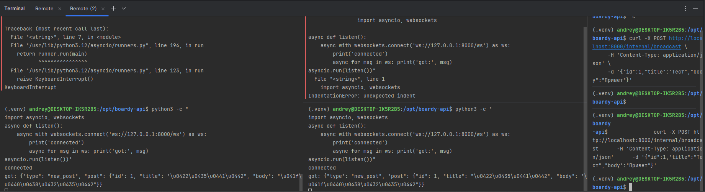

- Что произойдет, если один из клиентов отключился во время рассылки?
  - Процесс отправки сообщений остальным клиентам не прервется
  - При попытке отправить данные на уже закрытый сокет отключившегося клиента, сервер выбросит исключение, но он проигнорирует ошибку и продолжит рассылку для всех оставшихся участников

- Где в коде это обрабатывается?
```python
    async def broadcast(self, message: dict):
        import json
        dead_connections = []
        for ws in self.active:
            try:
                await ws.send_text(json.dumps(message))
            except:
                dead_connections.append(ws)

        for ws in dead_connections:
            self.active.remove(ws)
```


## Часть B. Laravel: HTTP-callback

4. PostController

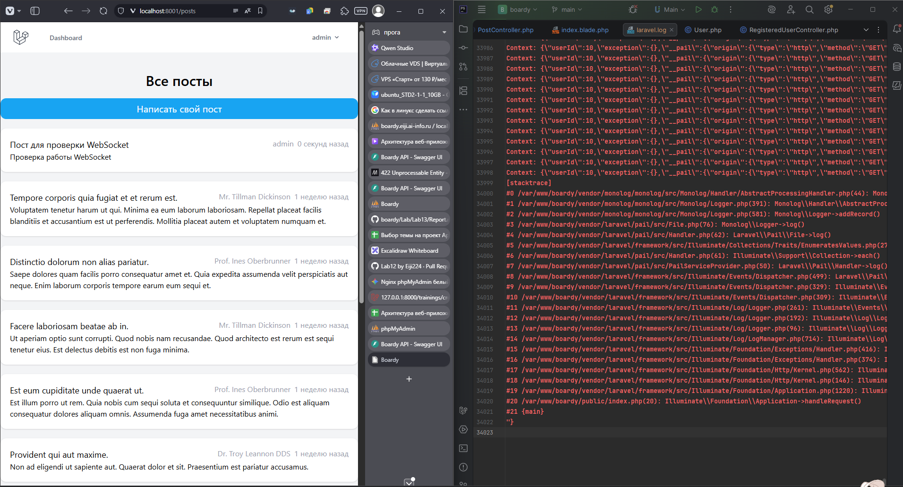

- Зачем нужен timeout(2)?
  - Параметр `timeout(2)` принудительно ограничивает время ожидания ответа от стороннего сервиса двумя секундами, предотвращая зависание текущего PHP-процесса
  - Это гарантирует, что даже при проблемах с микросервисом FastAPI веб-приложение продолжит быстро работать, сохраняя отзывчивость интерфейса для пользователя


- Что случится если FastAPI недоступен и timeout не указан?
  - Laravel будет ожидать ответ до выполнения дефолтного таймаута cURL, который обычно составляет 30–60 секунд
  - Для пользователя это обернется эффектом «бесконечной загрузки» страницы после отправки формы, а на стороне сервера начнут накапливаться заблокированные процессы PHP-FPM, что может полностью парализовать работу сайта

5. Проверка callback

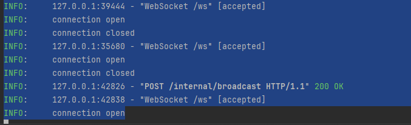

- Каковы основные проблемы архитектуры с HTTP-callback?
  - Синхронность и блокировка потока: Laravel отправляет HTTP-запрос к FastAPI в рамках основного жизненного цикла запроса пользователя, заставляя его ждать ответа от микросервиса перед рендерингом страницы
  - Низкая отказоустойчивость и потеря данных: Если FastAPI временно недоступен или перезагружается, отправленное через HTTP событие будет безвозвратно утеряно, так как в данной схеме отсутствует гарантированная доставка или повторные попытки
  - Плохая масштабируемость (Сильная связность): Монолит должен напрямую знать точный URL-адрес сокет-сервера, а при росте нагрузки прямые HTTP-запросы начнут перегружать FastAPI, вместо эффективного распределения через специализированный брокер сообщений (например, Redis или RabbitMQ)

## Часть C. JS клиент

6. WebSocket в Blade

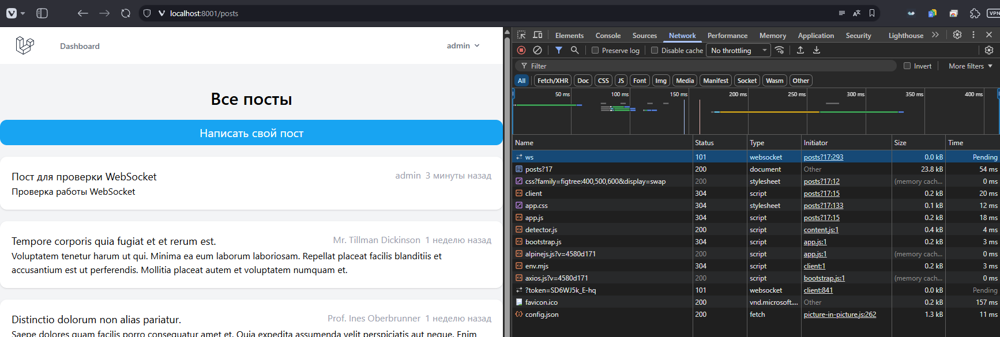

- Почему на локалке нужно `ws://`, а на проде `wss://`?
  - Протокол `ws://` является незашифрованным и используется на `localhost`, где трафик не выходит в сеть и безопасность соединения не критична
  - Протокол `ss://` (WebSocket Secure) использует TLS/SSL шифрование и обязателен на прод-серверах, так как современные браузеры блокируют незащищенные `ws` соединения на сайтах, работающих по `https`, в рамках политики безопасности смешанного контента


- Что произойдёт если использовать `wss://` без TLS?
  - Браузер не сможет установить соединение и выдаст ошибку рукопожатия (Handshake Error), так как принудительно ожидает от сервера валидный SSL/TLS сертификат и зашифрованный поток данных
  - Веб-сервер (Nginx), не настроенный на обработку SSL для этого порта, просто разорвет входящее соединение, из-за чего сокеты в приложении перестанут работать

7. Два браузера

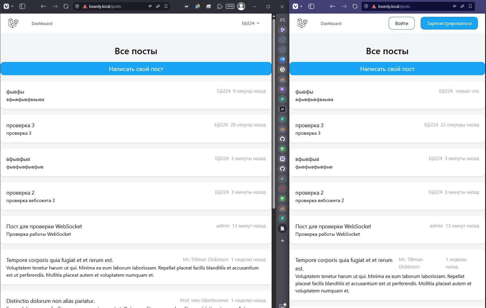

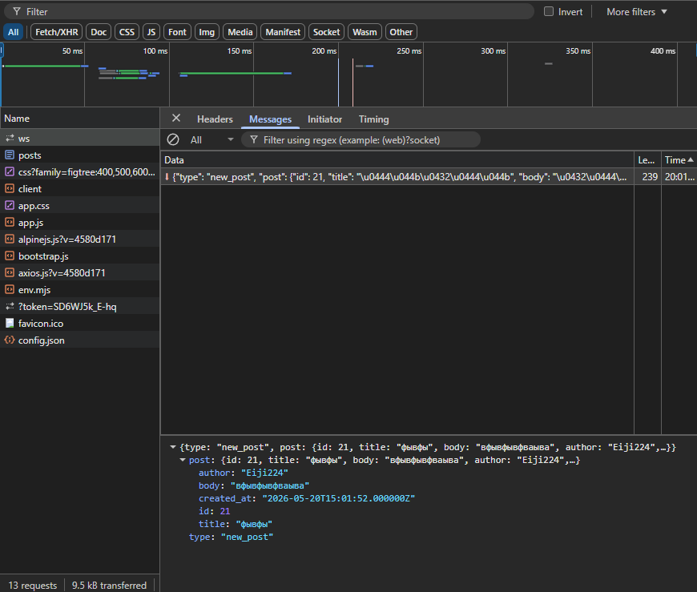

8. XSS

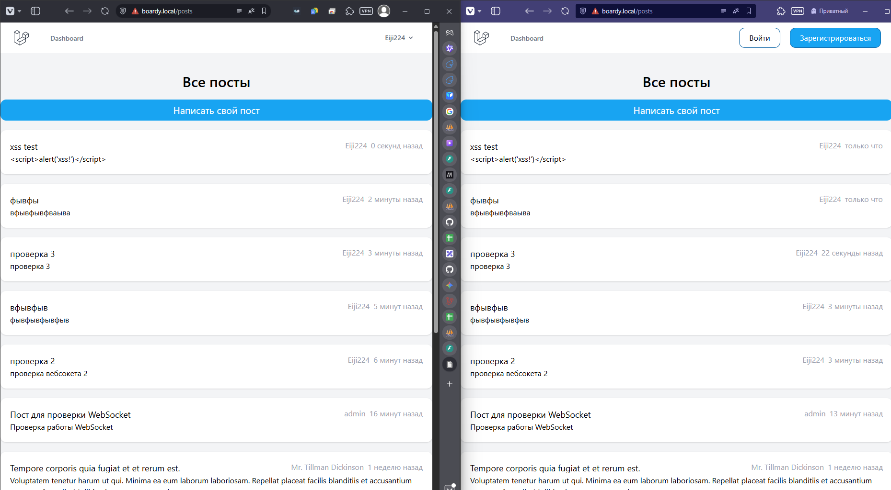

- Что делает функция escapeHtml()?
  - Функция преобразует опасные спецсимволы HTML (такие как `<`, `>`, `&`, `"`, `'`) в их безопасные текстовые эквиваленты (мнемоники, например, `<` превращается в `&lt;`)
  - Благодаря этому браузер интерпретирует полученную строку исключительно как обычный текст для отображения, а не как исполняемый код или новые теги разметки
- Что случится если вставить данные напрямую в innerHTML без экранирования?
  - Браузер выполнит внедренный вредоносный код (например, `<script>` или инлайн-события вроде ``), что приведет к успешной XSS-атаке
  - Злоумышленник сможет красть сессии, файлы cookie пользователей, перенаправлять их на фишинговые сайты или выполнять несанкционированные действия от их имени прямо в браузере

9. Переподключение

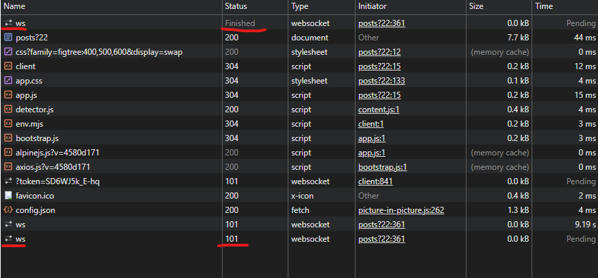


## Часть D. Nginx

10. WS-проксирование

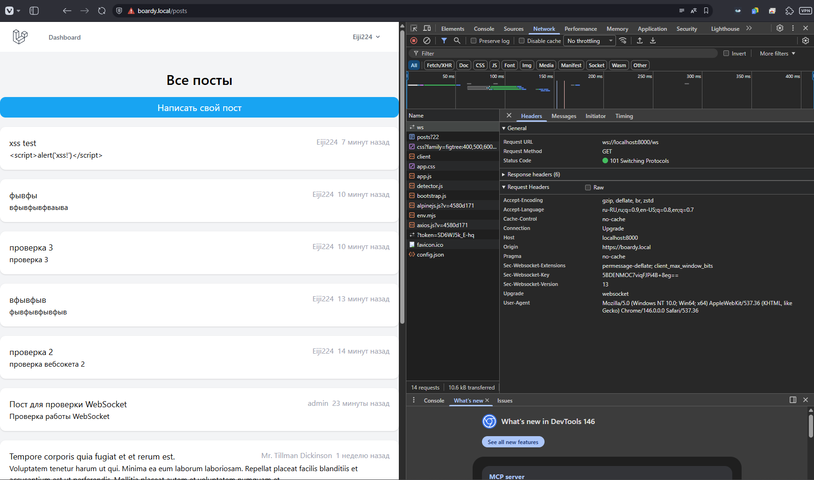

- Что сломается если убрать proxy_http_version 1.1?
  - По умолчанию Nginx использует версию HTTP/1.0 для проксирования, которая не поддерживает постоянные соединения (Keep-Alive), необходимые для работы WebSockets
  - Без этой строки попытка установить соединение завершится ошибкой, так как сервер не сможет выполнить процедуру рукопожатия (Handshake)
- Что сломается если убрать proxy_set_header Upgrade?
  - Браузер не сможет сообщить бэкенд-серверу (FastAPI) о необходимости переключения протокола с обычного HTTP на WebSocket
  - Прокси-сервер передаст запрос как стандартный HTTP-запрос, из-за чего соединение не будет модернизировано и вернет ошибку
- Что сломается если убрать proxy_read_timeout?
  - Nginx будет использовать стандартный таймаут ожидания (обычно 60 секунд) и автоматически разрывать соединение, если в течение этого времени между клиентом и сервером не передавались данные
  - Это приведет к постоянным обрывам связи у пользователей при отсутствии активности в чате или ленте, заставляя клиентское приложение бесконечно переподключаться

11. Закрыть /internal

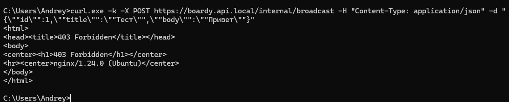

- Почему /internal/broadcast опасен без ограничения доступа?
  - Без ограничений любой внешний пользователь может отправить POST-запрос на этот эндпоинт и принудительно разослать поддельные push-уведомления или фейковые посты всем подключенным клиентам в обход валидации Laravel
  - Это открывает критическую уязвимость для спама, фишинга, дезинформации и позволяет злоумышленникам манипулировать интерфейсом пользователей в реальном времени
- Кто мог бы его вызвать?
  - Любой злоумышленник или автоматизированный бот, который обнаружит этот маршрут при сканировании или разборе исходного кода фронтенда
  - Конкуренты или хакеры, использующие утилиты вроде `curl` или Postman для намеренной отправки деструктивного или компрометирующего контента на ваш сокет-сервер