# Отчёт по практике №14: Финальная микросервисная архитектура

## Часть A. Passport как OAuth 2.1 сервер

### Задание 1. Установка и SPA-клиент

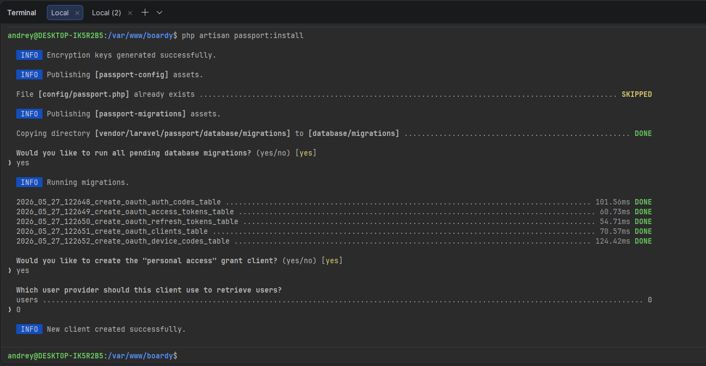

- `Client ID` не появился, поэтому его на скриншоте нет

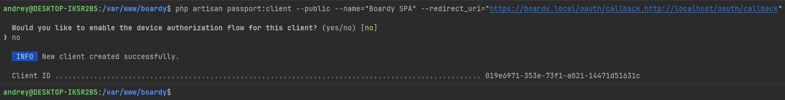

> **Вопрос:** Почему публичный клиент без secret? Чем PKCE заменяет client_secret и от какой атаки защищает?
>
> **Ответ:** SPA-приложения классифицируются как публичные клиенты, поскольку весь их исходный код (включая JavaScript) выполняется в браузере и полностью виден через инструменты разработчика. Следовательно, хранение `client_secret` в таком окружении бессмысленно, так как он не может оставаться секретным. 
> 
> Механизм PKCE заменяет секрет клиента, используя криптографическую пару: клиент генерирует случайный `code_verifier` и его хеш `code_challenge` (обычно через SHA-256). При запросе авторизации передается только `code_challenge`, который сервер сохраняет, привязывая к будущему коду авторизации. На этапе обмена кода на токен клиент обязан передать исходный `code_verifier`. Сервер самостоятельно вычисляет его хеш и сверяет с сохраненным значением. Без знания исходного `code_verifier` обмен невозможен.
> 
> Это надежно защищает от атаки перехвата кода авторизации (Authorization Code Interception Attack): если злоумышленник перехватит одноразовый `authorization_code`, он не сможет обменять его на токен, так как у него нет исходного `code_verifier`.

### Задание 2. TTL и refresh

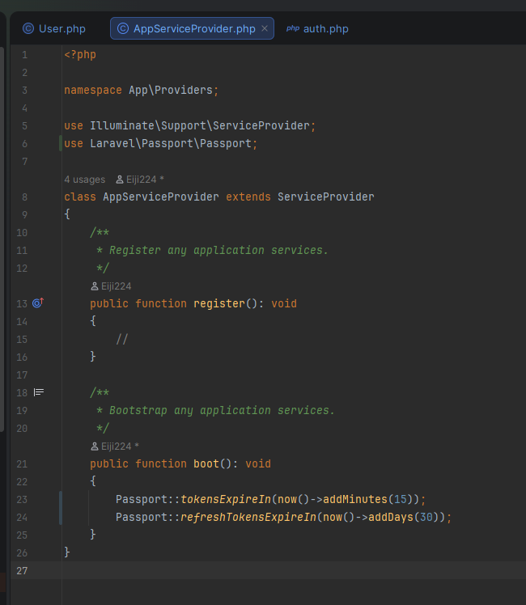

> **Вопрос:** Почему access короткий, а refresh длинный? Что произойдёт если access будет 24 часа?
>
> **Ответ:** Access-токен является bearer-токеном: любой, кто им владеет, получает доступ от имени пользователя. Он передается в заголовке каждого запроса и часто хранится в доступных для JavaScript местах. Короткий срок его жизни (TTL) минимизирует окно уязвимости: в случае компрометации токен быстро станет недействительным.
> 
> Refresh-токен решает обратную задачу — обеспечение удобства. Он хранится исключительно в защищенной HttpOnly+Secure-cookie, недоступной для JS, и передается только на специальный эндпоинт `/oauth/token`. Длительный TTL (например, 30 дней) позволяет клиенту незаметно для пользователя получать новые access-токены (silent refresh) без необходимости повторного ввода логина и пароля каждые 15 минут.
> 
> Если установить TTL access-токена в 24 часа, украденный токен останется действительным целые сутки. Отозвать выпущенный JWT без внедрения глобального черного списка (blacklist) на всех микросервисах практически невозможно. Более того, изменения прав доступа или блокировка пользователя администратором не вступят в силу до истечения срока действия токена. Комбинация короткого access и длинного refresh — это оптимальный компромисс между безопасностью и пользовательским опытом (UX).

### Задание 3. Проверка выдачи через curl

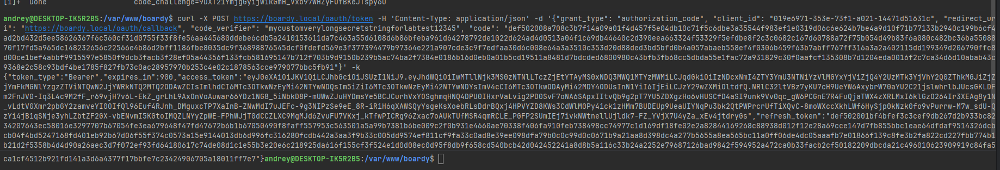

> **Вопрос:** Какие шаги OAuth flow прошёл этот curl-запрос?
>
> **Ответ:** Данный запрос демонстрирует прохождение потока **Authorization Code Grant с расширением PKCE**, который включает следующую последовательность:
> 
> 1. **Генерация PKCE-пары на клиенте:** Создается случайный `code_verifier` (например, 32 байта в кодировке base64url с помощью openssl), на основе которого вычисляется `code_challenge = base64url(SHA-256(code_verifier))`.
> 2. **Запрос авторизации (GET `/oauth/authorize`):** Клиент отправляет запрос с параметрами `response_type=code`, `client_id`, `redirect_uri`, `code_challenge`, `code_challenge_method=S256`, `state` и `scope`. Passport проверяет сессию пользователя, сохраняет `code_challenge` во временном хранилище, привязывая его к будущему коду, и выдает согласие.
> 3. **Редирект с кодом:** После успешной авторизации сервер перенаправляет браузер на `redirect_uri`, добавляя в параметры URL одноразовый и короткоживущий `authorization_code` и исходный `state`.
> 4. **Обмен кода на токены (POST `/oauth/token`):** Клиент отправляет запрос с `grant_type=authorization_code`, `client_id`, полученным `code`, исходным `code_verifier` и `redirect_uri`. Passport вычисляет хеш от `code_verifier`, сверяет его с сохраненным `code_challenge` и при успешном совпадении выдает пару токенов: `access_token` (в формате RS256-JWT), `refresh_token`, а также метаданные (`expires_in`, `token_type=Bearer`).
> 
> В дальнейшем `access_token` используется для аутентификации запросов к FastAPI, который проверяет его криптографическую подпись с помощью публичного ключа Passport без необходимости обращения к серверу авторизации.

## Часть Б. Две базы данных

### Задание 4. Создание boardy_api

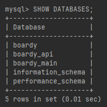

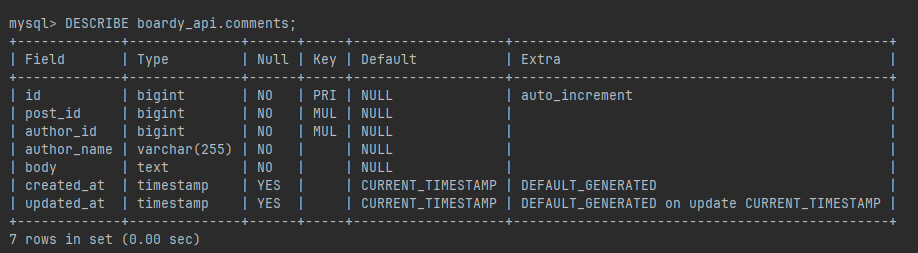

> **Вопрос:** Почему в comments нет FK на posts и users? Что делать с целостностью данных?
>
> **Ответ:** Фундаментальный принцип микросервисной архитектуры — **Database per Service** (отдельная база данных для каждого сервиса). Внешние ключи (FK) между базами разных сервисов не используются, чтобы избежать жесткой связности.
> 
> Целостность данных в такой архитектуре обеспечивается на уровне приложения и событий:
> 
> - **При записи:** FastAPI принимает `author_id` из проверенного JWT, а `post_id` — из параметров URL. Сервис исходит из того, что на момент создания комментария эти идентификаторы валидны.
> - **При чтении:** Для оптимизации запросов и избежания межбазовых JOIN-ов, в таблицу `comments` денормализованно записывается копия имени автора (`author_name`) на момент создания комментария.
> - **Согласованность в конечном счете (Eventual consistency):** Реализуется через шину событий, например, Redis Pub/Sub. Когда Laravel обновляет профиль пользователя, он публикует событие `user.renamed`. Сервис FastAPI, подписанный на этот канал, перехватывает сообщение и обновляет поле `author_name` во всех соответствующих комментариях. Аналогичным образом обрабатываются события удаления (`post.deleted`, `user.deleted`), позволяя сервису очищать осиротевшие записи.

### Задание 5. FastAPI подключён к новой БД

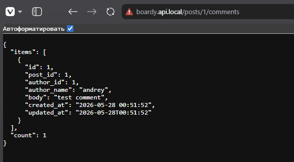

## Часть В. FastAPI: RS256 + полный CRUD

### Задание 6. RS256 проверка

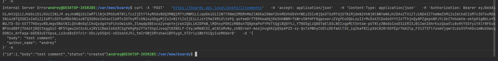

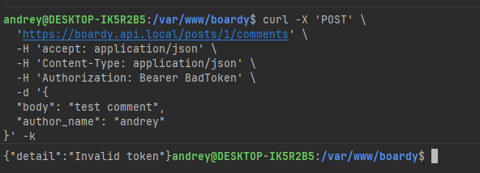

> **Вопрос:** Почему RS256 безопаснее HS256 для распределённых систем?
>
> **Ответ:** Алгоритм RS256 использует асимметричное шифрование: сервер авторизации хранит и использует закрытый (приватный) ключ исключительно для подписи токенов. Микросервисы же проверяют валидность этой подписи с помощью общедоступного публичного ключа. Это кардинально повышает безопасность, поскольку исключает необходимость распространения или хранения единого секретного ключа (как в симметричном HS256) на стороне каждого микросервиса, что минимизирует риск его компрометации и несанкционированной генерации токенов.

### Задание 7. Полный CRUD с author_name

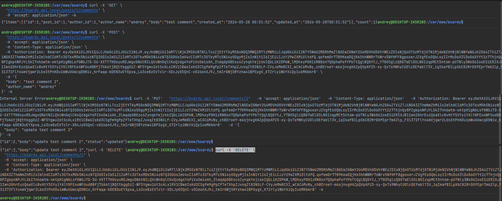

> **Вопрос:** Почему author_name передаётся в payload запроса, а не извлекается из токена? Что было бы если зашить в JWT custom claim?
>
> **Ответ:** JWT-токен должен содержать только стабильный и неизменяемый идентификатор пользователя (`sub`). Имя пользователя — это изменяемые данные. При создании комментария в базу записывается актуальное на тот момент имя, переданное в теле запроса. Это и есть денормализация: хранение снимка данных позволяет избежать дополнительных запросов к чужой базе при каждом выводе списка комментариев.
> 
> Если же сохранить имя пользователя в качестве custom claim внутри JWT, возникнет проблема устаревания данных (data staleness). Access-токен живет, например, 15 минут. Если пользователь изменит свое имя в профиле, его текущий токен все еще будет содержать старое имя. Все комментарии, созданные в эти 15 минут, будут ошибочно атрибутированы старым именем, что создаст несогласованность данных до момента следующего обновления токена.

### Задание 8. Owner check

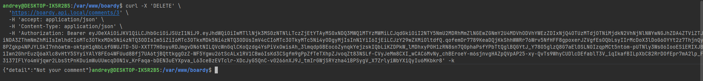

> **Вопрос:** Где в коде проверяется владелец? Что произойдёт если убрать эту проверку?
>
> **Ответ:** Логика проверки прав на владение объектом реализована в роутере `routers/comments.py`, внутри обработчиков методов `update_comment` и `delete_comment`. Сравнивается `author_id` извлекаемого комментария с `sub` из авторизационного токена текущего пользователя.
> 
> Удаление этой проверки приведет к критической уязвимости безопасности, известной как **IDOR (Insecure Direct Object Reference)**. В этом случае любой аутентифицированный пользователь, зная идентификатор чужого комментария, сможет отправить запросы `PUT` или `DELETE` и получить возможность модифицировать или удалять контент, созданный другими пользователями.

### Задание 9. CORS

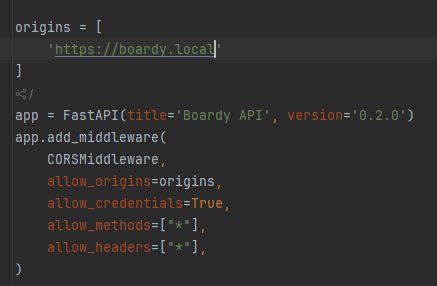

> **Вопрос:** Почему allow_origins=['*'] + credentials=true браузер блокирует? Что произошло бы с куками если бы пропустил?
>
> **Ответ:** Спецификация CORS категорически запрещает использование подстановочного знака `*` в заголовке `Access-Control-Allow-Origin` при одновременной передаче учетных данных (`credentials: true`). Браузер принудительно заблокирует такой ответ. Сервер обязан явно указать доверенный домен (например, `https://gorgeous.ai-info.ru`), как это сделано в настройках `main.py`.
> 
> Если бы браузер игнорировал это правило и пропустил запрос, возникла бы серьезная угроза безопасности. Любой фишинговый или вредоносный сайт, открытый в браузере авторизованного пользователя, мог бы выполнить запрос к нашему API с флагом `credentials: 'include'`. Браузер автоматически прикрепил бы к этому запросу файлы cookie нашего домена. Сервер, считая запрос легитимным, вернул бы конфиденциальные данные или выполнил бы действие от имени пользователя, что фактически является успешной CSRF-атакой.

## Часть Г. React PKCE flow

### Задание 10. PKCE утилиты

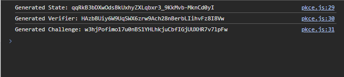

> **Вопрос:** Почему code_challenge передаётся в /authorize, а code_verifier — в /token? Что если перепутать?
>
> **Ответ:** Этот механизм аналогичен безопасной проверке пароля по его хешу. На этапе `/authorize` передается только необратимый хеш (`code_challenge`), поскольку этот запрос проходит через браузер и может быть зафиксирован в истории, логах прокси-серверов или перехвачен расширениями. Раскрытие хеша безопасно, так как восстановить из него исходное значение криптографически сложно.
> 
> Исходный `code_verifier` раскрывается только на этапе POST-запроса к `/token`. Этот запрос идет напрямую от клиента к серверу в теле запроса, не отражаясь в URL, что делает передачу безопасной. Сервер самостоятельно вычисляет хеш от полученного `code_verifier` и сверяет его с сохраненным `code_challenge`. Совпадение доказывает, что инициатор запроса токена и инициатор запроса авторизации — одно и то же лицо.
> 
> При перепутывании параметров (отправка `verifier` в `/authorize` и `challenge` в `/token`) сервер попытается хешировать уже захешированный `challenge`. Результат не совпадет с сохраненным исходным `verifier`, сервер отклонит выдачу токена, и процесс авторизации будет прерван.

### Задание 11. Login flow

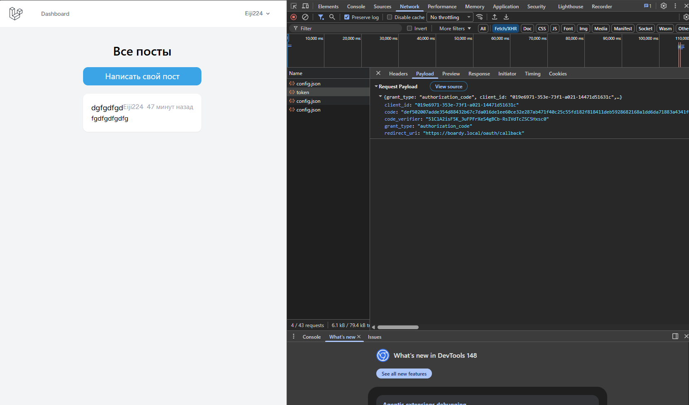

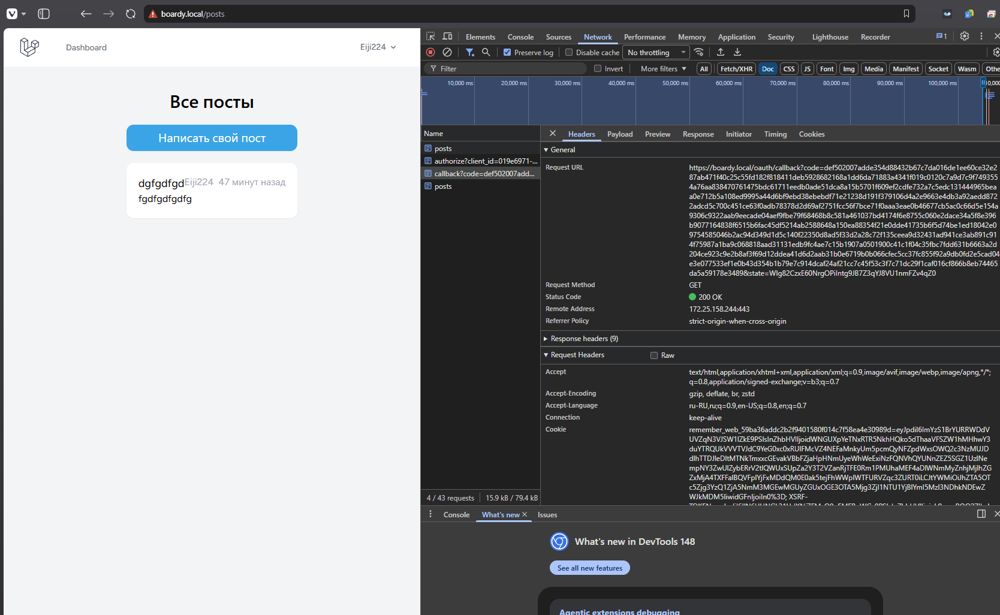

### Задание 12. Обмен code на токены

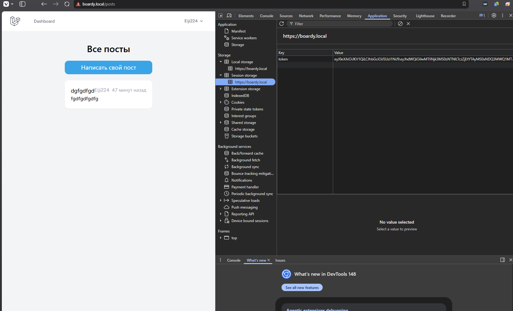

> **Вопрос:** Что произойдёт если убрать проверку state? Какая атака возможна?
>
> **Ответ:** Параметр `state` представляет собой криптографически стойкую случайную строку (nonce), которую клиент генерирует и сохраняет в `sessionStorage` перед перенаправлением на сервер авторизации, а затем сверяет при возврате на `/oauth/callback`.
> 
> Отсутствие этой проверки открывает дверь для **атаки с привязкой сессии**. Злоумышленник может инициировать процесс авторизации для *своего* аккаунта, получить валидный `authorization_code`, а затем заманить жертву по специально сформированной ссылке: `https://gorgeous.ai-info.ru/oauth/callback?code=<код_атакующего>`. Браузер жертвы выполнит обмен кода на токены и сохранит `access_token`, принадлежащий атакующему. В результате жертва будет неосознанно работать в сессии злоумышленника, передавая ему свои данные или совершая действия от его имени.
> 
> Проверка `state` предотвращает это: сгенерированный жертвой `state` не совпадет с тем, который пришел в поддельном URL, и клиентский метод `handleCallback()` выбросит исключение, прервав процесс до обмена кода.

### Задание 13. Refresh token в HttpOnly cookie

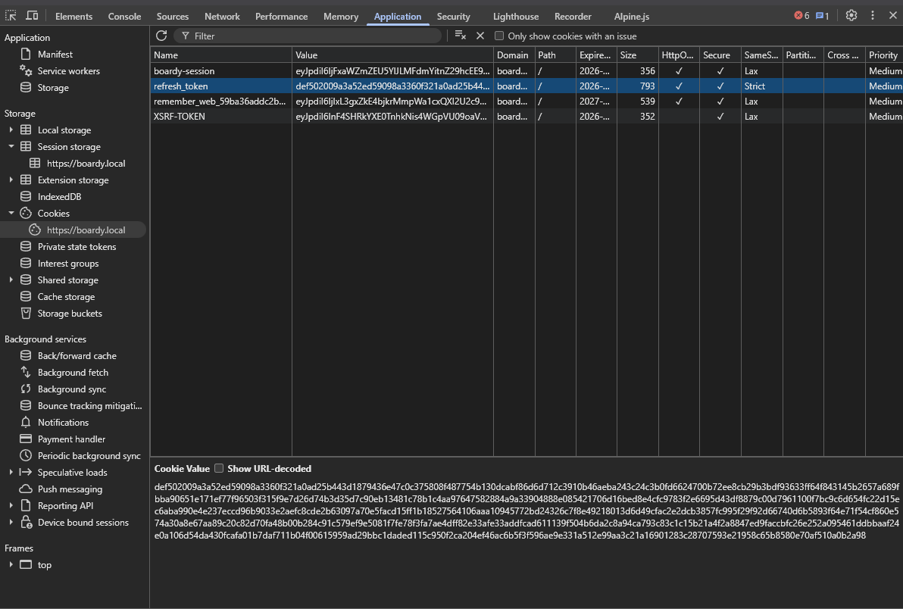

> **Вопрос:** Что случится если refresh положить в localStorage и сайт получит XSS?
>
> **Ответ:** Хранилище `localStorage` полностью доступно для любого JavaScript-кода, выполняющегося в рамках данного домена (origin). В случае успешной XSS-атаки (Cross-Site Scripting) внедренный скрипт сможет одной командой извлечь refresh-токен и передать его на подконтрольный злоумышленнику сервер. Учитывая, что срок жизни refresh-токена составляет 30 дней, атакующий получит долгосрочный доступ к аккаунту жертвы. Этот доступ сохранится даже после смены пароля или выхода из системы, пока токен не истечет или не будет принудительно отозван.
> 
> Использование флага `HttpOnly` для cookie нейтрализует эту угрозу: браузер блокирует любой доступ к такой cookie из JavaScript (она не видна в `document.cookie`). Cookie будет автоматически прикрепляться только к легитимным запросам на эндпоинт `/oauth/token`. Даже при наличии XSS, злоумышленник не сможет украсть сам refresh-токен для использования вне браузера жертвы, что значительно снижает масштаб ущерба.

### Задание 14. Silent refresh

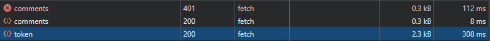

## Часть Д. Redis Pub/Sub

### Задание 15. Redis установлен

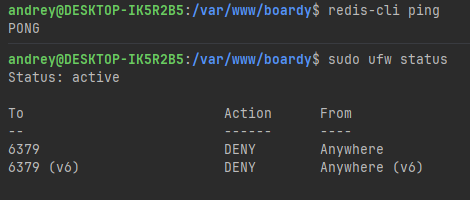

### Задание 16. Laravel publish new_post

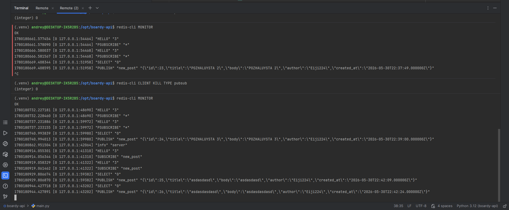

> **Вопрос:** Чем Redis::publish архитектурно лучше Http::post() к FastAPI?
>
> **Ответ:** Архитектурные преимущества `Redis::publish` перед прямыми HTTP-вызовами (`Http::post`) заключаются в следующем:
> - **Снижение связности (Loose Coupling):** При использовании HTTP Laravel вынужден знать точный URL и формат API-контракта сервиса FastAPI. Любое изменение эндпоинта или хоста приведет к поломке кода Laravel. В модели Pub/Sub обе стороны знают лишь имя канала (`new_post`) и схему сообщения, оставаясь полностью независимыми. Добавление новых подписчиков в будущем не потребует изменений в коде Laravel.
> - **Повышение отказоустойчивости:** Если сервис FastAPI временно недоступен, синхронный `Http::post()` завершится ошибкой (timeout), что может привести к ошибке для пользователя при создании поста, даже если Laravel успешно сохранил данные. При использовании `Redis::publish` сообщение мгновенно помещается в брокер; когда FastAPI поднимется и переподключится, базовая операция создания поста в Laravel не будет заблокирована для пользователя.
> - **Рост производительности:** Синхронный HTTP-запрос требует установления TCP-соединения, рукопожатия TLS, сериализации и парсинга ответа, что занимает десятки миллисекунд и блокирует рабочий процесс. Команда `Redis::publish` выполняется через локальное или оптимизированное сетевое соединение за единицы миллисекунд, не блокируя основной поток выполнения Laravel.

### Задание 17. FastAPI subscriber на new_post

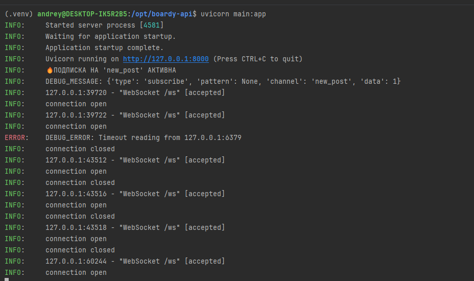

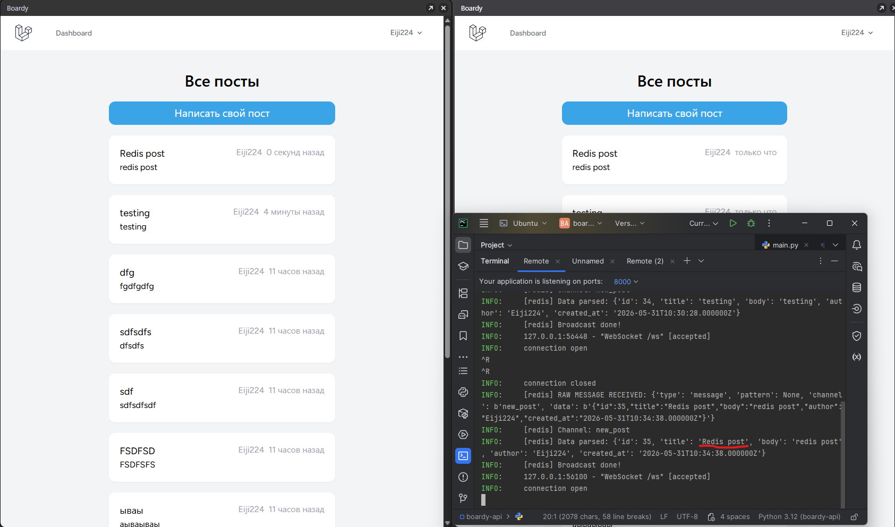

### Задание 18. User observer и user.renamed

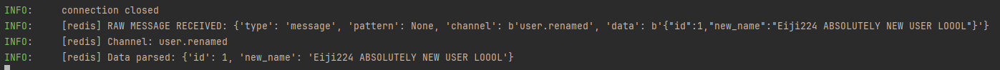

> **Вопрос:** Почему UserObserver вызывается автоматически? Где это магия Laravel?
>
> **Ответ:** Автоматический вызов методов `UserObserver` обеспечивается встроенным механизмом событий модели (Model Events) в ORM Eloquent. В процессе выполнения методов `save()` или `update()`, Eloquent автоматически генерирует и диспатчит события на различных этапах жизненного цикла записи: `creating`, `created`, `updating`, `updated`, `saving`, `saved`, `deleting`, `deleted` и `restored`.
> 
> Конструкция `User::observe(UserObserver::class)` действует как глобальный регистратор: она связывает методы класса-наблюдателя с одноименными событиями модели. Например, наличие метода `updated(User $user)` предписывает Laravel вызвать его сразу после успешного события `updated`.
> 
> Внутри этого метода используется вызов `$user->wasChanged('name')`. Это необходимая оптимизация от Eloquent, которая проверяет, было ли изменено конкретное поле (`name`) в текущем запросе. Это гарантирует, что событие `user.renamed` будет опубликовано в Redis только при фактическом изменении имени, игнорируя обновления других полей (например, email или пароля), что предотвращает генерацию избыточных событий.

### Задание 19. Денормализация имени

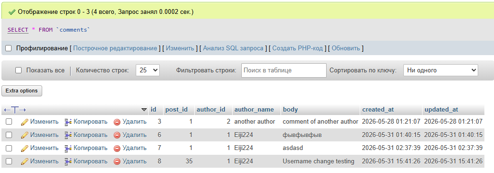

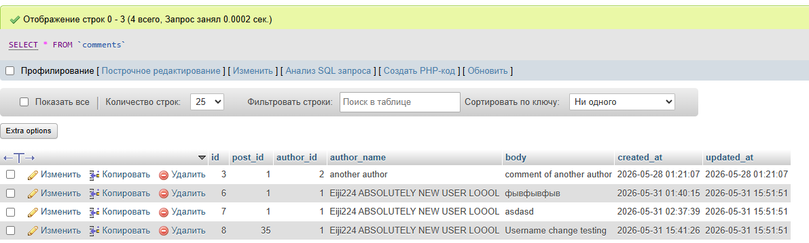

> **Вопрос:** Что такое eventual consistency? Когда между сменой имени и обновлением comments может быть задержка?
>
> **Ответ:** **Согласованность в конечном счете (Eventual consistency)** — это архитектурная модель распределенных систем, в которой данные в различных сервисах могут временно находиться в рассинхронизированном состоянии, но при отсутствии новых обновлений гарантированно придут к единому корректному состоянию через определенный промежуток времени.
> 
> После выполнения `$user->update(['name' => 'NewName'])`:
> 1. В `boardy_db.users.name` имя меняется мгновенно.
> 2. UserObserver публикует событие `user.renamed` в Redis.
> 3. FastAPI subscriber получает сообщение и выполняет массовое обновление `author_name` в своих записях `comments`.
> 
> Задержка (или потенциальная потеря) синхронизации может возникнуть в следующих ситуациях:
> - **Недоступность подписчика:** Если сервис FastAPI перезагружается или падает, он может пропустить сообщение из Redis Pub/Sub (так как это паттерн fire-and-forget без сохранения истории), и денормализация не сработает вовсе.
> - **Очереди и пиковые нагрузки:** При наличии единственного подписчика и высокой частоте обновлений (сотни изменений в секунду), обработка сообщений будет выстраиваться в очередь, увеличивая время задержки.
> - **Сетевые лаги:** Задержки в канале связи между Laravel и Redis или между Redis и FastAPI.
> - **Длительные операции в БД:** Если у пользователя миллионы комментариев, выполнение запроса `UPDATE comments SET author_name=... WHERE author_id=...` может занять значительное время.

## Часть Е. Финальные проверки

### Задание 20. Два браузера: посты в реалтайме

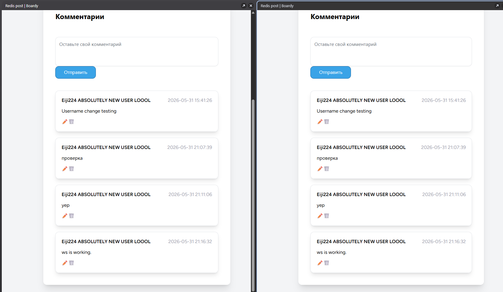

### Задание 21. Два браузера: комментарии в реалтайме

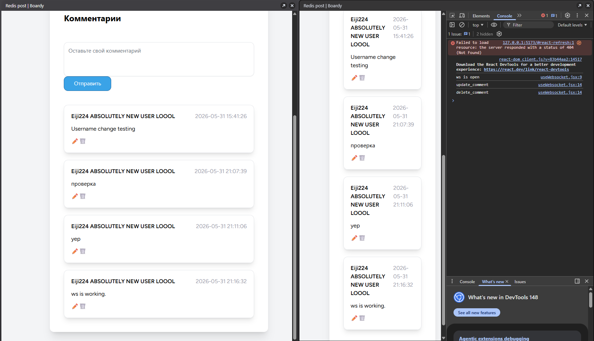

### Задание 22. Никаких прямых HTTP-вызовов

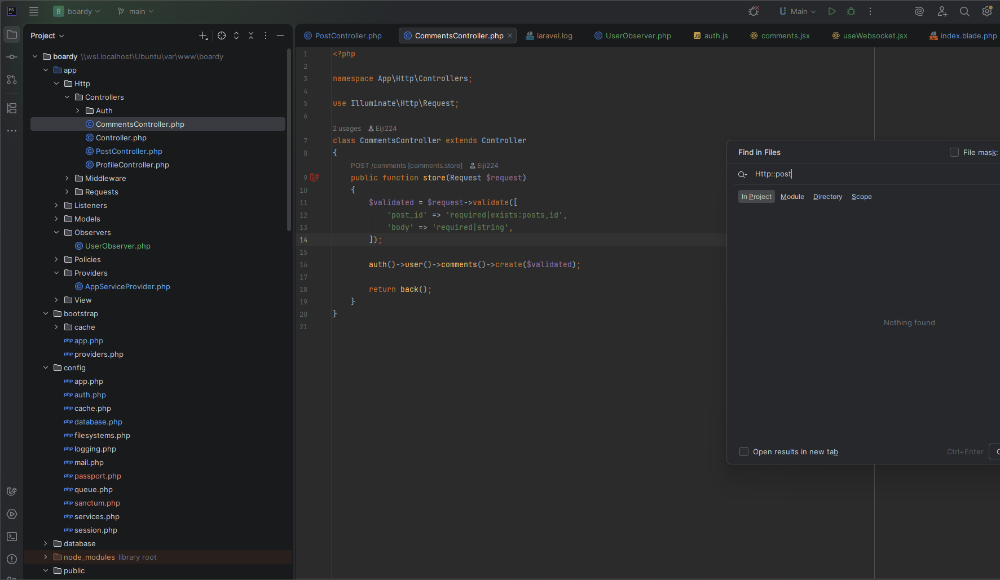

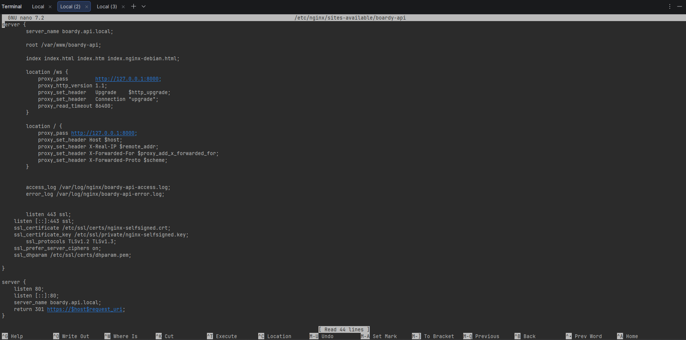
