# Отчёт по практике 15 — Docker и Docker Compose

## Часть A. Dockerfile для Laravel

### 1. PHP-FPM с расширениями

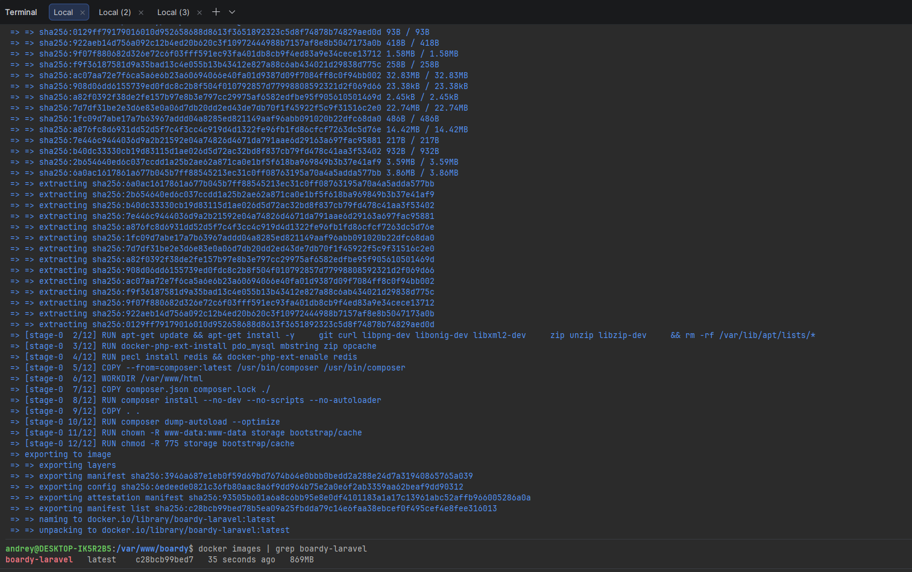

**Зачем PHP-FPM, а не Apache+PHP?**
Архитектура PHP-FPM (FastCGI Process Manager) предполагает выделение процесса обработки PHP-кода в отдельный пул, который взаимодействует с веб-сервером (например, Nginx) по протоколу FastCGI. Это позволяет Nginx эффективно отдавать статический контент и выступать в роли обратного прокси, в то время как PHP-FPM изолированно выполняет динамическую логику. В противовес этому, модуль `mod_php` для Apache встраивает интерпретатор PHP непосредственно в каждый процесс веб-сервера, что делает архитектуру монолитной, менее производительной и сложной для оптимизации в условиях контейнеризации.

### 2. Кеширование composer-зависимостей

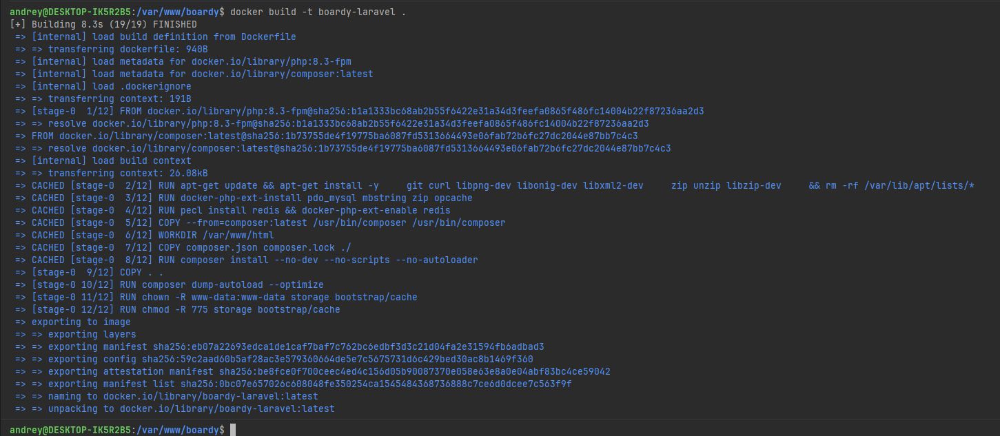

**Что произойдёт, если COPY всего проекта сделать ДО composer install?**
Процесс сборки Docker-образа основан на послойной архитектуре и механизме кэширования. Если инструкция `COPY . .` (копирование всех файлов проекта) будет выполнена до `composer install`, то любое, даже незначительное изменение в исходном коде (например, в `README.md` или контроллере) приведет к инвалидации кэша этого слоя. Как следствие, все последующие слои, включая установку зависимостей, будут пересобираться с нуля. Это критически замедлит процесс сборки, так как при каждом коммите Docker будет вынужден заново скачивать и устанавливать все пакеты из `composer.json`, игнорируя ранее сохраненный кэш.

### 3. .dockerignore

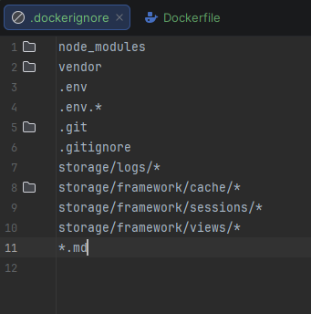

**Что произойдёт, если не исключить `.env` из образа?**
Файл `.env` является хранилищем конфиденциальной информации: паролей к базам данных, приватных API-ключей, токенов авторизации и криптографического `APP_KEY`. Если не добавить его в файл `.dockerignore`, он будет скопирован внутрь Docker-образа и физически сохранен в одном из слоев его файловой системы. Поскольку образы часто передаются через публичные или корпоративные реестры, это приведет к прямой и необратимой утечке учетных данных (credentials), что создает критическую уязвимость безопасности.

## Часть Б. Dockerfile для FastAPI

### 4. requirements.txt

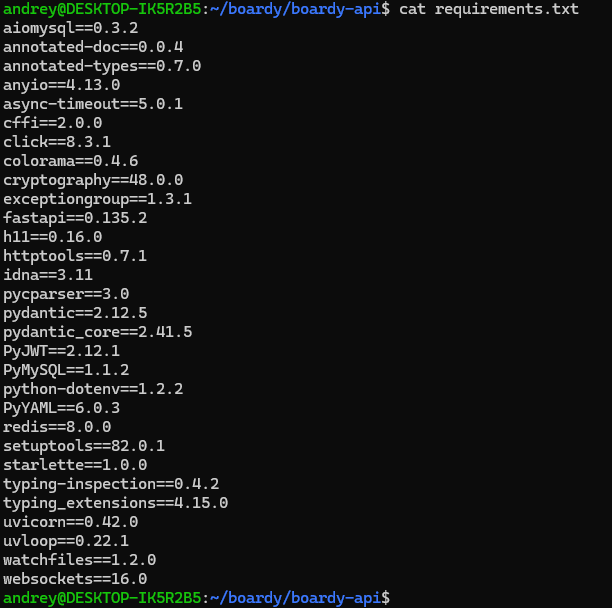

**Почему версии фиксируем, а не пишем `latest`?**
Жесткая фиксация версий зависимостей (например, `fastapi==0.100.0`) гарантирует воспроизводимость (reproducibility) сборки. Если использовать нефиксированные версии или теги вроде `latest`, то при каждой пересборке образа менеджер пакетов `pip` будет устанавливать последние доступные релизы. Спустя некоторое время выход мажорных версий библиотек с обратно несовместимыми изменениями (breaking changes) приведет к тому, что ранее стабильно работающий код перестанет компилироваться или выполнится с ошибками. Фиксация версий обеспечивает детерминированное поведение окружения независимо от времени сборки.

### 5. Сборка образа FastAPI

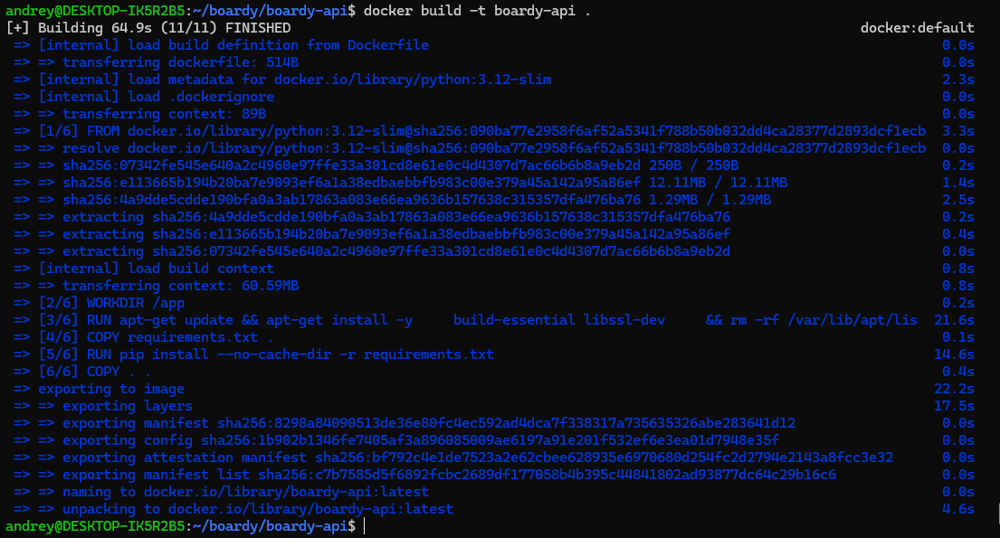

### 6. CMD с правильным host

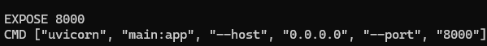

**Почему `--host 0.0.0.0`, а не `127.0.0.1`?**
В контексте сетевых интерфейсов контейнера адрес `127.0.0.1` (localhost) указывает исключительно на внутренний loopback-интерфейс самого контейнера. Поскольку Nginx и FastAPI работают в изолированных контейнерах и взаимодействуют через виртуальную Docker-сеть, запросы от Nginx приходят на внешний сетевой интерфейс контейнера с FastAPI. Если Uvicorn будет сконфигурирован на прослушивание только `127.0.0.1`, он будет отклонять все входящие соединения извне. Указание `--host 0.0.0.0` предписывает серверу принимать соединения на всех доступных сетевых интерфейсах контейнера, делая его доступным для других сервисов в Docker-сети.

## Часть В. Конфиг Nginx

### 7. docker/nginx/default.conf

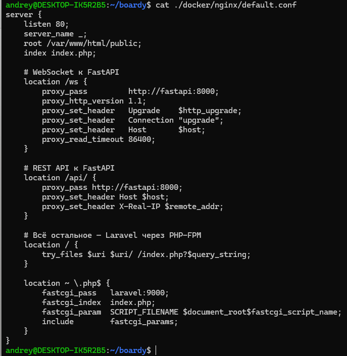

**Почему `laravel:9000`, а не `127.0.0.1:9000`?**
В экосистеме Docker Compose реализован встроенный механизм service discovery (обнаружения сервисов) на базе собственного DNS-сервера. Все контейнеры, подключенные к одной пользовательской сети, могут обращаться друг к другу по имени сервиса, указанного в `docker-compose.yml`. Когда Nginx пытается установить соединение с `laravel:9000`, Docker DNS резолвит это имя во внутренний IP-адрес соответствующего контейнера. Использование `127.0.0.1` в данном контексте некорректно, так как этот адрес указывает на loopback-интерфейс самого контейнера Nginx, где процесс PHP-FPM физически отсутствует.

### 8. WebSocket location

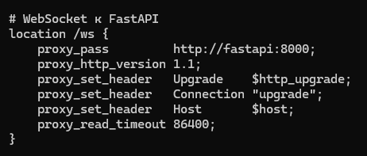

## Часть Г. docker-compose.yml

### 9. Пять сервисов

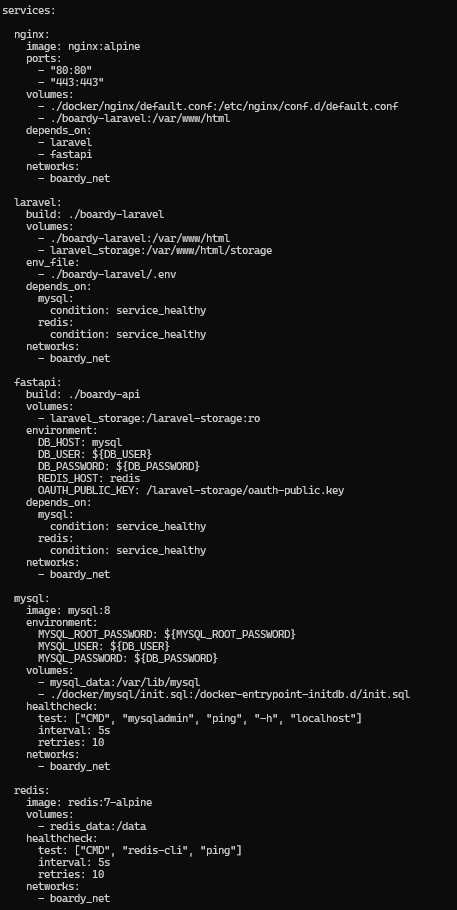

Здесь добавил volume в laravel с node_modules, чтоб работал frontend в laravel

### 10. Volumes

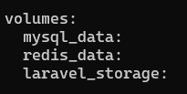

**Что произойдёт с данными MySQL без `mysql_data` volume после `docker compose down`?**
При отсутствии явно объявленного именованного volume (named volume) все данные, генерируемые базой данных, записываются в верхний (read-write) слой файловой системы контейнера. Выполнение команды `docker compose down` приводит к остановке и полному удалению контейнера вместе с его анонимными слоями. В результате все накопленные данные (таблицы, индексы, конфигурации) будут безвозвратно уничтожены.

**Чем именованный volume отличается от bind-mount?**
Именованный volume (named volume) полностью управляется демоном Docker: данные физически хранятся в специфичной для Docker директории на хосте (обычно `/var/lib/docker/volumes/`), абстрагируясь от файловой системы хоста, что обеспечивает высокую переносимость и безопасность. Bind-mount, в свою очередь, создает жесткую привязку к абсолютному пути в файловой системе хост-машины. Этот подход идеален для разработки (например, для hot-reload кода), но снижает уровень изоляции и делает конфигурацию зависимой от конкретной операционной системы и структуры директорий хоста.

### 11. Healthcheck для MySQL и Redis


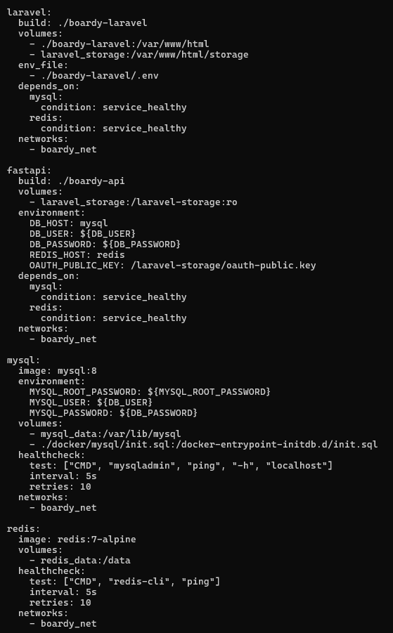

**Почему `depends_on` без `healthcheck` недостаточно?**
Директива `depends_on` по умолчанию гарантирует лишь строгий порядок старта контейнеров на уровне процесса их создания, но не контролирует фактическую готовность приложения внутри контейнера к приему соединений. Процессу MySQL после запуска контейнера требуется время на инициализацию системных таблиц и подготовку к работе. Если Laravel-контейнер стартует сразу вслед за MySQL, он попытается установить соединение с еще не готовой базой данных и получит ошибку отказа в подключении (race condition). Использование `condition: service_healthy` в связке с директивой `healthcheck` предписывает Docker Compose ожидать, пока встроенный скрипт проверки (например, `mysqladmin ping`) не подтвердит, что сервис перешел в состояние `healthy`, и только после этого запускать зависимые контейнеры.

### 12. init.sql для двух БД

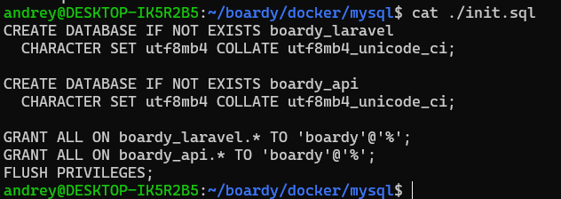


**Почему `init.sql` выполняется только при первом запуске?**
Официальный Docker-образ MySQL спроектирован так, что скрипты инициализации, расположенные в директории `/docker-entrypoint-initdb.d/`, выполняются строго один раз — в момент создания новой, пустой базы данных. Это происходит только при первом запуске контейнера с чистым (неинициализированным) именованным volume. Если volume `mysql_data` уже содержит структуру и данные, entrypoint-скрипт определяет, что база уже инициализирована, и пропускает выполнение SQL-файлов. Следовательно, любые изменения в `init.sql` после первого успешного запуска не будут применены автоматически.

### 13. Два .env файла

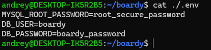

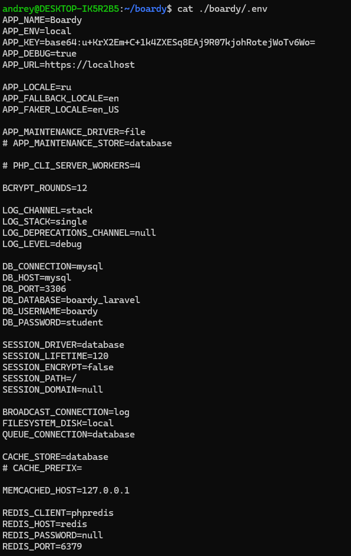

Здесь также был изменен APP_URL и другие .env конфиги для адаптации под docker. В том числе SESSION_DOMAIN

**Зачем два разных `.env`?**
Разделение конфигураций обусловлено разными областями применения. Корневой файл `.env` находится в контексте выполнения Docker Compose и используется для интерполяции переменных внутри `docker-compose.yml` (например, для передачи паролей баз данных в переменные окружения контейнеров). Файл `.env` внутри директории Laravel является конфигурацией самого PHP-приложения (фреймворка). Такое разграничение позволяет независимо управлять инфраструктурными параметрами оркестратора и бизнес-логикой приложения, избегая дублирования и конфликтов имен переменных.

**Почему `DB_HOST=mysql`, а не `127.0.0.1`?**
Как упоминалось ранее, в изолированной среде контейнера адрес `127.0.0.1` указывает исключительно на его собственный loopback-интерфейс, где процесс сервера баз данных не запущен. Значение `mysql` в переменной `DB_HOST` соответствует имени сервиса, объявленного в `docker-compose.yml`. Благодаря встроенному DNS-серверу Docker, это имя динамически резолвится во внутренний IP-адрес контейнера с MySQL в рамках общей виртуальной сети (`boardy_net`), обеспечивая корректную маршрутизацию трафика между микросервисами.

## Часть Д. Запуск и проверка

### 14. docker compose up

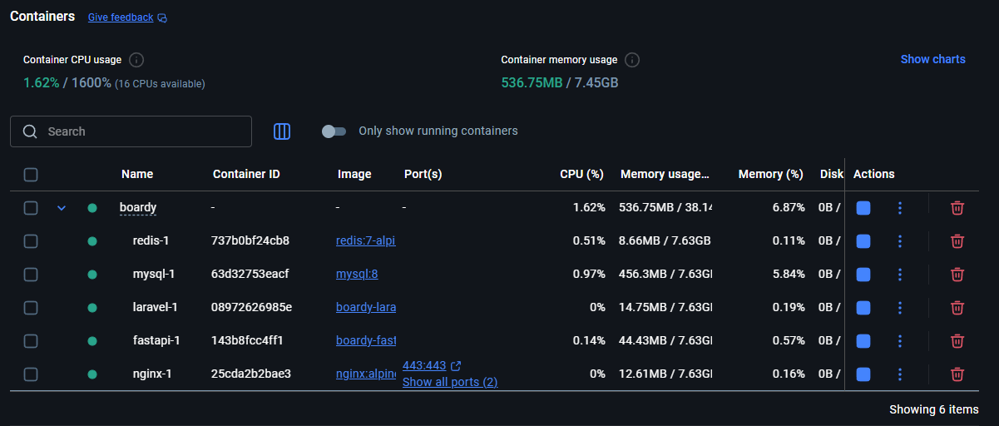

### 15. Миграции в контейнере

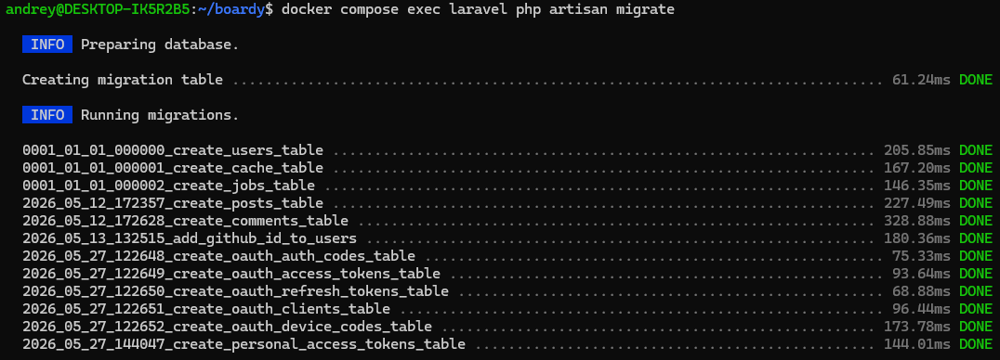

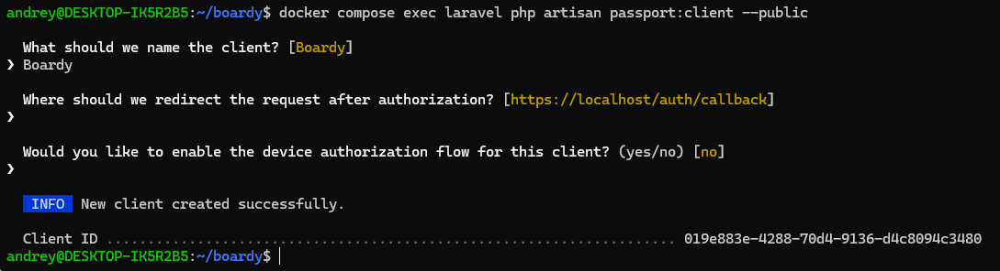

**Чем `docker compose exec` отличается от `docker compose run`?**
Команда `docker compose exec` предназначена для выполнения произвольных команд внутри *уже работающего* контейнера, используя его существующее окружение, сетевые интерфейсы и подключенные volumes. В отличие от нее, `docker compose run` создает и запускает *совершенно новый*, временный контейнер на основе того же образа, что и целевой сервис. Команда `run` обычно применяется для выполнения разовых задач (например, миграций или скриптов), изолированного тестирования или запуска команд, когда основной контейнер сервиса по какой-то причине не активен.

### 16. Приложение работает

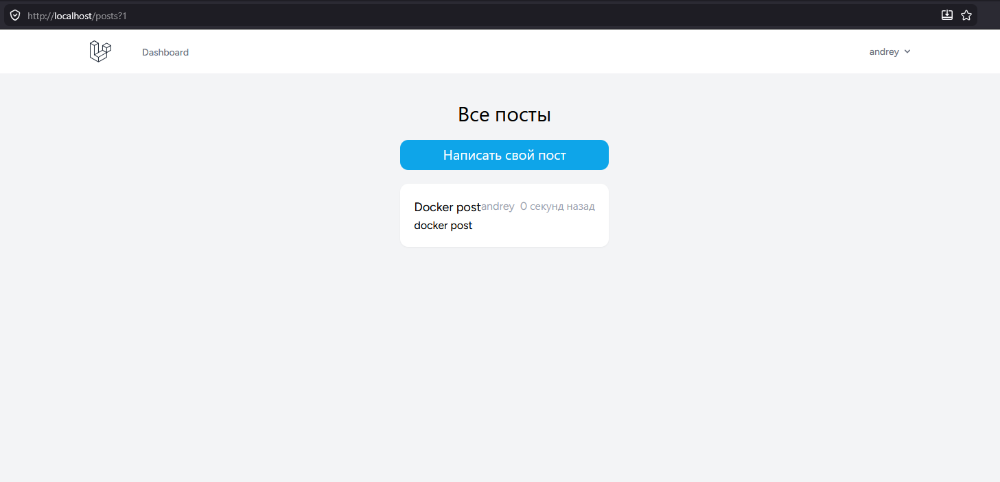

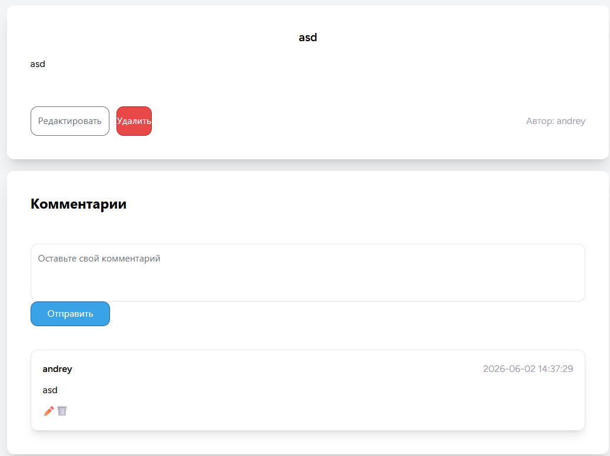

### 17. Реалтайм работает

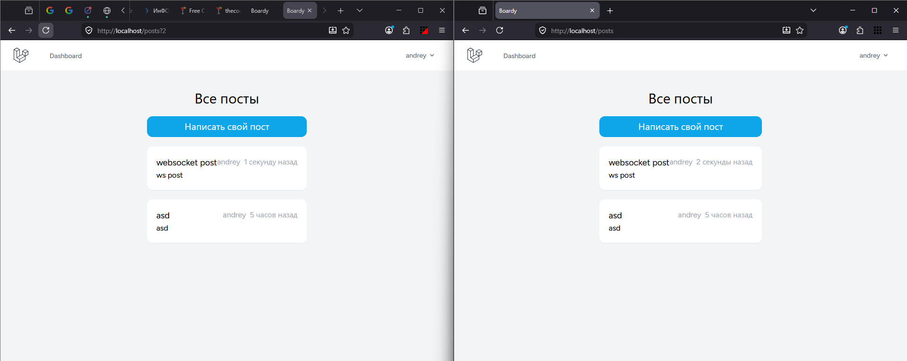

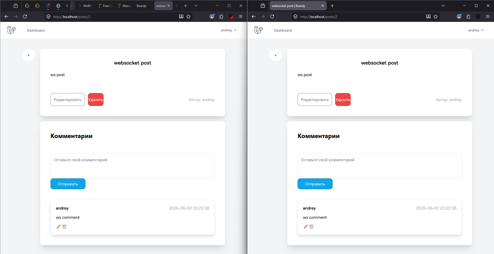

### 18. Данные переживают перезапуск

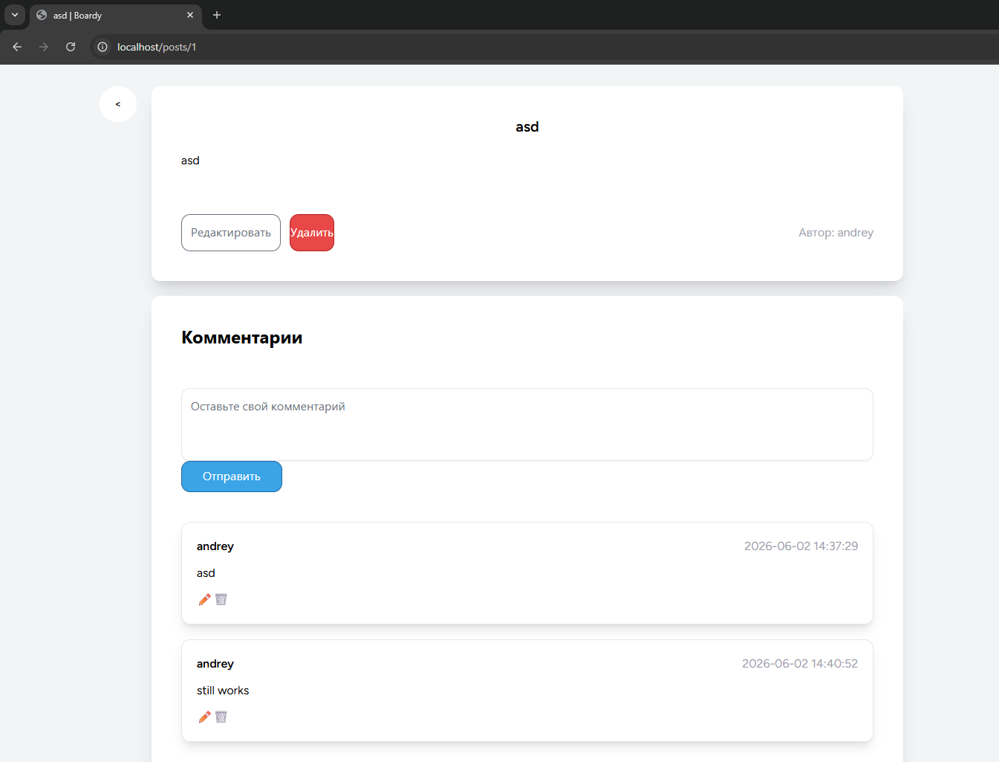

**Что произойдёт при `docker compose down -v`?**
Использование флага `-v` (или `--volumes`) при выполнении команды `docker compose down` предписывает Docker не только остановить и удалить контейнеры и созданные сети, но и принудительно уничтожить все именованные volumes, ассоциированные с данным Compose-проектом. Это приведет к полной и безвозвратной потере всех персистентных данных, хранящихся в базах данных MySQL и Redis (пользователей, постов, комментариев, сессий). Без этого флага volumes остаются нетронутыми на хост-машине, и данные успешно переживают остановку и последующий подъем инфраструктуры. Применение флага `-v` в продуктивной среде (production) крайне опасно и категорически не рекомендуется.

### 19. Централизованные логи

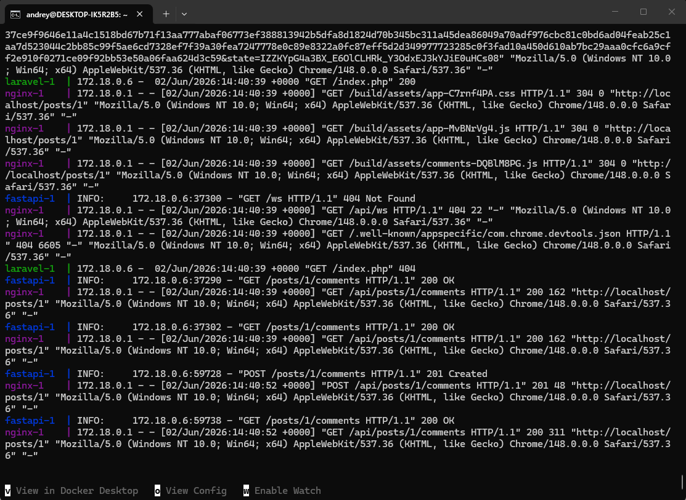

**Какие плюсы централизованных логов Docker по сравнению с `tail -f /var/log/*` на хосте?**
- **Агрегация и удобство навигации:** Логи всех запущенных сервисов объединяются в единый поток с возможностью фильтрации по имени конкретного контейнера, что устраняет необходимость открытия множества терминальных сессий.
- **Автоматическое обогащение метаданными:** Docker автоматически добавляет к каждой строке лога временную метку (timestamp) и идентификатор источника (имя сервиса/контейнера), упрощая анализ последовательности событий в распределенной системе.
- **Универсальность сбора:** Механизм логирования Docker перехватывает стандартные потоки вывода (`stdout` и `stderr`) процессов внутри контейнера. Это избавляет разработчиков от необходимости настраивать сложные механизмы ротации и маппинга файлов логов для каждого приложения, а также решает проблему логов, которые приложение пытается записать в несуществующие директории контейнера.

### 20. Чистая машина

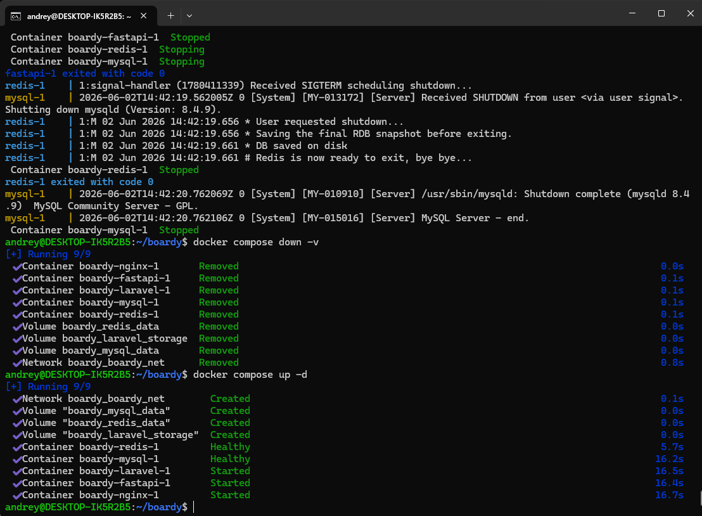

**Какая команда нужна на новой машине от клона репозитория до рабочего приложения?**
```bash
docker compose up -d --build
```