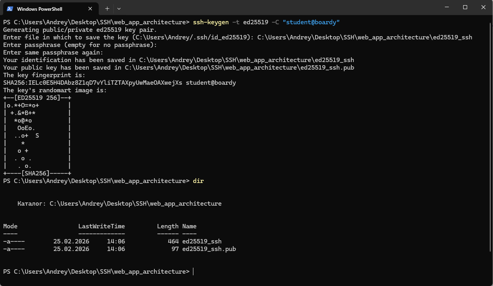
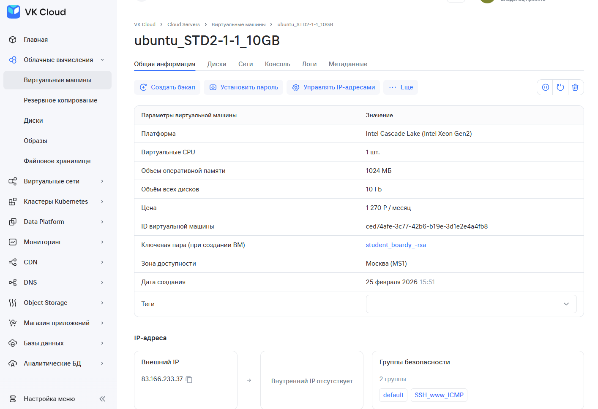
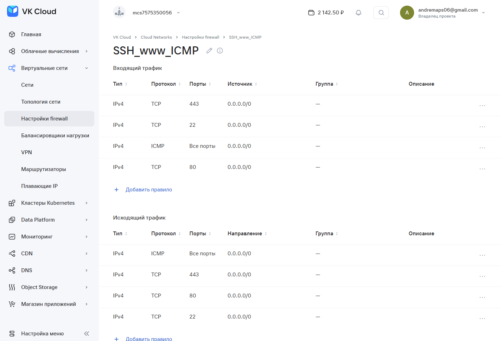
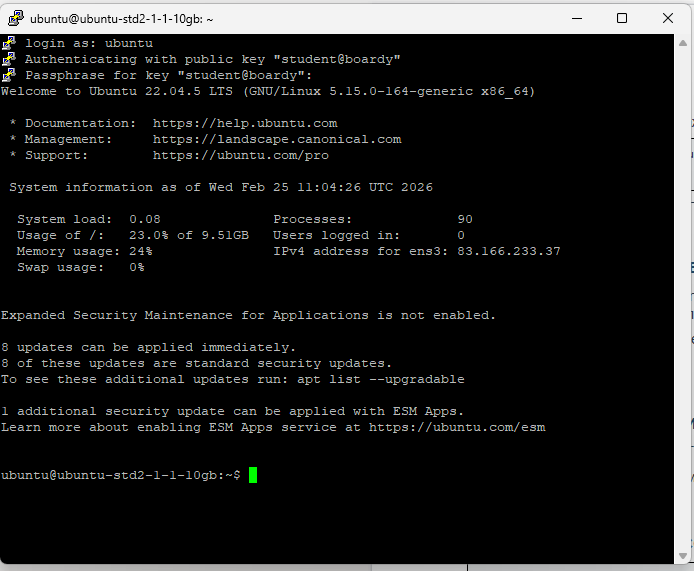
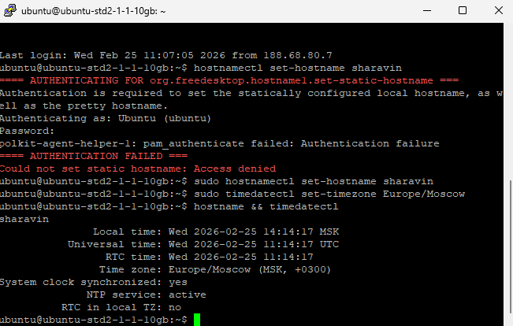
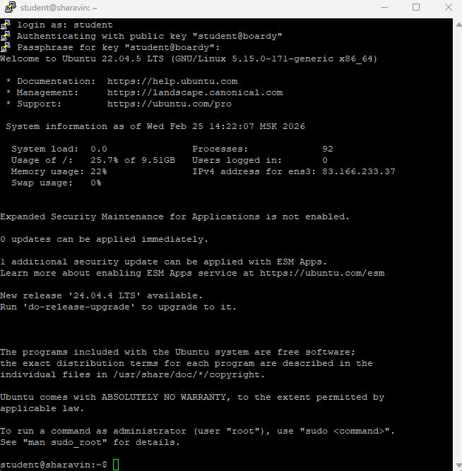
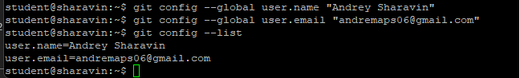
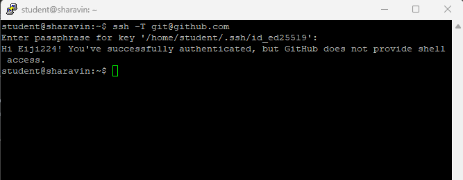
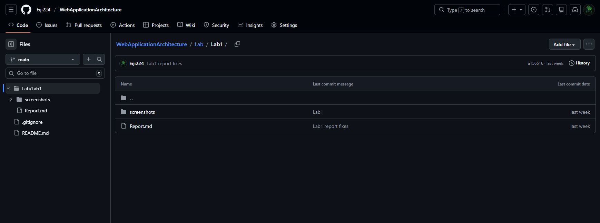

# Практика 2. VPS, SSH, GIT

1. SSH-ключ

2. VPS и файрвол

3. Подключение через PuTTY

4. Настройка сервера

5. Пользователь student

6. Git и SSH-ключ -> GitHub

7. Репозиторий и структура

8. Ветка и pull-request
