# Лабораторная работа №4 - HTTP, виртуальные хосты, проект Boardy

## Часть A. Виртуальный хост основного сайта
1. Директория проекта

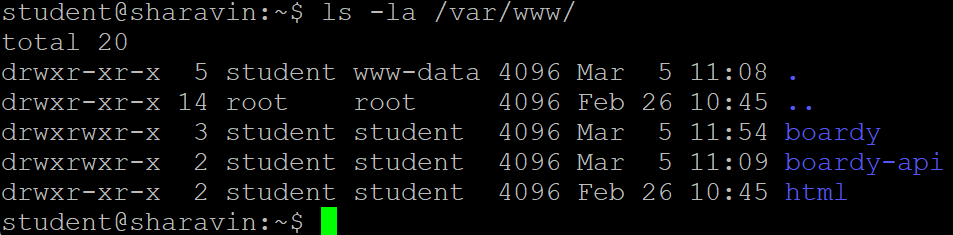

2. Конфиг виртуального хоста

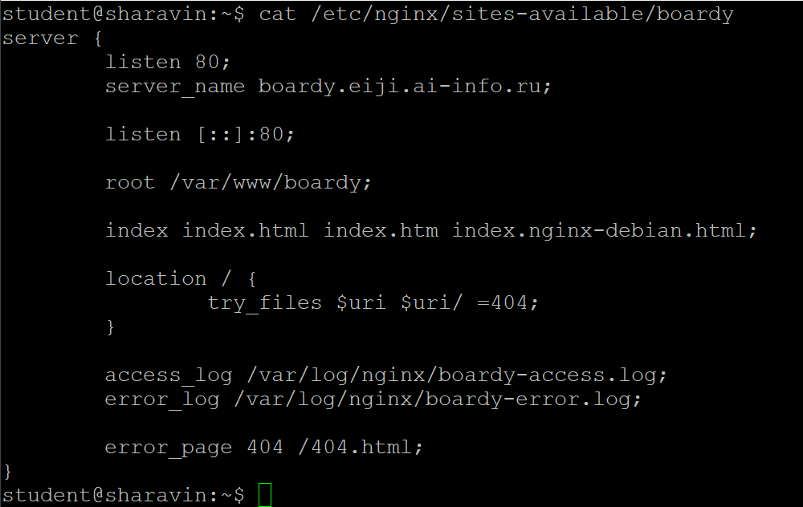

- **server_name** - название домена, по которому nginx определяет к какому из сайтов обращается клиент
- **root** - директория, в которой искать файлы для сайта
- **access_log** - путь к файлу, в котором логируются все запросы клиентов
- **error_log** - путь к файлу, в котором логируются все ошибки сервера
- **try_files** - отвечает за проверку существования файлов в директории. Если файлов нет - возвращает ошибку 404
- **error_page** - отвечает за отправку определённого файла, в зависимости от кода ошибки

## Часть B. Страницы проекта
3. Лендинг

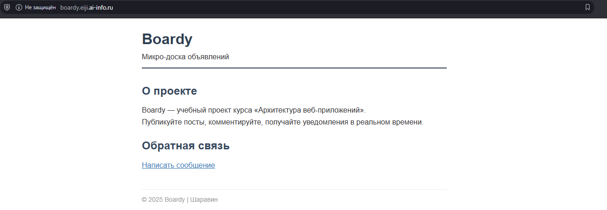

4. Форма обратной связи

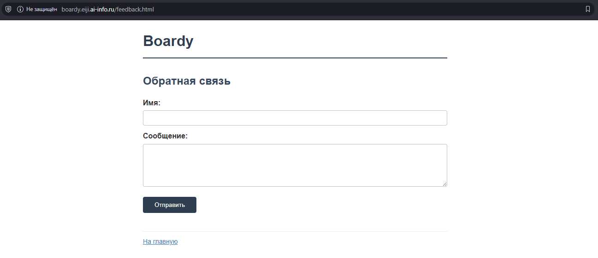

5. Стили и 404

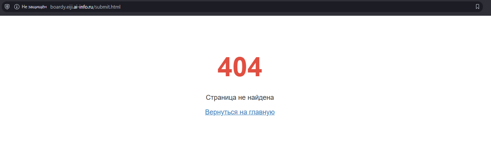

## Часть C. Второй виртуальный хост - API
6. DNS-запись для поддомена

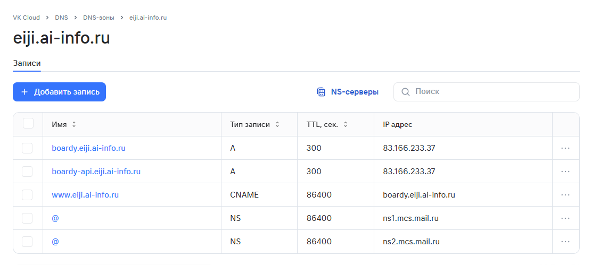

7. Проверка DNS

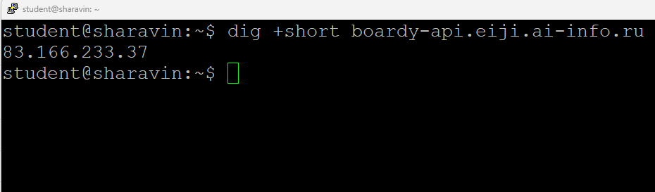

8. Конфиг и заглушка API

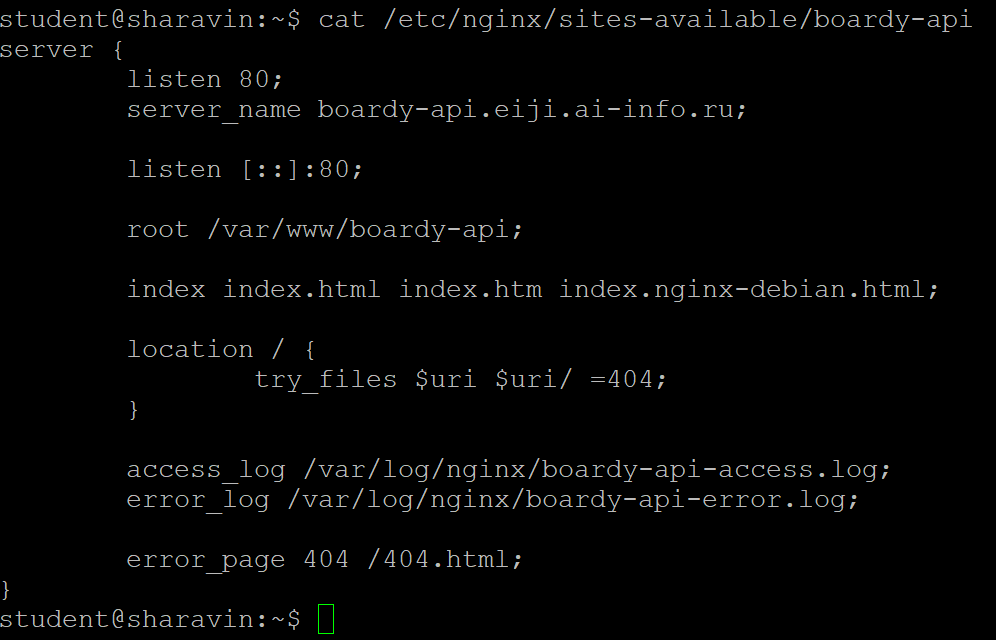

## Часть D. Исследование HTTP
9. GET-запрос через curl -v

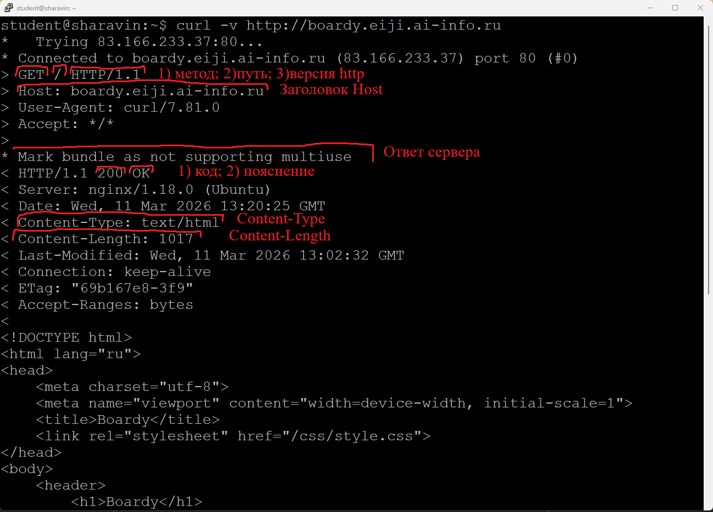

10. Виртуальные хосты в действии

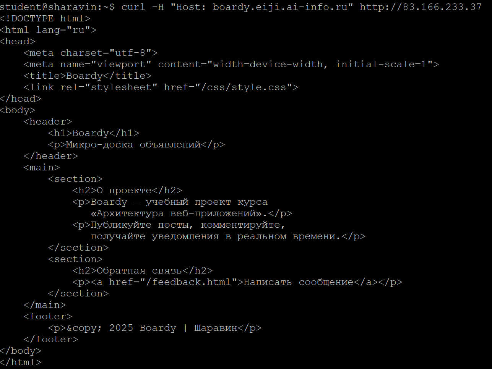

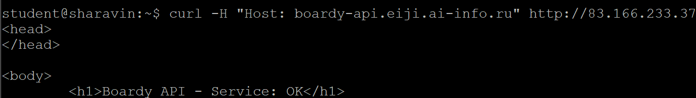

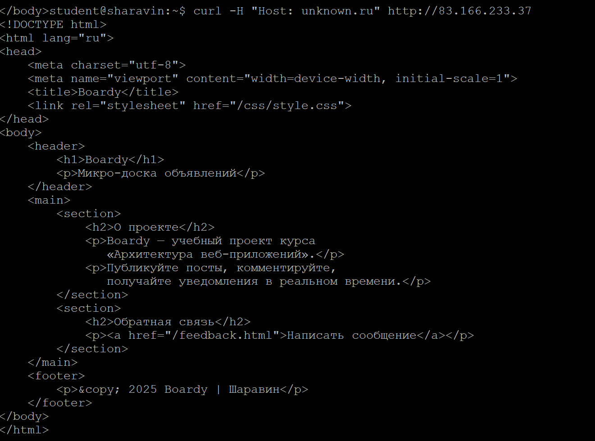

- Один IP-адрес может обслуживать множество сайтов благодаря HTTP-заголовку Host.
- Веб-сервер (nginx) использует этот заголовок для выбора правильной конфигурации (virtual host).
  - Если Host совпадает с настроенным server_name → отдаётся соответствующий сайт
  - Если Host не найден → срабатывает default_server (первый или явно помеченный)
- Это позволяет размещать десятки сайтов на одном сервере с одним IP-адресом, экономя ресурсы.
- В третьем запросе nginx не нашёл *unknown.ru* в конфигурации и вернул сайт по умолчанию - *boardy.eiji.ai-info.ru*

11. POST-запрос

- В этом задании у Вас была допущена ошибка: страницы *submit.html* не существует (вернулась бы 404), поэтому я отправил запрос на страницу *index.html*

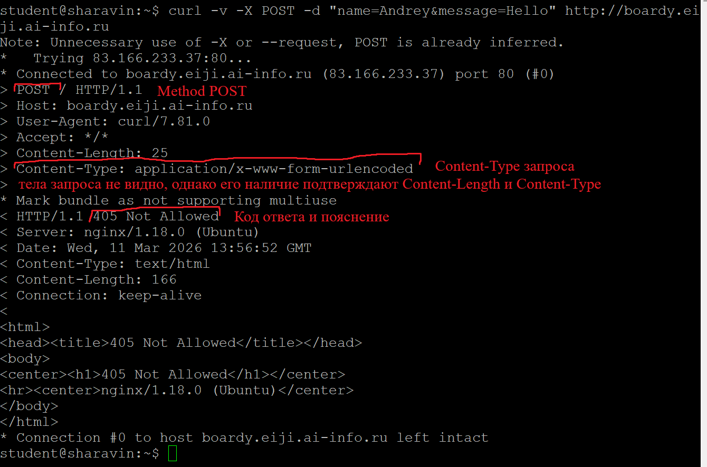

- Сервер nginx вернул 405, потому что boardy.eiji.ai-info.ru - это статический сайт, который настроен только на отдачу файлов (метод GET), он не умеет обрабатывать POST-запросы

12. HEAD-запрос

- Метод HEAD - это облегчённый метод GET: он возвращает те же заголовки, но без тела ответа
- Это позволяет эффективно проверять существование ресурса, его метаданные и актуальность кэша, экономя трафик и время

## Часть E. Логи
13. Раздельные логи

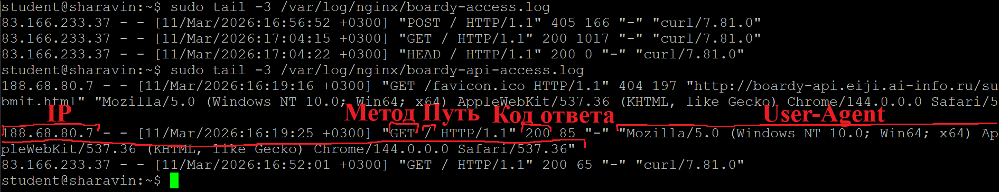

14. Фильтрация логов

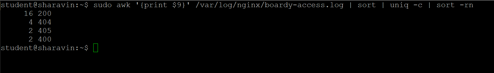