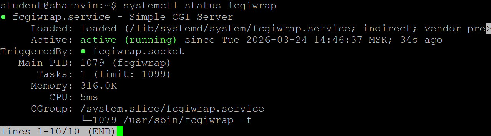
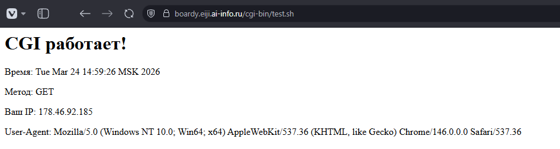
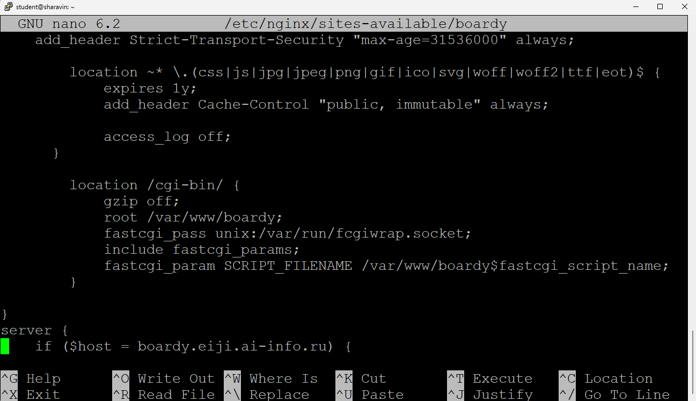
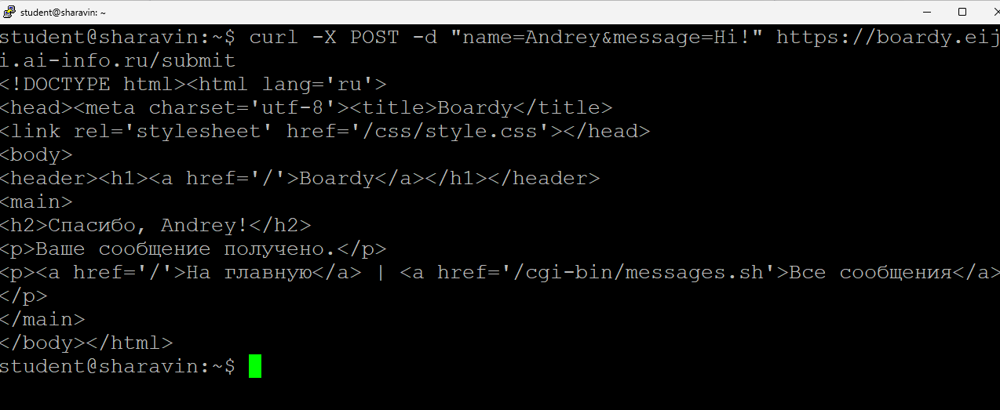
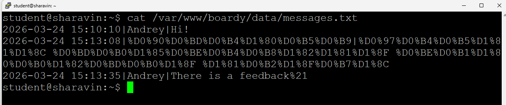
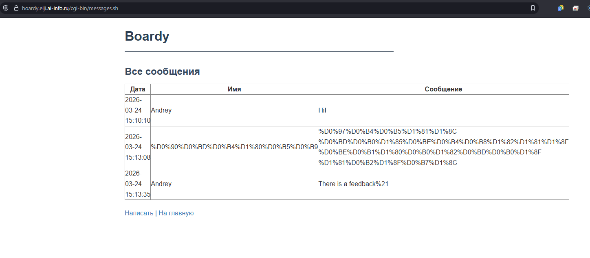
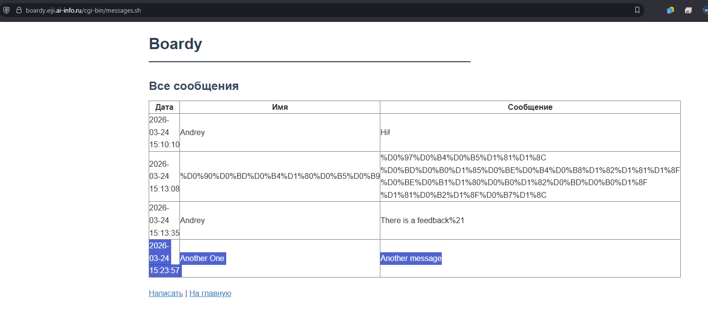
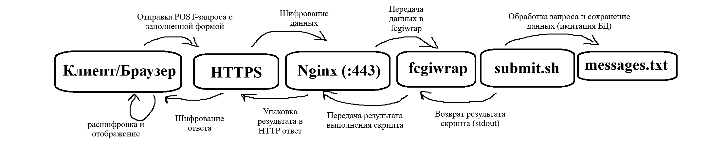
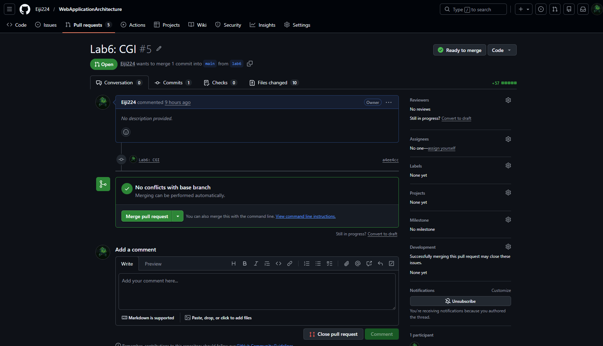

# CGI

## Часть A. CGI-скрипт

1. Установка fcgiwrap

2. Тестовый скрипт

3. Конфигурация Nginx

## Часть B. Форма Boardy

4. Скрипт обработки формы

5. Форма в браузере

6. Данные на диске

## Часть C. Страница сообщений

7. Скрипт вывода сообщений

8. Полный цикл

## Часть D. Анализ

9. Путь запроса

10. Теоретические вопросы
     - Что такое CGI и какую проблему он решил в 1993 году?
       - CGI - интерфейс, который позволяет веб-серверу запускать программы так, как если бы их запускал человек. В 1993 году он решил проблему статичности веба, дав возможность создавать интерактивные приложения, вместо простых HTML-страниц
     - Как CGI-скрипт получает данные POST-запроса?
        - Веб-сервер передаёт данные POST-запроса CGI-скрипту через стандартный поток ввода (stdin). Дополнительно сервер устанавливает переменную окружения CONTENT_LENGTH, чтобы скрипт знал, сколько байт необходимо прочитать из этого потока
     - Почему CGI создаёт проблемы при высокой нагрузке?
        - Для каждого запроса сервер создаёт новый процесс, что требует значительных затрат CPU и памяти на инициализацию и завершение. При высокой нагрузке это приводит к быстрому исчерпанию ресурсов сервера и существенному замедлению обработки запросов из-за накладных расходов на создание процессов
     - Чем отличается fastcgi_pass от proxy_pass?
        - fastcgi_pass использует специализированный протокол FastCGI для связи с постоянными процессами приложения, что эффективнее для выполнения кода. proxy_pass перенаправляет запрос по обычному HTTP/HTTPS на другой сервер, выступая в роли обратного прокси, что универсальнее, но может быть менее производительно для локальных скриптов
     - Зачем нужен fcgiwrap, если Apache запускает CGI напрямую?
       - В отличие от Apache, nginx не поддерживает запуск CGI-скриптов напрямую, поэтому fcgiwrap выступает посредником, оборачивая CGI в протокол FastCGI. Это позволяет лёгким серверам вроде nginx выполнять CGI-скрипты без необходимости перехода на полноценный сервер приложений

# Pull Request

