# Практика 7. PHP-FPM и FastAPI

## Часть A. PHP-FPM

1. Установка PHP-FPM

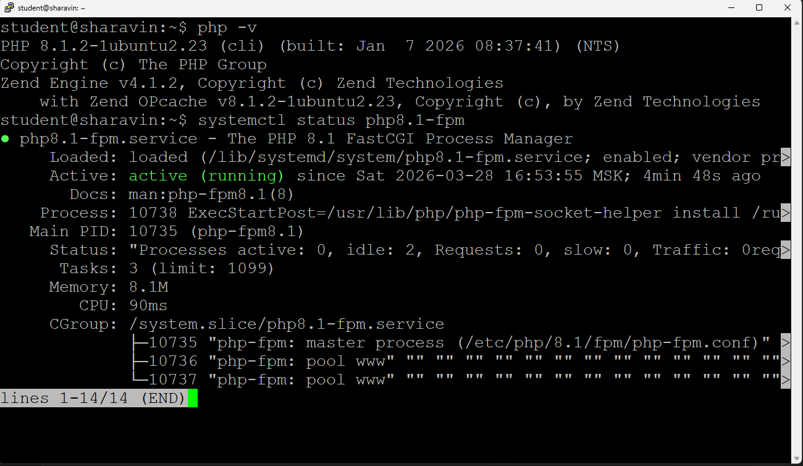

2. Форма и сообщения на PHP

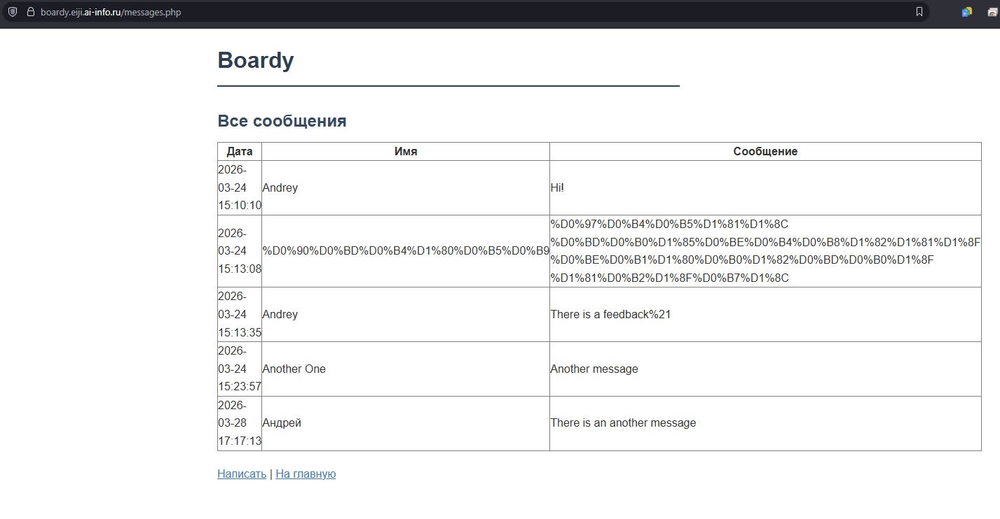

3. Конфиг для Nginx для PHP

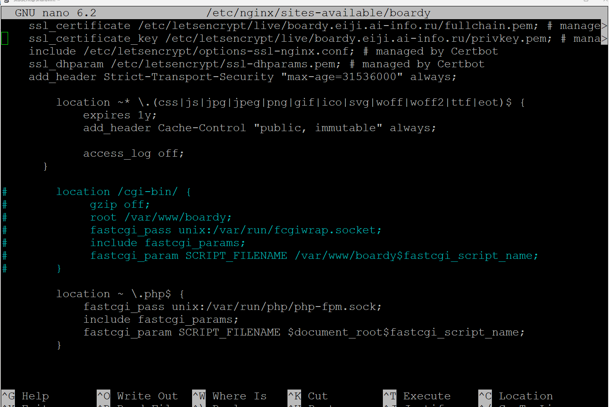

PHP-FPM использует пул постоянных процессов, обрабатывающих множество запросов без перезапуска, в то время как CGI через fcgiwrap создает новый процесс для каждого отдельного запроса. Это делает PHP-FPM быстрее, так как исключает накладные расходы на постоянную инициализацию и завершение процессов

4. Shared nothing

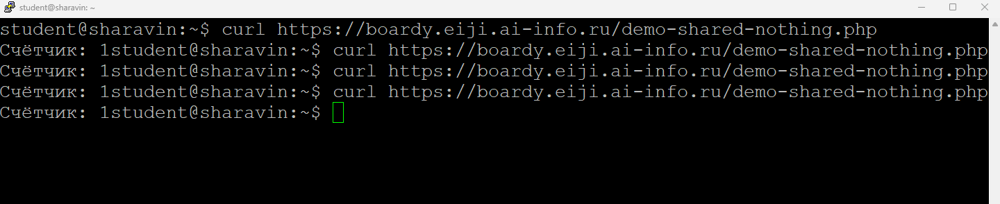

- Почему счётчик не растёт?
  - Потому что PHP работает в архитектуре shared nothing - каждый HTTP-запрос создаёт новую, изолированную среду выполнения
  - Переменная счётчика инициализируется заново при каждом запросе, выполняется скрипт, и после ответа все данные уничтожаются. Следующий запрос начинает с чистого листа
- Что такое Shared Nothing?
  - Это архитектура, при которой:
    -  Каждый запрос обрабатывается независимо от других
    -  Нет общего состояния между запросами
    -  Переменные, ресурсы, подключения - всё создаётся заново и уничтожается после ответа

5. Блокировка воркеров

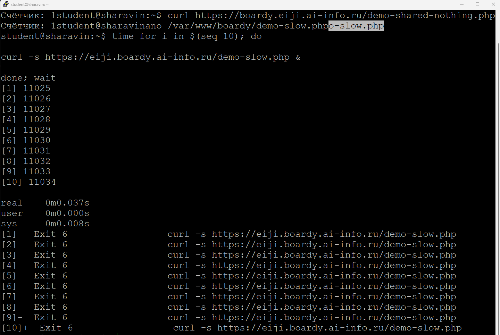

- По умолчанию у PHP-FPM 5 воркеров
- Если мы шлём одновременно 10 запросов, 5 запросов сразу берутся в работу воркерами, оставшиеся 5 встают в очередь Nginx

## Часть B. FastAPI

6. Установка и приложение

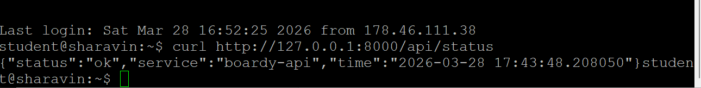

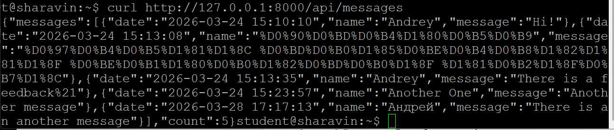

7. Живой процесс (счётчик)

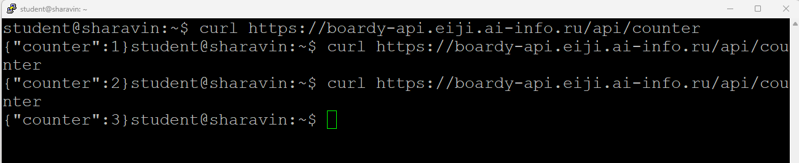

- Счётчик растёт, потому что FastAPI - долгоживущий процесс, который сохраняет значения глобальных переменных межлу запросами. PHP на каждый запрос создаёт новый процесс и все переменные уничтожаются после ответа

8. Async: 10 запросов за 2 секунды

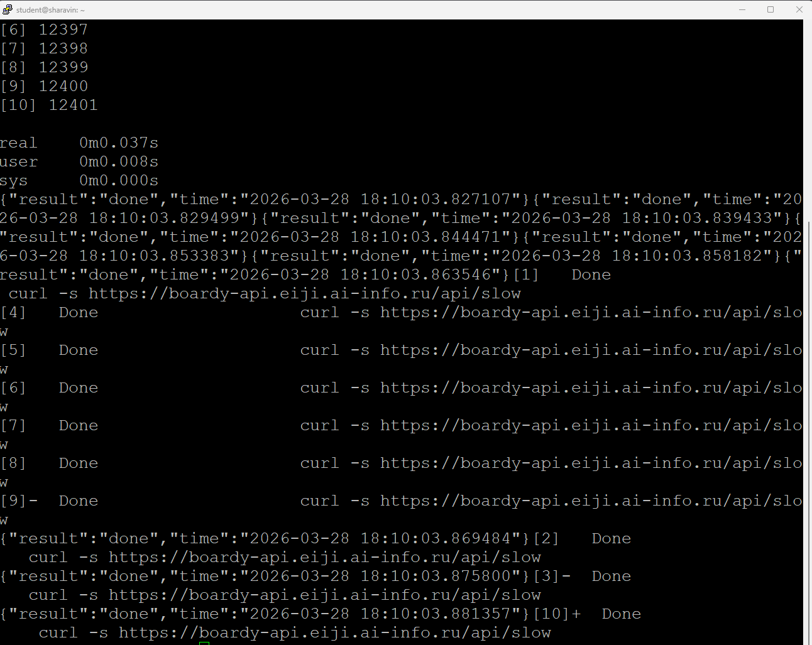

- 10 запросов обработались за 2 секунды, потому что все запросы обрабатывались параллельно, а не последовательно

9. Блокирующий код убивает event loop

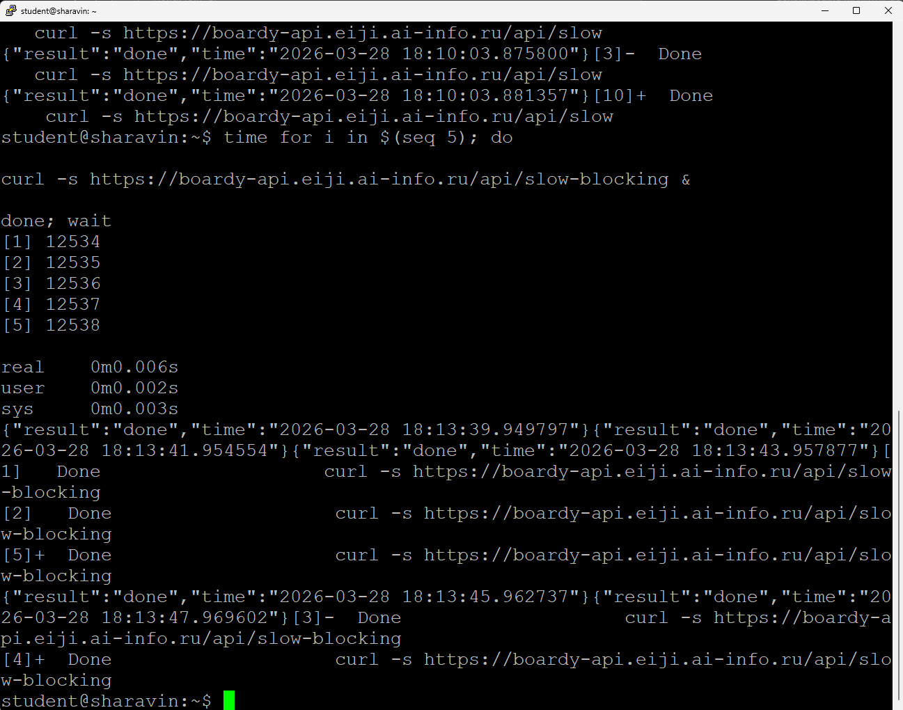

- `/api/slow` использует `await asyncio.sleep(2)`, который не блокирует event loop и позволяет обрабатывать все запросы параллельно, поэтому 5 запросов выполняются за ~2 секунды
- `/api/slow-blocking` использует `time.sleep(2)`, который блокирует весь event loop, заставляя запросы выполняться последовательно один за другим, что занимает ~10 секунд

10. Swagger

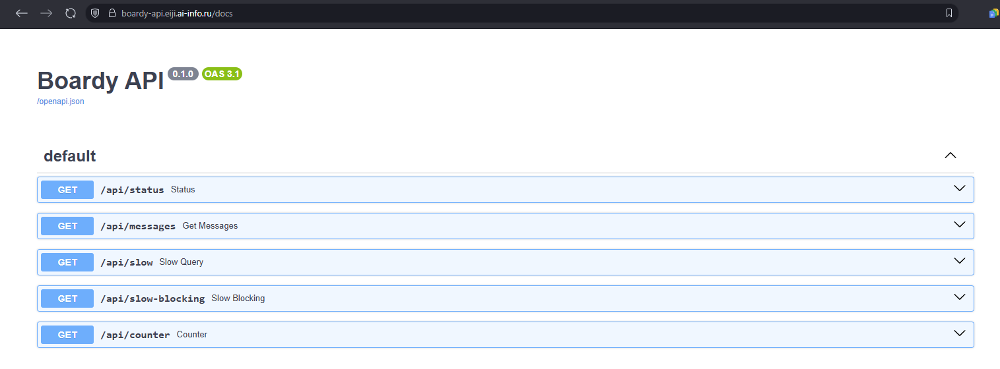

11. systemd-сервис

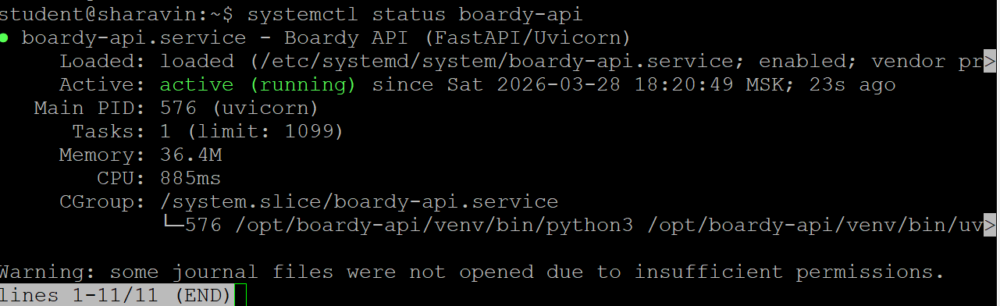

12. Nginx proxy_pass

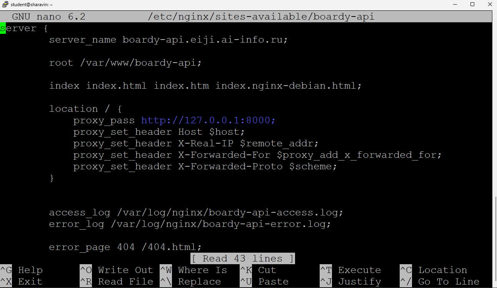

- `proxy_pass` передаёт запросы по HTTP (как обычный браузер), а `fastcgi_pass` использует FastCGI - специальный бинарный протокол для CGI-приложений
  - PHP использует `fastcgi_pass`, потому что PHP-FPM работает по протоколу FastCGI
  - Python (FastAPI) использует `proxy_pass`, потому что эти приложения запускаются как HTTP-серверы через Uvicorn и общаются с Nginx по обычному HTTP

## Часть C. Сравнение

13. Два формата

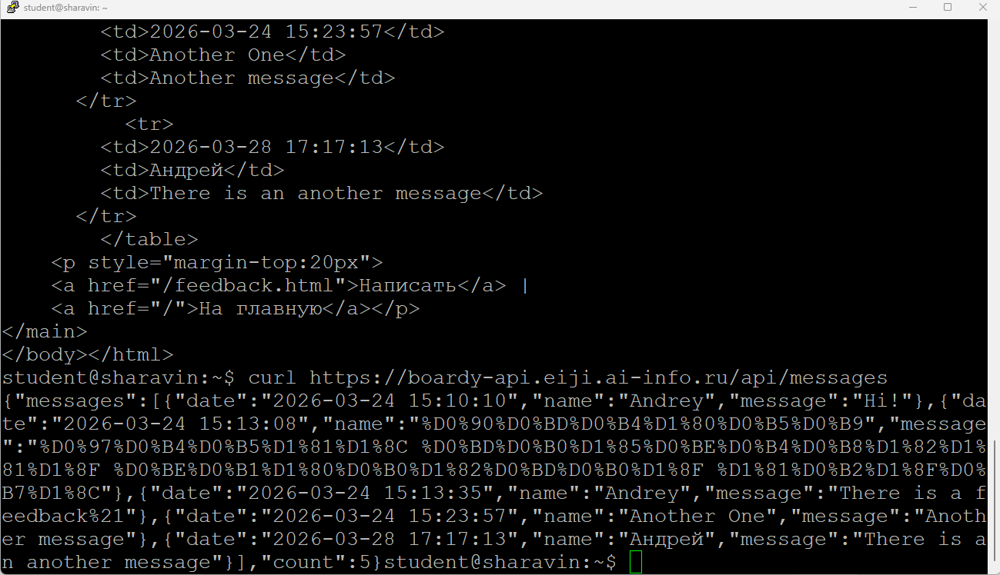

- **HTML страница (первый формат)** - удобен для браузера, так как он может сразу отрендерить страницу и показать её пользователю сайта
- **JSON (второй формат)** - удобен для передачи данных с сервера, так как в ответе находятся только необходимые данные в виде пары ключ-значение
  - JSON используют другие API или Frontend-фреймворки

14. Процессы

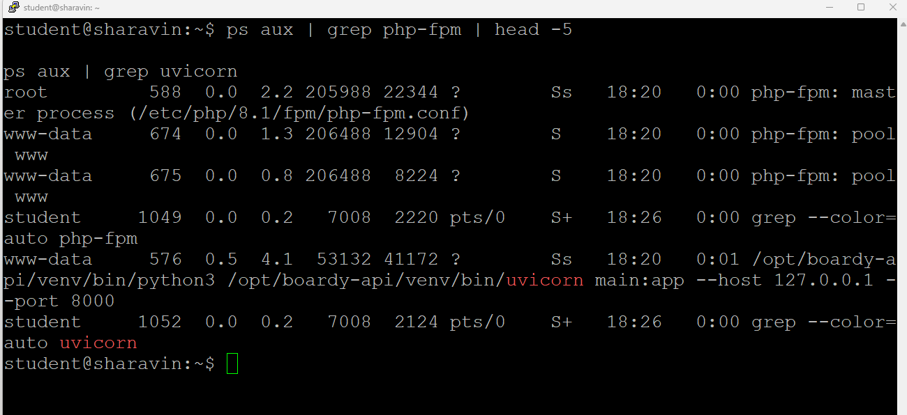

# Pull Request