# Практика 8: MySQL

## Часть A. MySQL - установка и настройка

1. Установка MySQL

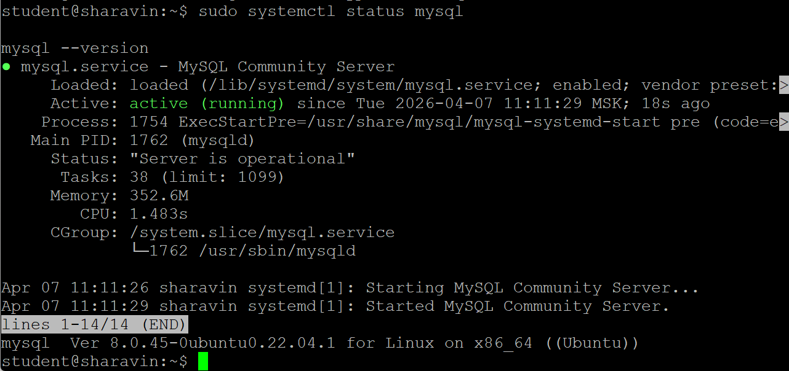

2. База данных и пользователь

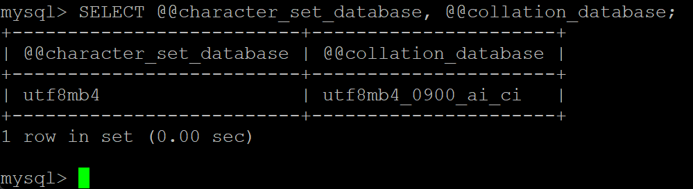

- Мы выбираем **utf8mb4**, так как в этой кодировке содержатся все Unicode-символы, а это все языки + эмодзи. **Utf8** содержит только BMP: буквы, цифры, знаки
- **Collation** - это правила сравнения и сортировки символов
- **unicode_ci** - это правила точного сравнения по Unicode-правилам

3. phpMyAdmin

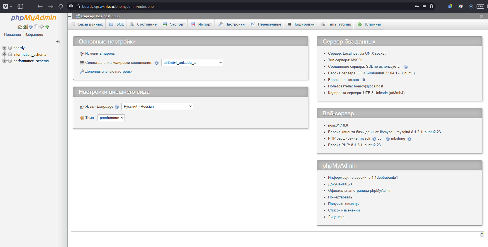

## Часть B. Таблицы и связи

4. Три таблицы

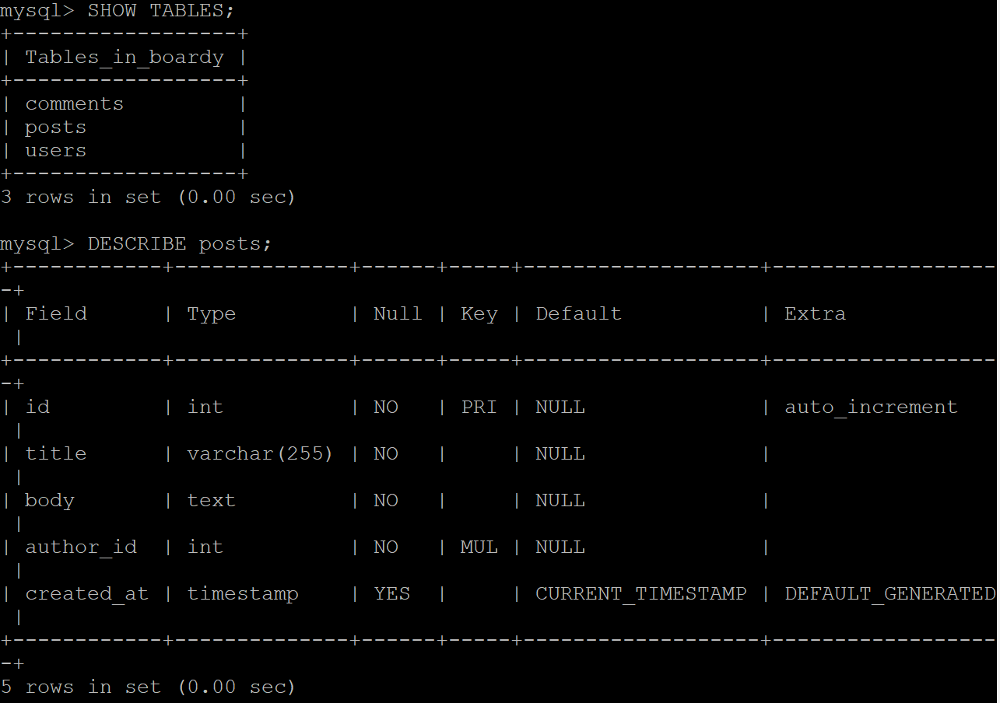

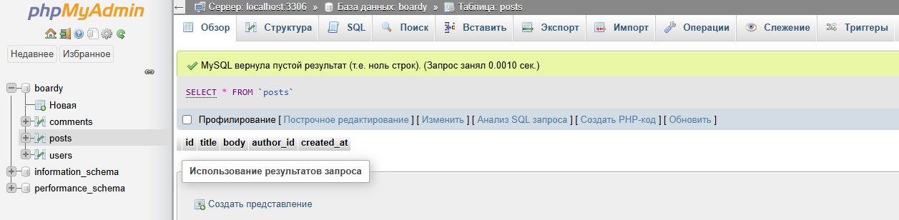

- **FOREIGN KEY** - это инструкция, говорящая, что в столбце будет использоваться значение из другой таблицы
- **ON DELETE CASCADE** - это инструкция, говорящая, что запись необходимо удалить, если удалится запись из другой таблицы, связанной через **FOREIGN KEY**
- Мы используем движок **InnoDB**, т.к. в нём встроенны транзакции, внешние ключи, а также строковые блокировки. В другом движке **MyISAM** таких свойств нет

5. SQL-скрипт

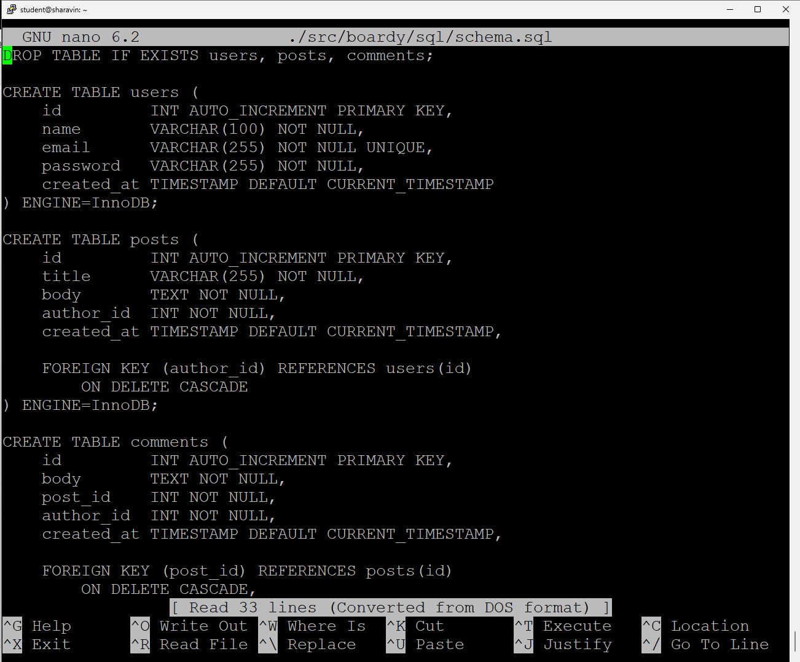

## Часть C. SQL - базовые операции

6. INSERT

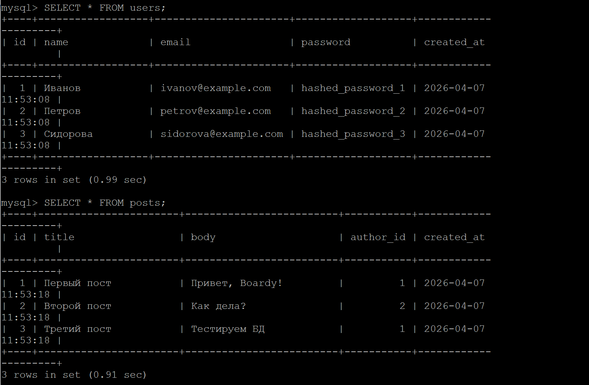

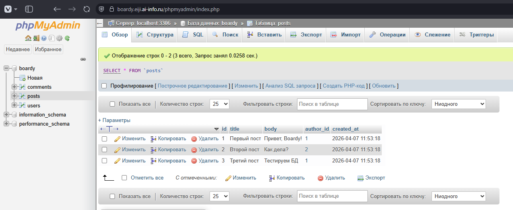

7. SELECT + JOIN

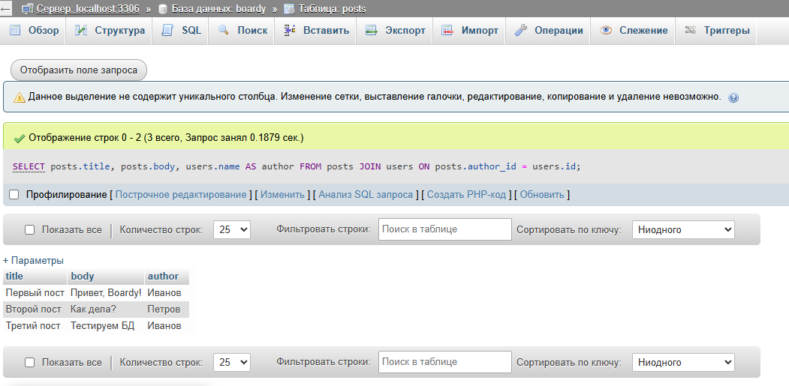

8. Foreign Key - защита целостности

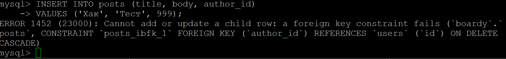

9. CASCADE

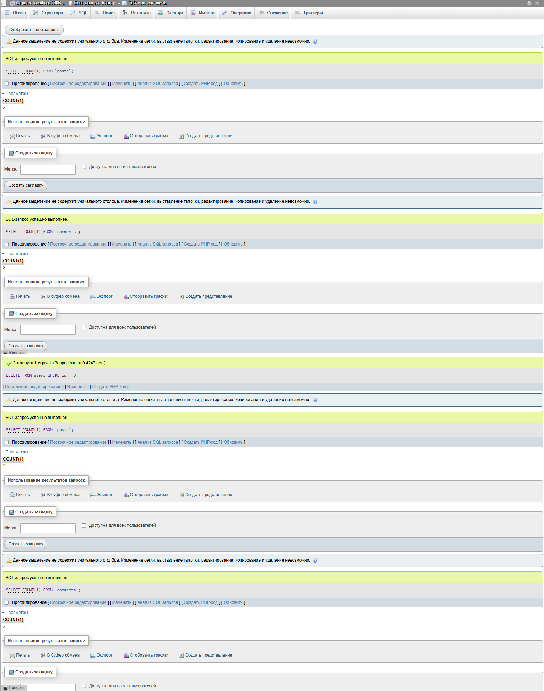

10. SQL-инъекция

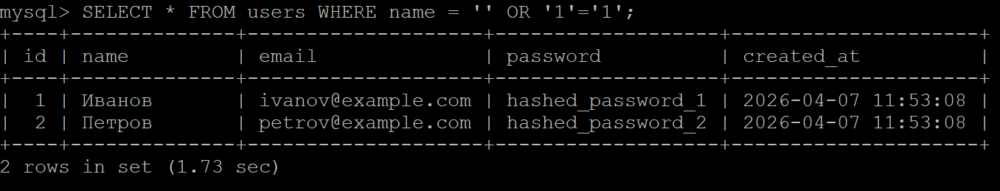

- SQL-инъекция работает так, что злоумышленник вводит специальные символы в форму, которые «ломают» структуру SQL-запроса и заставляют базу данных выполнить чужой код
- prepared statement защищает, потому что заранее компилирует структуру запроса, а данные передаются отдельно и экранируются автоматически

## Часть D. PHP + MySQL

11. db.php

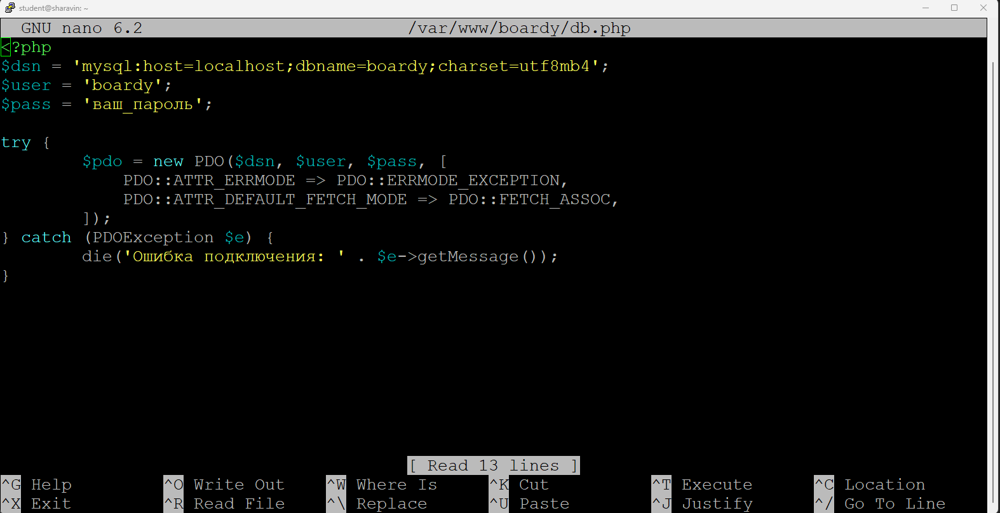

12. submit.php через MySQL

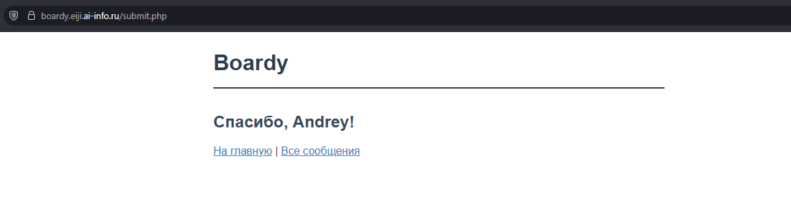

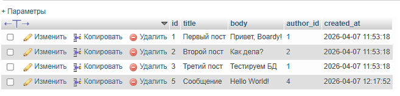

13. messages.php через MySQL

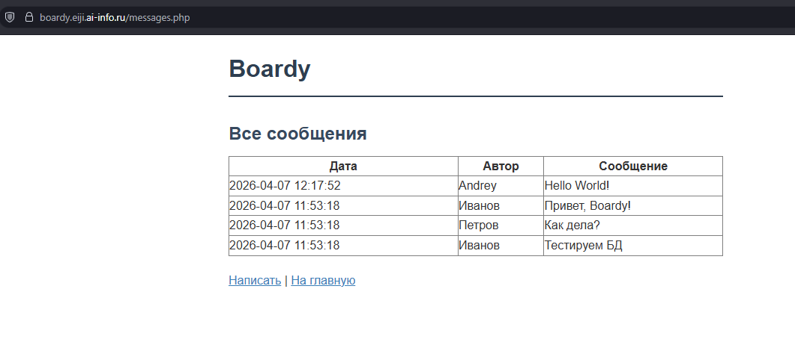

## Часть E. FastAPI + MySQL

14. aiomysql

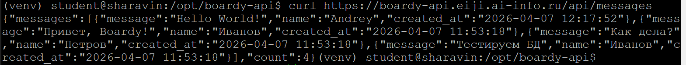

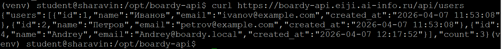

- aiomysql - это асинхронный драйвер MySQL
  - await — не блокирует event loop при запросе к БД
  - Обычный mysql-connector заблокировал бы, как `time.sleep`

# Pull Request

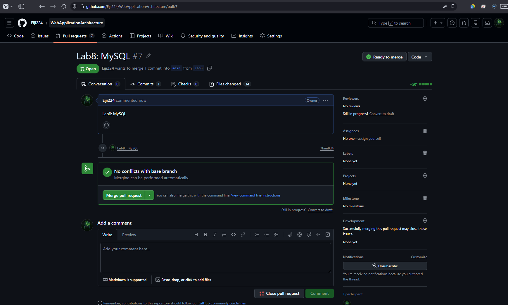