# Практика 9. REST API SSR vs CSR (JavaScript)

## Часть A. REST API

1. Структура проекта

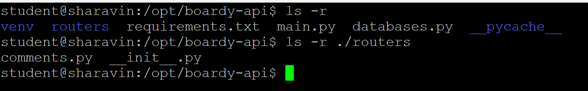

2. GET - список комментариев

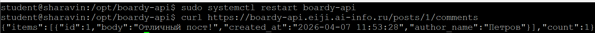

- Какой SQL-запрос выполняет этот эндпоинт?
```sql
SELECT c.id, c.body, c.created_at, u.name AS author_name
  FROM comments c
  JOIN users AS u ON c.author_id = u.id
 WHERE c.post_id = %s
 ORDER BY c.created_at
```
- Зачем JOIN?
  - Чтобы отобразить в результате связи между автором постов и автором комментария

3. POST - создать комментарий

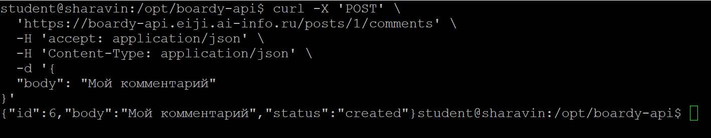

- Почему 201, а не 200? 
  - 201 - Запрос успешно выполнен и был создан новый комментарий
  - 200 - Запрос успешно выполнен
- Что означает Content-Type: application/json?
  - Серверу была отправлена информация в формате json

4. PUT - редактировать

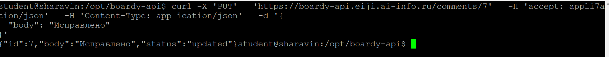

- Чем PUT отличается от POST?
  - POST - создаёт новый объект
  - PUT - изменяет поля в уже существующем объекте
- Почему URL другой (/comments/{id}, а не /posts/{id}/comments)?
  - Потому что мы работаем конкретно с комментариями, изменяем конкретно комментарии. У нас нет необходимости менять посты

5. DELETE - удалить

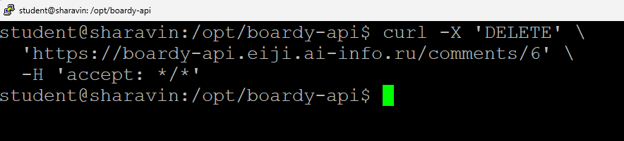

- Перечислите 4 HTTP-глагола. Какой код ответа у каждого и почему?
  - GET - 200 (Запрос выполнен успешно) Чтение
  - POST - 201 (Новый ресурс был успешно создан) Создание
  - PUT - 200 (Изменено) Обновление
  - DELETE - 204(Без контента) Удаление

6. Ошибки

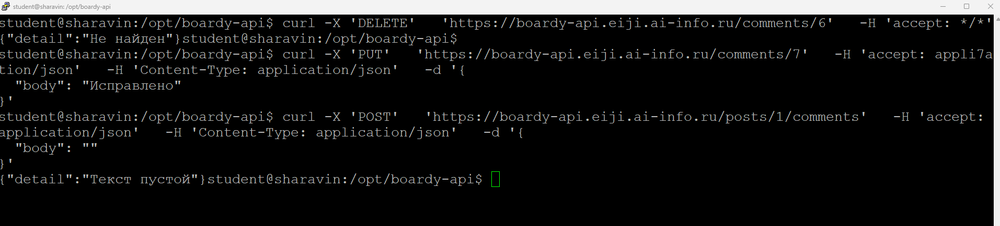

- Чем 404 отличается от 422?
  - 404 - объект не найден
  - 422 - указывает, что сервер понимает тип содержимого в теле запроса и синтаксис запроса является правильным, но серверу не удалось обработать инструкции содержимого

7. Swagger

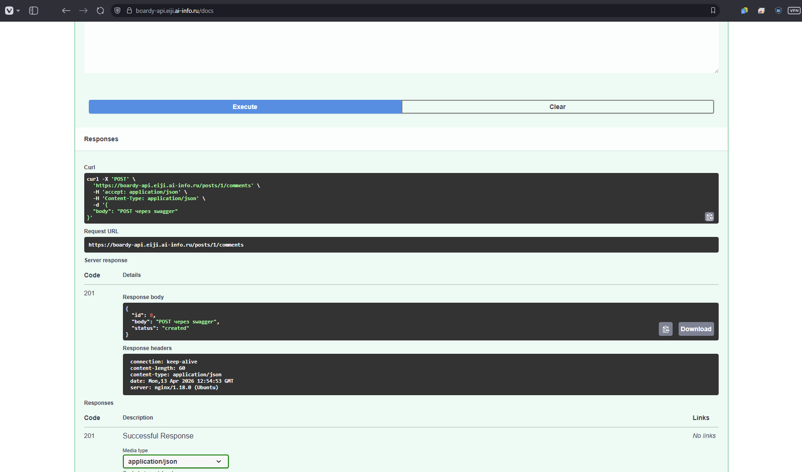

## Часть B. JavaScript-клиент

8. Vanilla JS - демо

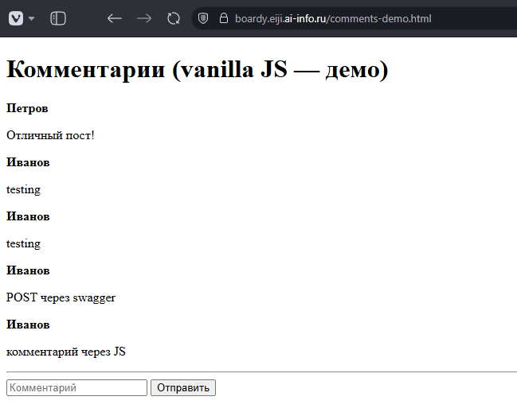

- Что делает функция esc()?
  - Функция предотвращает XSS атаки, превращая опасные спец. символы в безопасные текстовые эквиваленты
- Что случится если её не вызвать?
  - Без её вызова высок риск срабатывания XSS-атаки

9. React - полный CRUD

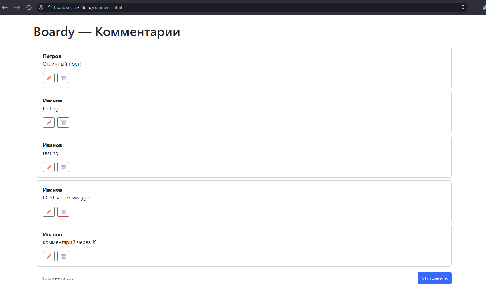

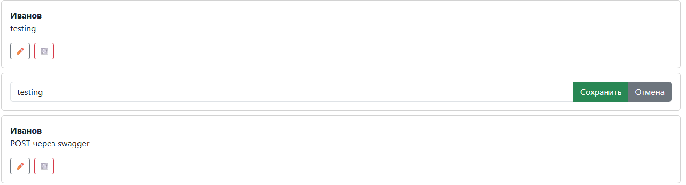

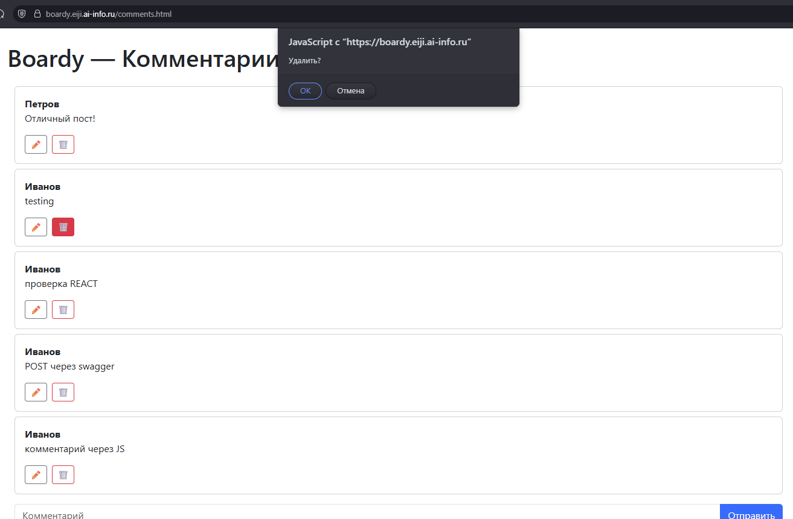

10. Сравнение кода

- Где хранится состояние (список комментариев, текст формы)?
  - Vanila JS: Состояние хранится в виде HTML
  - React: Состояние хранится в памяти
- Как обновляется список после добавления?
  - Vanila JS: Сначала перехватываем событие отправки, создаем новые элементы через JS
  - React: Добавляем элементы в состояние
- Как реализовано редактирование?
  - Vanila JS: Ищем элемент по id, добавляем обработчики событий, а после сохранения вручную изменяем текст в DOM
  - React: Проверяем состояние флага `isEditing` и в зависимости от его значения показываем форму или текст комментария
- Как защищаемся от XSS?
  - Vanila JS: Пишем собственную функцию, которая заменяет спец. символы на текстовые аналоги
  - React: Защита встроена по умолчанию

11. DevTools -> Network

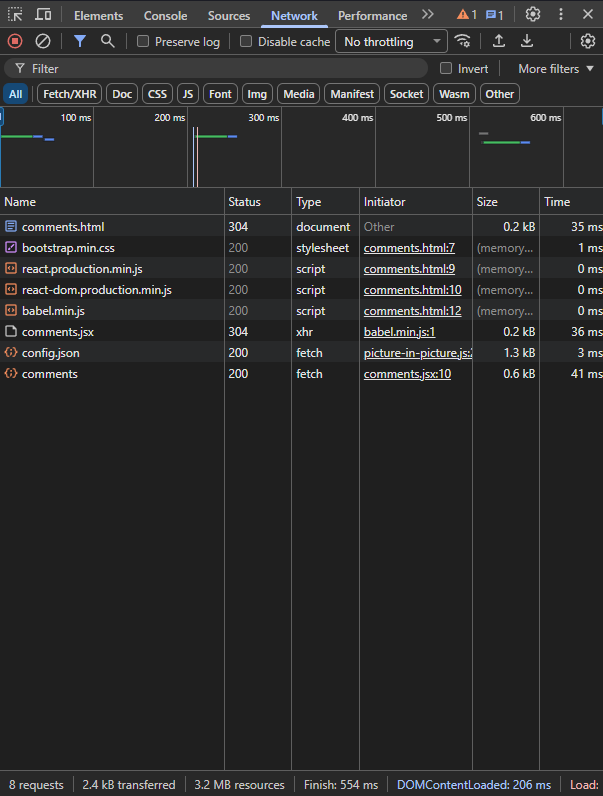

- Сколько запросов?
  - 8
- Какой из них к API
  - `comments` - самый нижний

## Часть C. SSR vs CSR

12. View Source

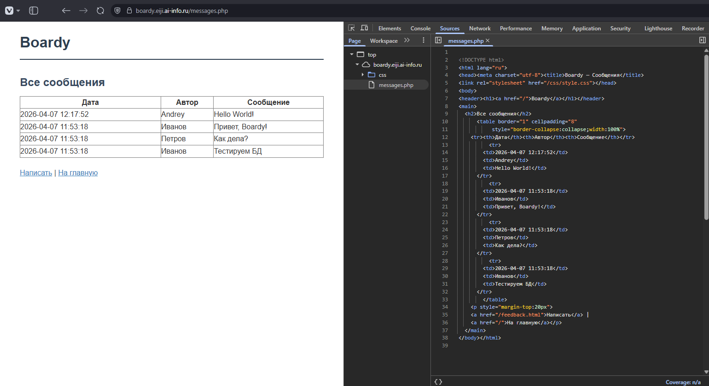

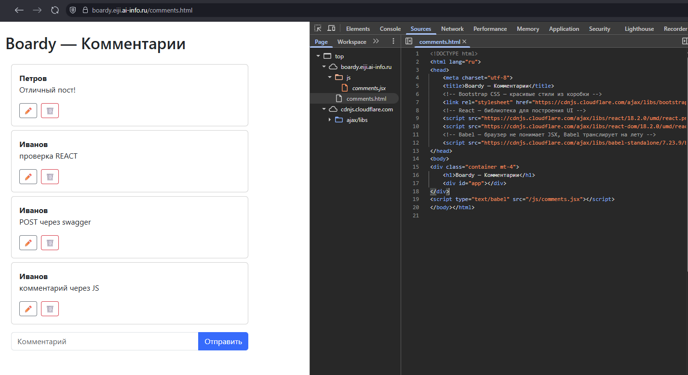

- Почему в CSR нет данных в исходнике?
  - Браузер сначала скачивает HTML, потом JS-скрипты и исполняет их - отправляет запросы к API и монтирует компоненты внутри специального контейнера
- Что увидит поисковый бот?
  - Обычные боты не исполняют JS и для них страница будет абсолютно пустой, однако продвинутые боты могут исполнять JS и, соответственно, получать данные с API

13. XSS

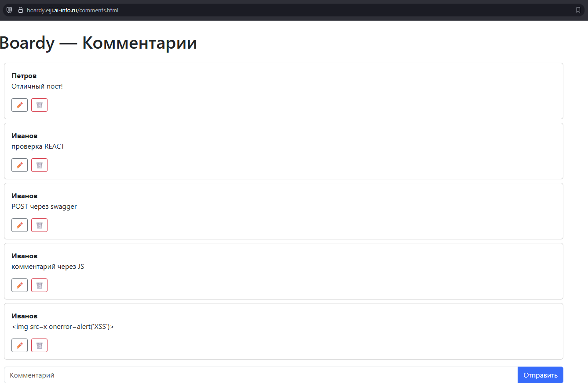

- Как vanilla JS и React защищаются от XSS?
  - Vanila JS: Безопасность зависит от того, какой метод манипуляции DOM выберет программист
  - React: Когда мы вставляем какую-либо переменную в HTML теги (используя фигурные скобки), React перед вставкой преобразует все потенциально опасные символы в безопасные аналоги
- Какой способ надёжнее?
  - React

14. Итоговая таблица

| Параметр | SSR (PHP)       | vanilla JS       | React            |
| :--- |:----------------|:-----------------|:-----------------|
| Кто рендерит HTML | сервер          | клиент(браузер)  | клиент(браузер)  |
| Формат ответа сервера | HTML            | пустой HTML + JS | пустой HTML + JS |
| View Source: данные видны | да              | нет              | нет              |
| Перезагрузка при отправке | да              | нет              | нет              |
| Защита от XSS | встроенная      | ручная           | встроенная       |
| Сложность кода | ниже vanilla JS | высокая          | ниже vanilla JS          |

# Pull Request

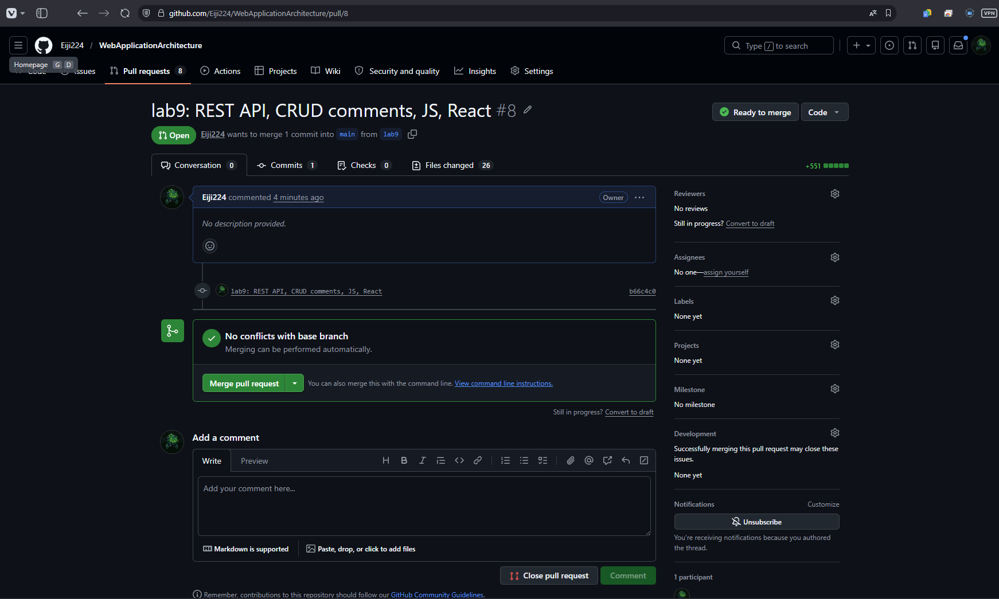