# Практика 5 - HTTPS

## Часть A. HTTPS для основного сайта

1. Установка certbot

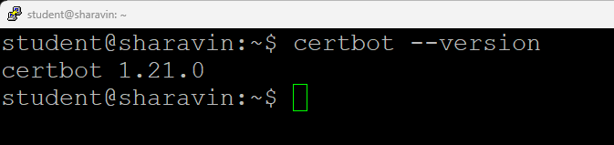

2. Получение сертификата

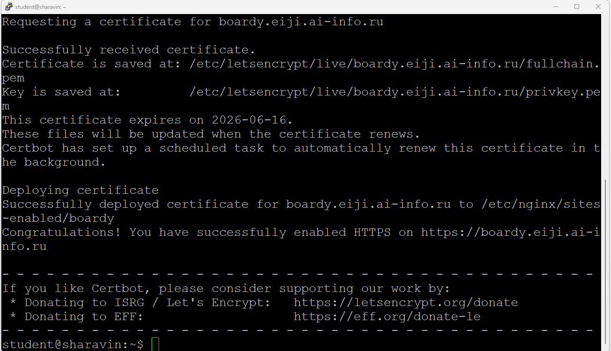

3. Проверка в браузере

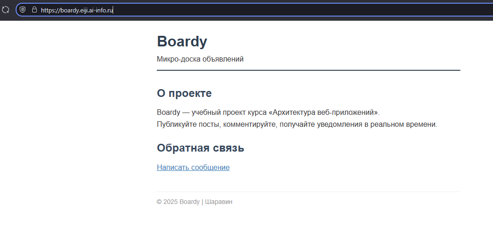

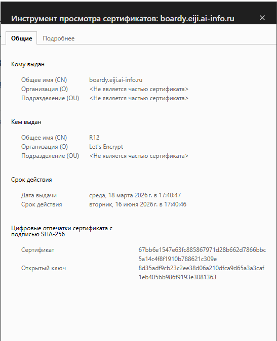

4. Редирект

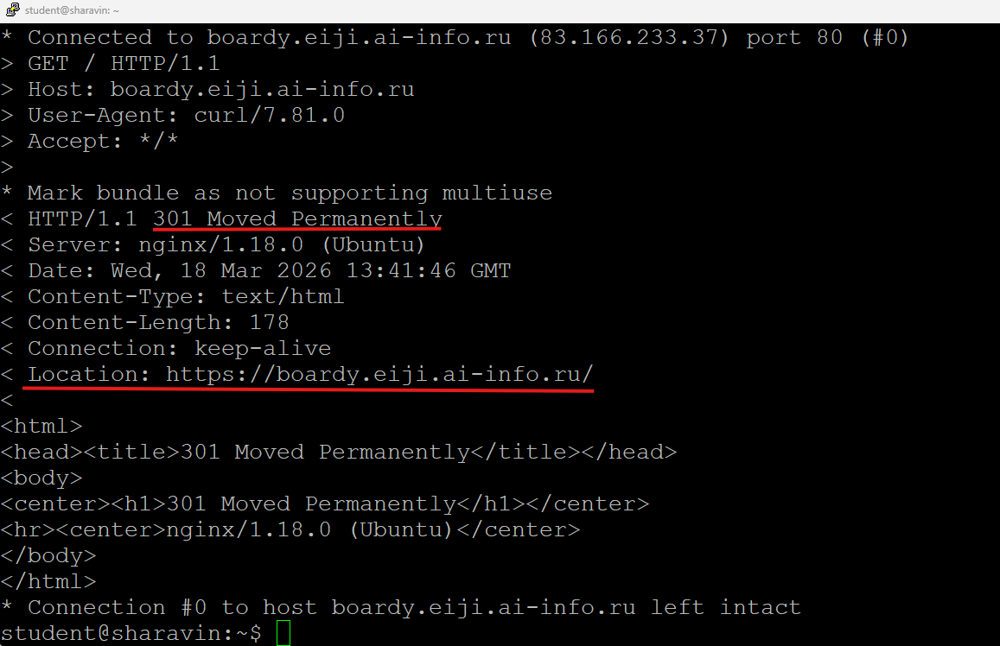

5. Конфиг после certbot

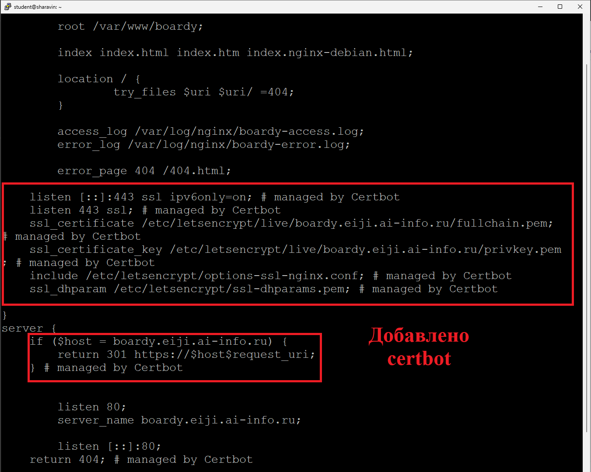

## Часть B. HTTPS для API-сервиса

6. Сертификат для api-поддомена

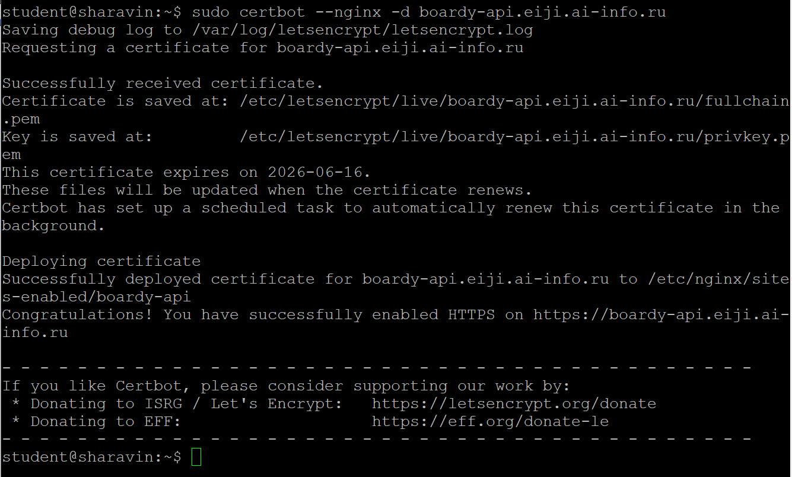

7. Проверка обоих доменов

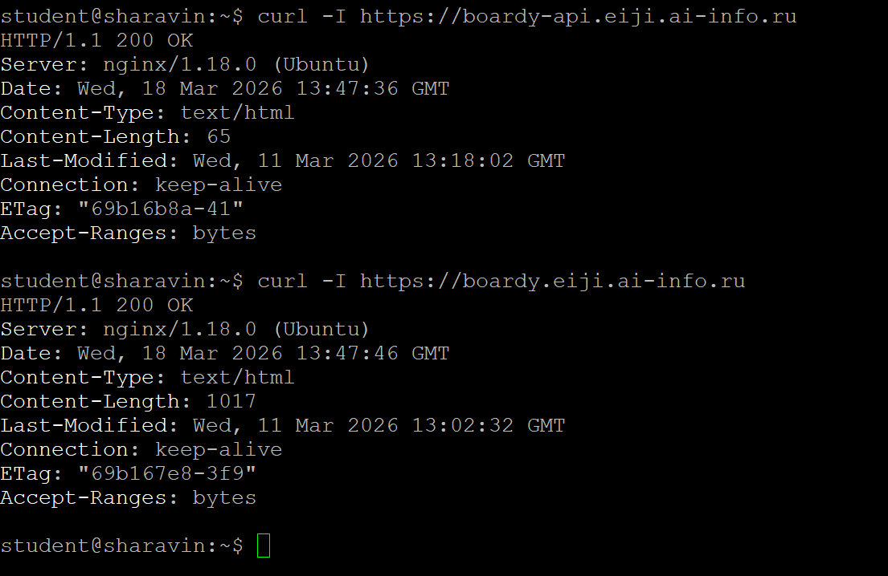

## Часть C. Разбор TLS

8. TLS handshake

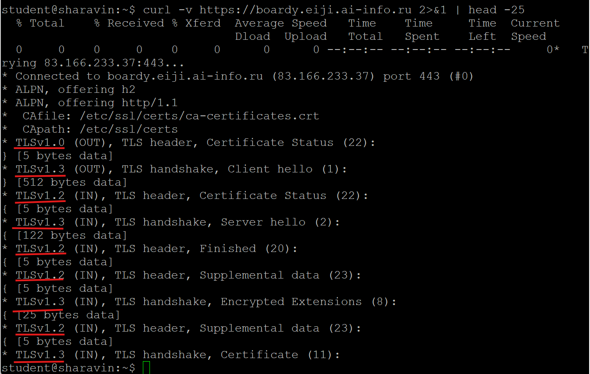

9. Цепочка доверия

Браузер проверяет цепочку доверия сверху вниз: начиная с доверенного корневого сертификата в своём хранилище, он криптографически проверяет подпись каждого следующего сертификата. Только если вся цепочка валидна (подписи верны, сроки не истекли, домен совпадает, сертификат не отозван), соединение считается безопасным.

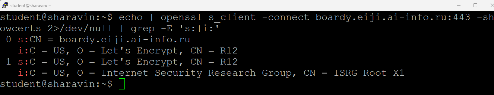

10. Сравнение сертификатов

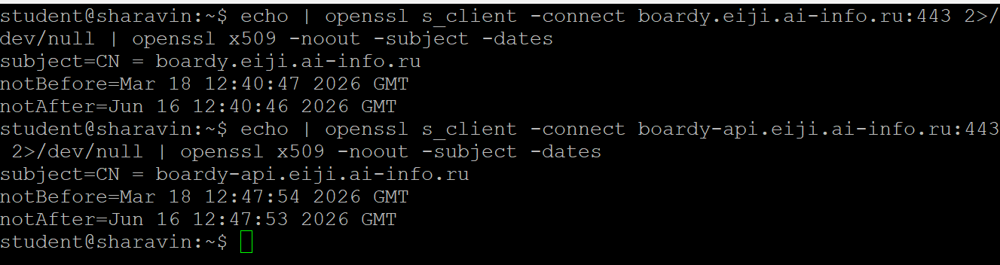

Общие характеристики:
- Оба сертификата действительны 90 дней (с 18 марта 2026 по 16 июня 2026)
- Оба домена являются поддоменами зоны eiji.ai-info.ru

Различие - время выпуска, разница в 7 минут

## Часть D. HSTS, кэширование, gzip

11. HSTS

HSTS (HTTP Strict Transport Security) - это заголовок, который предписывает браузеру взаимодействовать с сайтом только по защищённому протоколу HTTPS, автоматически преобразуя все попытки подключения по HTTP в безопасные запросы. Он защищает от атак типа SSL-stripping и перехвата cookie, исключая возможность перехвата данных при первом обращении к сайту или при подмене незащищённых ссылок

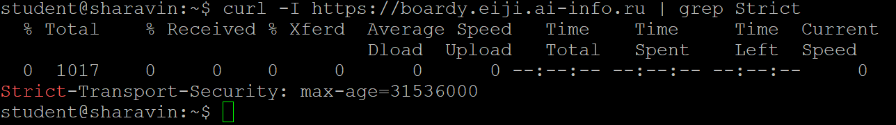

12. Кэширование и gzip

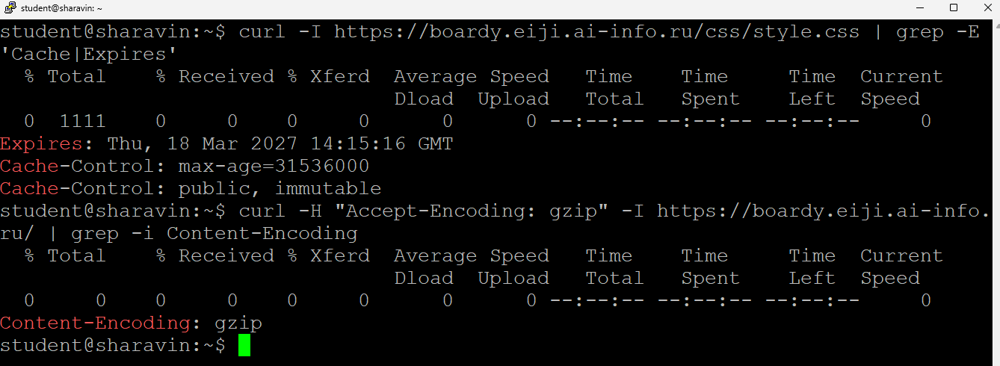

13. Автообновление

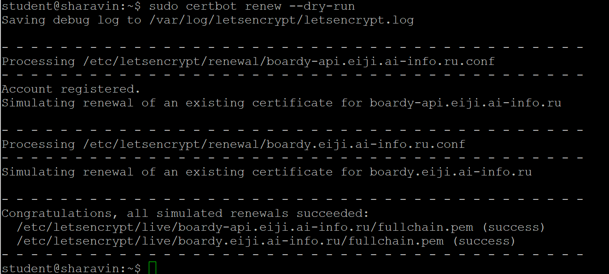