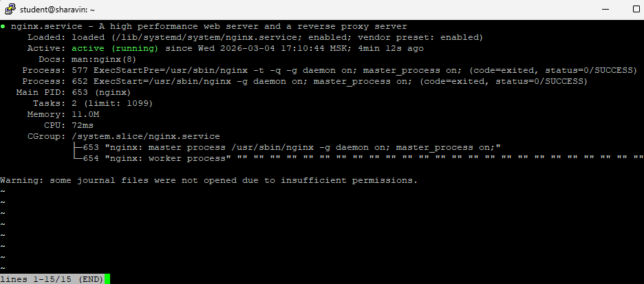
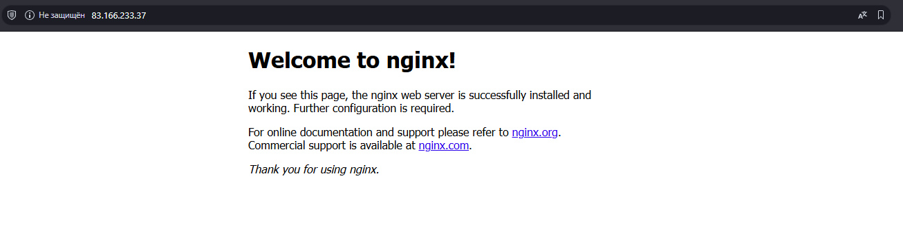
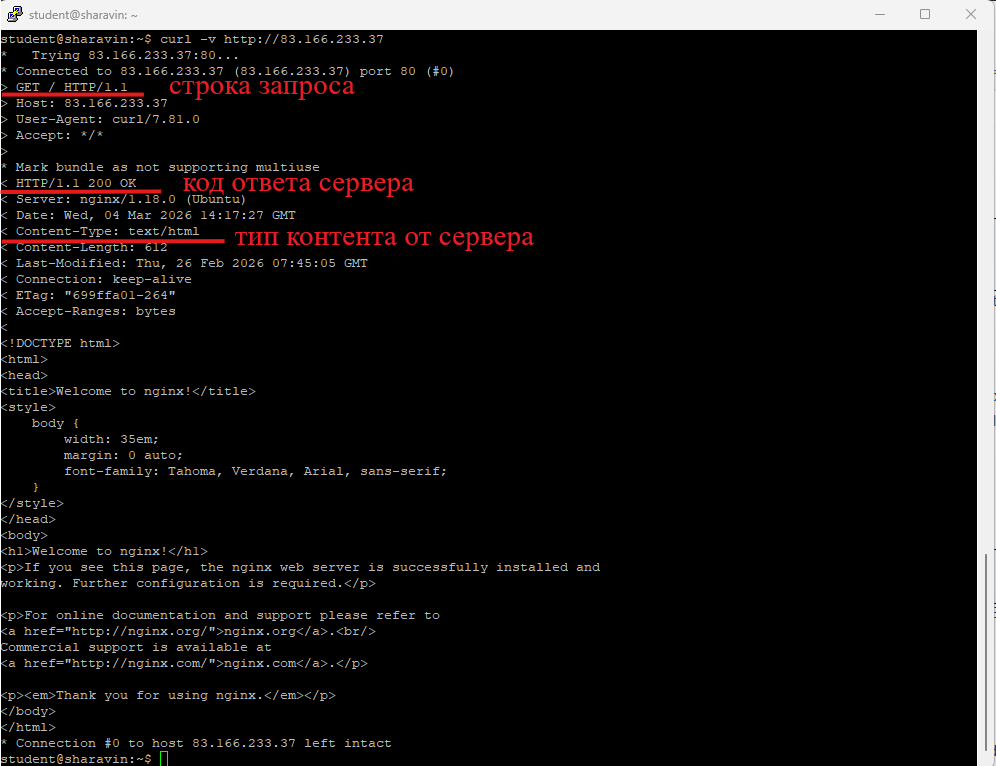
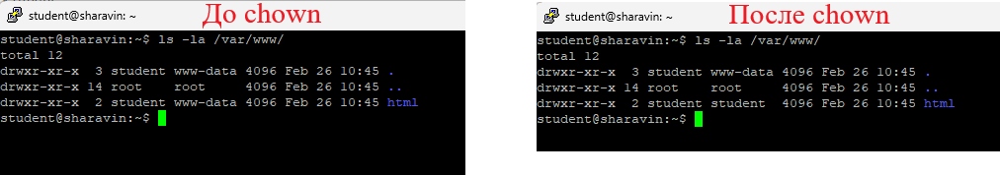
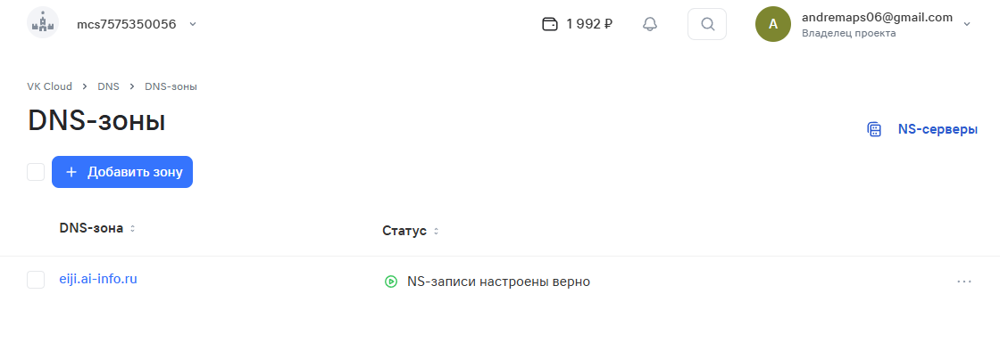
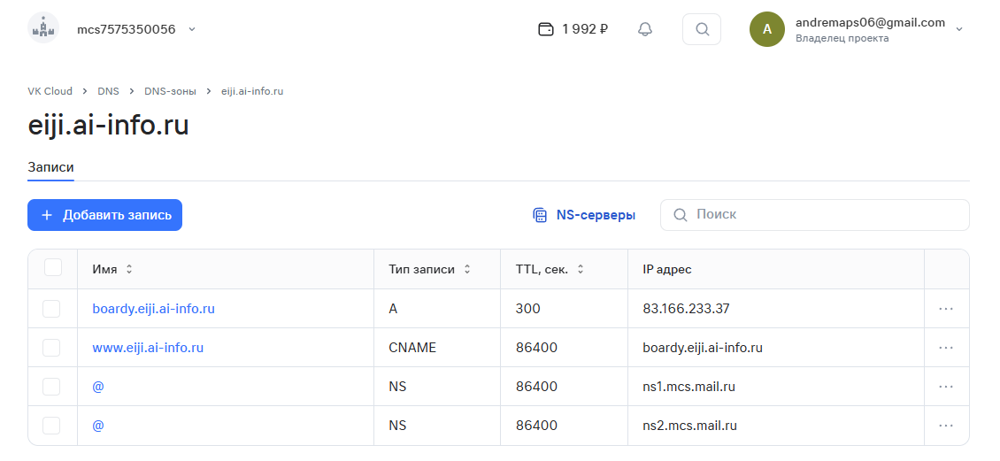
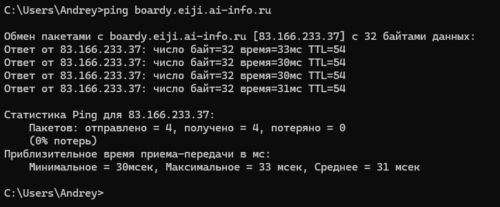
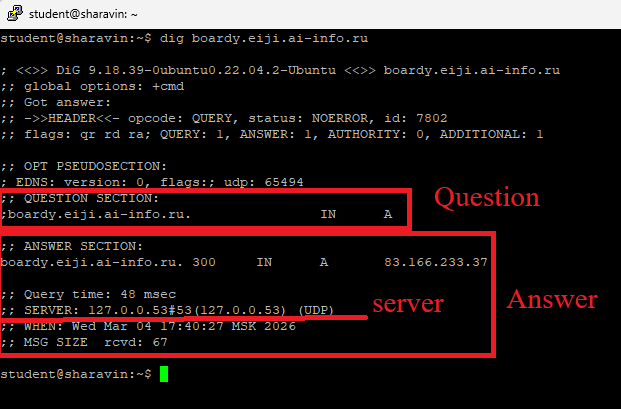
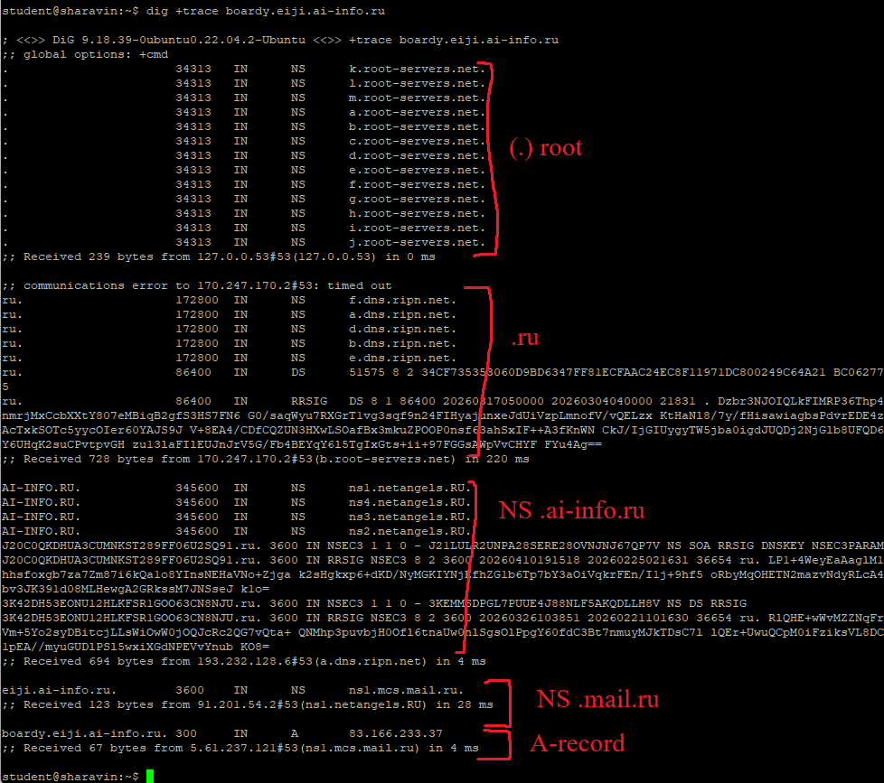
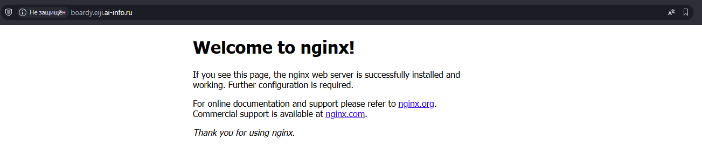

# Практика 3. NGINX, DNS

## Часть A. NGINX

1. Установка NGINX

2. Страница по IP

3. curl

4. Директория и права

5. Конфигурация Nginx
   - **listen** - Какой порт необходимо слушать серверу
   - **root** - Директория с файлами, которые должен отдавать сервер
   - **server_name** - Имя хоста (домена), которое потом сопоставляется с заголовком из HTTP запроса (можно разместить несколько сайтов на одном IP адресе)
   - **index** - название файла(-ов), которые nginx отдаёт по умолчанию

## Часть B. DNS

6. DNS-зона

7. A-запись

8. ping

9. dig

10. dig +trace

11. Сайт по домену
